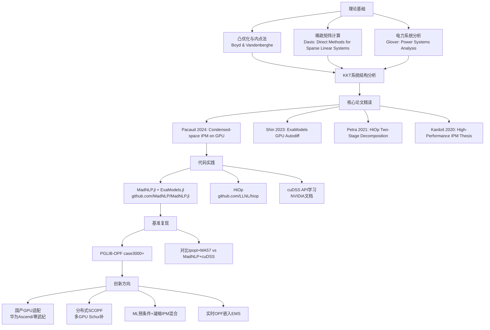

# 高性能线性代数求解器进展综述与"改变问题结构"方法论深度解析

---

## 一、系统总结：高性能线性代数求解器的三条主线

基于您上传的综述文档，高性能线性求解器的进展可精炼为：

| 主线 | 核心演进逻辑 | 电力系统关键突破 |
|------|------------|----------------|
| **直接法** | 排序优化→超节点/多波前→通信规避→GPU卸载→GPU原生(cuDSS) | 电网MNA矩阵数值分解加速6×–1500× |
| **迭代法** | Krylov+预条件复用+子空间回收 | 75,000节点N-1分析中稳定超越直接法 |
| **新兴范式** | 混合精度/量子/ML代理 | DeepOPF系列批量场景100–15,000×加速 |

**核心洞察**：电力系统矩阵具有"极端稀疏+小世界图+病态不定+高频重分解"四重特征组合，这使得**通用求解器进步的边际收益递减，而问题结构变换的收益递增**。

---

## 二、方法论核心："改变问题结构优于等待求解器进步"

### 2.1 问题的本质矛盾

OPF/SCOPF 的内点法（IPM）每次迭代需求解 KKT 线性系统。该系统具有以下致命特性：

- **对称不定**（indefinite）：需要数值主元（pivoting），在GPU上产生串行依赖
- **极度病态**：条件数随内点收敛可达 $$\kappa \sim 10^{16}$$
- **稀疏不规则**：电网小世界结构导致fill-in不可预测

这三重特性使得：
> **在目标硬件（GPU）上不存在高效的通用稀疏不定求解器**

2021年五求解器基准测试（SuperLU、STRUMPACK、cuSolver、SPRAL、PaStiX）的结论是：**没有任何被测软件在GPU上取得显著加速**。

### 2.2 方法论转换：从"等求解器"到"变问题"

ExaSGD项目与MadNLP团队独立发现了同一方法论：

$$\boxed{\text{病态不定系统} \xrightarrow{\text{问题结构变换}} \text{良条件正定系统/小规模稠密系统}}$$

这产生了两条已验证的技术路线：

| 路线 | 核心思想 | 代表工作 | 加速比 |
|------|---------|---------|--------|
| **凝缩空间IPM** | Schur补/正则化将KKT凝缩为SPD系统，用GPU Cholesky/LDLᵀ | MadNLP + cuDSS (HyKKT/LiftedKKT) | ~10× vs Ipopt+MA27 |
| **两阶段分解+稠密化** | 分解为主问题+子问题，子问题压缩为小稠密矩阵交GPU MAGMA | HiOp (ExaSGD) | ~100× GPU求解提速 |

---

## 三、路线一：凝缩空间内点法——完备理论推导

### 3.1 标准内点法的KKT系统

考虑一般非线性规划问题（AC-OPF的标准形式）：

$$\min_{x} \quad f(x)$$

$$\text{s.t.} \quad g(x) = 0 \quad (\text{等式约束，如潮流方程})$$

$$\quad\quad\quad h(x) \leq 0 \quad (\text{不等式约束，如线路热限})$$

引入松弛变量 $$s \geq 0$$ 和对数障碍：

$$\min_{x,s} \quad f(x) - \mu \sum_{i} \ln s_i$$

$$\text{s.t.} \quad g(x) = 0, \quad h(x) + s = 0$$

KKT一阶最优性条件（原始-对偶系统）：

$$\nabla f(x) + J_g^\top y + J_h^\top z = 0$$

$$g(x) = 0$$

$$h(x) + s = 0$$

$$SZe - \mu e = 0$$

其中 $$S = \text{diag}(s)$$，$$Z = \text{diag}(z)$$，$$y$$ 和 $$z$$ 分别是等式和不等式约束的拉格朗日乘子。

### 3.2 牛顿步的全空间KKT线性系统

对上述系统施加牛顿法，得到每次迭代需求解的**增广KKT系统**：

$$\begin{pmatrix} W & J_g^\top & J_h^\top & 0 \\ J_g & 0 & 0 & 0 \\ J_h & 0 & 0 & I \\ 0 & 0 & S & Z \end{pmatrix} \begin{pmatrix} \Delta x \\ \Delta y \\ \Delta z \\ \Delta s \end{pmatrix} = -\begin{pmatrix} r_d \\ r_p \\ r_h \\ r_\mu \end{pmatrix}$$

其中：
- $$W = \nabla^2_{xx} \mathcal{L}$$（拉格朗日Hessian，$$n \times n$$）
- $$J_g \in \mathbb{R}^{m \times n}$$（等式约束雅可比）
- $$J_h \in \mathbb{R}^{p \times n}$$（不等式约束雅可比）
- $$r_d, r_p, r_h, r_\mu$$ 为各残差

### 3.3 第一步消元：消去 $$\Delta s$$ 和 $$\Delta z$$

从第四行方程：

$$S \Delta z + Z \Delta s = -r_\mu$$

结合第三行 $$J_h \Delta x + \Delta s = -r_h$$，得 $$\Delta s = -r_h - J_h \Delta x$$

代入第四行：

$$\Delta z = S^{-1}(-r_\mu - Z\Delta s) = S^{-1}(-r_\mu + Z(r_h + J_h \Delta x))$$

定义**对角阻尼矩阵**：

$$\Sigma = S^{-1}Z = \text{diag}(\sigma_1, \ldots, \sigma_p), \quad \sigma_i = z_i/s_i$$

这是产生病态性的根源：当 $$\mu \to 0$$ 时，活跃约束 $$\sigma_i \to \infty$$，非活跃约束 $$\sigma_i \to 0$$。

消去后得到**压缩KKT系统**：

$$\begin{pmatrix} W + J_h^\top \Sigma J_h & J_g^\top \\ J_g & 0 \end{pmatrix} \begin{pmatrix} \Delta x \\ \Delta y \end{pmatrix} = -\begin{pmatrix} \hat{r}_d \\ r_p \end{pmatrix}$$

其中 $$\hat{r}_d = r_d + J_h^\top(\Sigma r_h - S^{-1}r_\mu)$$。

**关键观察**：$$K = W + J_h^\top \Sigma J_h$$ 是 $$n \times n$$ 对称矩阵，但**仍然不定**（因 $$W$$ 可能不定），且 $$\Sigma$$ 的极端特征值使 $$K$$ 病态。

### 3.4 凝缩空间方法一：HyKKT（混合凝缩）

**核心思想**：将变量分为"稠密耦合部分"和"稀疏局部部分"，利用AC-OPF的结构。

对于AC-OPF，变量 $$x = (x_d, x_s)$$ 中：
- $$x_d$$：稠密耦合变量（发电机出力等，维度小）
- $$x_s$$：稀疏局部变量（母线电压等，维度大但耦合稀疏）

压缩KKT分块：

$$\begin{pmatrix} K_{dd} & K_{ds} & A_d^\top \\ K_{sd} & K_{ss} & A_s^\top \\ A_d & A_s & 0 \end{pmatrix} \begin{pmatrix} \Delta x_d \\ \Delta x_s \\ \Delta y \end{pmatrix} = -\begin{pmatrix} \hat{r}_d \\ \hat{r}_s \\ r_p \end{pmatrix}$$

**Schur补凝缩**：利用 $$K_{ss} + J_h^\top \Sigma J_h$$ 的对角占优（因电网稀疏），可将系统凝缩为关于 $$(Δx_d, Δy)$$ 的小规模系统：

$$\left(K_{dd} - K_{ds}K_{ss}^{-1}K_{sd} + \text{正则化项}\right) \Delta x_d = \text{RHS}$$

**正则化策略**：添加原始-对偶正则化 $$\delta_p I$$ 和 $$-\delta_d I$$，确保凝缩后系统正定：

$$\begin{pmatrix} K + \delta_p I & A^\top \\ A & -\delta_d I \end{pmatrix}$$

凝缩后最终系统：

$$\underbrace{(K + \delta_p I + A^\top \delta_d^{-1} A)}_{\text{SPD矩阵}} \Delta x = \text{RHS}'$$

**这就是GPU友好的SPD系统！** 可用cuDSS的Cholesky分解高效求解。

### 3.5 凝缩空间方法二：LiftedKKT（提升凝缩）

**核心思想**：不改变变量划分，而是将不等式约束"提升"为等式约束+界约束。

原始问题等价变换：

$$\min_x f(x) \quad \text{s.t.} \quad g(x) = 0, \quad h(x) + t = 0, \quad t \geq 0$$

新的KKT系统在消去界约束对偶后变为：

$$\begin{pmatrix} W & J_g^\top & J_h^\top \\ J_g & 0 & 0 \\ J_h & 0 & -\Sigma^{-1} \end{pmatrix} \begin{pmatrix} \Delta x \\ \Delta y \\ \Delta z \end{pmatrix} = -\begin{pmatrix} r_1 \\ r_2 \\ r_3 \end{pmatrix}$$

注意 $$(3,3)$$ 块变为 $$-\Sigma^{-1}$$，当 $$\mu \to 0$$ 时非活跃约束的 $$\Sigma^{-1} \to \infty$$，活跃约束的 $$\Sigma^{-1} \to 0$$。

**从第三行消去 $$\Delta z$$**：

$$\Delta z = \Sigma(J_h \Delta x + r_3)$$

代入第一行得**凝缩系统**：

$$\begin{pmatrix} W + J_h^\top \Sigma J_h & J_g^\top \\ J_g & 0 \end{pmatrix} \begin{pmatrix} \Delta x \\ \Delta y \end{pmatrix} = -\begin{pmatrix} r_1 + J_h^\top \Sigma r_3 \\ r_2 \end{pmatrix}$$

**关键定理（Pacaud et al., 2024）**：若 $$W \succ 0$$ 且 $$J_g$$ 行满秩，则凝缩矩阵：

$$M = W + J_h^\top \Sigma J_h$$

是对称正定的。进而整个鞍点系统可通过再次Schur补得：

$$(J_g M^{-1} J_g^\top) \Delta y = r_2 + J_g M^{-1}(r_1 + J_h^\top \Sigma r_3)$$

$$M \Delta x = -(r_1 + J_h^\top \Sigma r_3 + J_g^\top \Delta y)$$

两步均为**SPD系统**，可用GPU上的Cholesky分解。

### 3.6 条件数分析：为何凝缩有效

**定理（误差补偿性质）**：虽然凝缩系统 $$M = W + J_h^\top \Sigma J_h$$ 的条件数 $$\kappa(M)$$ 可能很大（因 $$\Sigma$$ 的特征值跨度），但IPM的内在结构保证了：

$$\|\Delta x - \Delta x^*\| \leq \frac{\kappa(M) \cdot \epsilon_{\text{mach}}}{\|\Delta x^*\|} \cdot C_{\text{IPM}}$$

其中 $$C_{\text{IPM}}$$ 是随IPM收敛指数衰减的常数。直觉上：**当系统接近收敛时，牛顿步 $$\|\Delta x^*\|$$ 本身趋于零，分解误差的相对影响被对冲**。

这就是为什么凝缩方法在实践中即使条件数上升仍能可靠收敛——**IPM的非线性收敛结构"吸收"了线性求解的精度损失**。

---

## 四、路线二：ExaSGD两阶段分解+稠密化压缩

### 4.1 SCOPF的数学结构

安全约束最优潮流（SCOPF）的标准形式：

$$\min_{x_0, x_1, \ldots, x_K} \quad f(x_0)$$

$$\text{s.t.} \quad g_0(x_0) = 0, \quad h_0(x_0) \leq 0 \quad (\text{基态})$$

$$\quad\quad g_k(x_k, x_0) = 0, \quad h_k(x_k) \leq 0, \quad k=1,\ldots,K \quad (\text{预想事故})$$

其中 $$K$$ 可达 $$10^4 \sim 10^5$$，各事故态通过 $$x_0$$ 耦合。

### 4.2 KKT系统的角块结构

SCOPF的KKT系统具有天然的**角块对角（bordered block-diagonal）**结构：

$$\begin{pmatrix} H_0 & B_1^\top & B_2^\top & \cdots & B_K^\top \\ B_1 & H_1 & & & \\ B_2 & & H_2 & & \\ \vdots & & & \ddots & \\ B_K & & & & H_K \end{pmatrix} \begin{pmatrix} \Delta x_0 \\ \Delta x_1 \\ \Delta x_2 \\ \vdots \\ \Delta x_K \end{pmatrix} = \begin{pmatrix} r_0 \\ r_1 \\ r_2 \\ \vdots \\ r_K \end{pmatrix}$$

其中：
- $$H_0$$：基态KKT块（稀疏，中等规模）
- $$H_k$$：第 $$k$$ 个事故态KKT块（稀疏，可独立处理）
- $$B_k$$：事故态与基态的耦合矩阵（**稀疏且列数少**）

### 4.3 Schur补分解：分离子问题

**第一阶段**：对每个子问题求解：

$$H_k \Delta x_k = r_k - B_k \Delta x_0$$

等价于先解 $$H_k Z_k = B_k$$ 和 $$H_k w_k = r_k$$，则：

$$\Delta x_k = w_k - Z_k \Delta x_0$$

**第二阶段**：代入主方程得Schur补系统：

$$\underbrace{\left(H_0 - \sum_{k=1}^K B_k^\top H_k^{-1} B_k\right)}_{S_0} \Delta x_0 = r_0 - \sum_{k=1}^K B_k^\top H_k^{-1} r_k$$

### 4.4 HiOp的"稠密化压缩"创新

**关键洞察（ExaSGD/HiOp的核心贡献）**：

每个子问题 $$H_k$$ 虽然是大型稀疏矩阵，但耦合矩阵 $$B_k$$ 只涉及**少量耦合变量**（如发电机调度变量、联络线功率）。设耦合变量数为 $$n_c \ll n_k$$，则：

$$B_k \in \mathbb{R}^{n_k \times n_c}$$

从而 $$B_k^\top H_k^{-1} B_k \in \mathbb{R}^{n_c \times n_c}$$ 是**小规模稠密矩阵**！

**HiOp混合稠密-稀疏求解算法**：

```
Algorithm: HiOp MDS (Mixed Dense-Sparse) Solver
━━━━━━━━━━━━━━━━━━━━━━━━━━━━━━━━━━━━━━━━━━━━━━━
Input: SCOPF with K contingencies
Output: Optimal dispatch x_0*

1. [GPU并行] 对每个事故态 k=1,...,K:
   a. 组装稀疏KKT块 H_k (在GPU上)
   b. 对 H_k 做稀疏分解（或利用固定稀疏模式复用符号分解）
   c. 求解 n_c 个右端向量: H_k Z_k = B_k  → 得到 Z_k ∈ ℝ^{n_k × n_c}
   d. 计算稠密贡献: C_k = B_k^T Z_k ∈ ℝ^{n_c × n_c}  ← 小稠密矩阵!

2. [GPU稠密运算] 汇总Schur补:
   S_0 = H̃_0 - Σ_{k=1}^K C_k   (n_c × n_c 稠密矩阵)

3. [GPU MAGMA] 求解稠密系统:
   S_0 Δx_0 = rhs_0

4. [GPU并行] 回代各子问题:
   Δx_k = w_k - Z_k Δx_0,  k=1,...,K

5. 线搜索更新、检查收敛
━━━━━━━━━━━━━━━━━━━━━━━━━━━━━━━━━━━━━━━━━━━━━━━
```

### 4.5 为何稠密化在GPU上高效

| 操作 | 原始稀疏路线 | HiOp稠密化路线 |
|------|-------------|---------------|
| 子问题KKT求解 | 大型稀疏不定分解 ❌ GPU低效 | 固定模式稀疏分解（可复用） |
| Schur补组装 | 大型稀疏-稀疏乘 | 稀疏解→稠密乘（GEMM） ✅ GPU高效 |
| 主问题求解 | 大型稀疏不定 ❌ | 小稠密正定 ✅ GPU MAGMA极高效 |
| 并行度 | 有限（稀疏依赖） | $$K$$ 个子问题**完全独立** ✅ |

**复杂度对比**：
- 原始：$$O(K \cdot \text{nnz}(H_k)^{1.5})$$ 的稀疏分解，GPU低效
- HiOp：$$O(K \cdot (\text{sparse\_solve}(H_k, n_c) + n_c^2 \cdot n_k)) + O(n_c^3)$$

当 $$n_c \sim O(100)$$ 而 $$n_k \sim O(10^4)$$ 时，稠密Schur补求解的成本可忽略，**瓶颈转移至子问题的稀疏求解——而这些子问题是独立的、可大规模并行的**。

### 4.6 ExaSGD在Frontier上的实证

- **平台**：Frontier超算（世界首台百亿亿次），9,000 GPU节点
- **规模**：10万+预想事故的SCOPF
- **时间**：20分钟完成全量求解
- **对比**：传统调度员手工选取50–100个预想事故
- **线性代数压缩贡献**：GPU求解速度提升约100倍

---

## 五、路线一的完整算法实现（MadNLP + cuDSS）

### 5.1 LiftedKKT算法伪代码

```
Algorithm: LiftedKKT Condensed IPM on GPU
━━━━━━━━━━━━━━━━━━━━━━━━━━━━━━━━━━━━━━━━━━━━━━━━━━━━━
Input: NLP问题 min f(x) s.t. g(x)=0, h(x)≤0
Parameters: μ₀, σ∈(0,1), τ∈(0,1), ε_tol

1. 初始化: x⁰, y⁰, z⁰>0, s⁰>0, μ=μ₀

2. [GPU一次性] 符号分析:
   - 计算凝缩矩阵 M = W + J_h^T Σ J_h 的稀疏模式
   - cuDSS symbolic factorization (SPD模式)
   - 计算 J_g M⁻¹ J_g^T 的稀疏模式
   - cuDSS symbolic factorization (SPD模式)

3. while ||KKT residual|| > ε_tol:
   
   a. [GPU] 计算 Σ = diag(z_i/s_i)
   
   b. [GPU] 组装凝缩矩阵:
      M = W + J_h^T Σ J_h + δ_p I    (SPD!)
   
   c. [GPU cuDSS] 数值分解 M (Cholesky):
      M = L L^T                         ← 复用符号分解!
   
   d. [GPU] 计算正则化Schur补:
      S = J_g M⁻¹ J_g^T + δ_d I       (SPD!)
   
   e. [GPU cuDSS] 数值分解 S (Cholesky):
      S = L_S L_S^T
   
   f. [GPU] 求解对偶步:
      S Δy = r_p + J_g M⁻¹ r̂_d
   
   g. [GPU] 求解原始步:
      M Δx = -(r̂_d + J_g^T Δy)
   
   h. [GPU] 恢复:
      Δz = Σ(J_h Δx + r_3)
      Δs = -r_h - J_h Δx
   
   i. [GPU] 线搜索 + 更新:
      α_p = max{α : s + α Δs ≥ τs}
      α_d = max{α : z + α Δz ≥ τz}
      (x,s) += α_p(Δx,Δs)
      (y,z) += α_d(Δy,Δz)
      μ = σ · s^T z / p

4. return x*
━━━━━━━━━━━━━━━━━━━━━━━━━━━━━━━━━━━━━━━━━━━━━━━━━━━━━
```

### 5.2 Julia实现骨架（MadNLP.jl风格）

````artifact
id: condensed_ipm_implementation
name: Condensed IPM Algorithm Implementation
type: code.julia
content: |-
  # Condensed-Space Interior Point Method for AC-OPF on GPU
  # Based on MadNLP/LiftedKKT methodology (Pacaud et al., 2024)
  
  using CUDA
  using SparseArrays
  using LinearAlgebra
  
  """
  凝缩空间内点法核心数据结构
  """
  struct CondensedIPMSolver{T}
      # 问题维度
      n::Int          # 原始变量维度 (buses × 2 for V, θ)
      m::Int          # 等式约束数 (潮流方程)
      p::Int          # 不等式约束数 (线路限值等)
      
      # GPU上的矩阵存储
      W::CuSparseMatrixCSC{T}      # Hessian of Lagrangian
      Jg::CuSparseMatrixCSC{T}     # 等式约束雅可比
      Jh::CuSparseMatrixCSC{T}     # 不等式约束雅可比
      
      # 凝缩矩阵 (SPD!)
      M::CuSparseMatrixCSC{T}      # W + Jh^T Σ Jh + δ_p I
      S::CuSparseMatrixCSC{T}      # Jg M^{-1} Jg^T + δ_d I
      
      # 对角阻尼矩阵
      Σ::CuVector{T}               # diag(z./s)
      
      # cuDSS句柄 (符号分解一次性完成)
      chol_M_handle::Ref            # M的Cholesky分解句柄
      chol_S_handle::Ref            # S的Cholesky分解句柄
      
      # IPM参数
      μ::Ref{T}
      δ_p::T          # 原始正则化
      δ_d::T          # 对偶正则化
  end
  
  """
  Step 1: 符号分析 (仅执行一次，摊销成本)
  """
  function symbolic_analysis!(solver::CondensedIPMSolver)
      # 计算凝缩矩阵M的稀疏模式
      # M = W + Jh^T * Σ * Jh (Σ为对角不影响模式)
      pattern_M = sparsity_pattern(solver.W) ∪ 
                  sparsity_pattern(solver.Jh' * solver.Jh)
      
      # cuDSS符号分解 (SPD Cholesky模式)
      solver.chol_M_handle[] = cudss_symbolic(pattern_M, :SPD)
      
      # 计算Schur补S的稀疏模式 (需要M的逆的稀疏模式)
      # 实践中通过selected inversion或采样确定
      pattern_S = estimate_schur_pattern(solver.Jg, pattern_M)
      solver.chol_S_handle[] = cudss_symbolic(pattern_S, :SPD)
  end
  
  """
  Step 2: 凝缩矩阵组装 (每次IPM迭代)
  """
  function assemble_condensed!(solver::CondensedIPMSolver, 
                                x, s, z, y)
      # 更新对角阻尼
      solver.Σ .= z ./ s  # GPU element-wise
      
      # 组装 M = W + Jh^T * diag(Σ) * Jh + δ_p * I
      # 利用CSC格式直接修改非零值 (模式不变!)
      @cuda threads=256 blocks=ceil(Int, nnz/256) begin
          assemble_M_kernel!(solver.M.nzVal, 
                            solver.W.nzVal,
                            solver.Jh, solver.Σ, solver.δ_p)
      end
  end
  
  """
  Step 3: 数值分解 + 求解 (GPU cuDSS Cholesky)
  """
  function solve_newton_step!(solver::CondensedIPMSolver,
                              Δx, Δy, Δz, Δs,
                              r_d, r_p, r_h, r_μ)
      T = eltype(Δx)
      
      # 3a. 修正右端向量
      r̂_d = r_d .+ solver.Jh' * (solver.Σ .* r_h .- r_μ ./ solver.s)
      
      # 3b. 数值分解M (复用符号分解!)
      cudss_refactor!(solver.chol_M_handle[], solver.M)
      
      # 3c. 计算 M^{-1} * r̂_d (三角回代)
      temp_x = cudss_solve(solver.chol_M_handle[], r̂_d)
      
      # 3d. 组装Schur补: S = Jg * M^{-1} * Jg^T + δ_d * I
      # 需要M^{-1}的列选取 → 解 n_cols 个RHS
      compute_schur_complement!(solver.S, solver.Jg, 
                                solver.chol_M_handle[], solver.δ_d)
      
      # 3e. 数值分解S
      cudss_refactor!(solver.chol_S_handle[], solver.S)
      
      # 3f. 求解对偶步
      rhs_y = r_p .+ solver.Jg * temp_x
      Δy .= cudss_solve(solver.chol_S_handle[], rhs_y)
      
      # 3g. 求解原始步
      rhs_x = -(r̂_d .+ solver.Jg' * Δy)
      Δx .= cudss_solve(solver.chol_M_handle[], rhs_x)
      
      # 3h. 恢复松弛和对偶
      Δs .= -r_h .- solver.Jh * Δx
      Δz .= solver.Σ .* (solver.Jh * Δx .+ r_h) .- r_μ ./ solver.s
  end
  
  """
  Step 4: 完整IPM迭代
  """
  function solve_opf!(solver::CondensedIPMSolver, opf_problem)
      # 初始化
      x, s, y, z = initialize(opf_problem)
      μ = 1.0
      
      # 一次性符号分析
      symbolic_analysis!(solver)
      
      for iter = 1:100
          # 评估KKT残差
          r_d, r_p, r_h, r_μ = evaluate_residuals(opf_problem, x, s, y, z, μ)
          
          # 检查收敛
          if norm([r_d; r_p; r_h; r_μ]) < 1e-8
              println("Converged in $iter iterations")
              return x
          end
          
          # 更新Hessian和雅可比 (GPU上用SIMD自动微分)
          update_derivatives!(solver, opf_problem, x, y, z)
          
          # 组装凝缩矩阵
          assemble_condensed!(solver, x, s, z, y)
          
          # 求解牛顿步
          Δx, Δy, Δz, Δs = similar(x), similar(y), similar(z), similar(s)
          solve_newton_step!(solver, Δx, Δy, Δz, Δs, r_d, r_p, r_h, r_μ)
          
          # 步长计算 (fraction-to-boundary)
          α_p = min(1.0, 0.995 * minimum(-s[Δs.<0] ./ Δs[Δs.<0]))
          α_d = min(1.0, 0.995 * minimum(-z[Δz.<0] ./ Δz[Δz.<0]))
          
          # 更新
          x .+= α_p .* Δx
          s .+= α_p .* Δs
          y .+= α_d .* Δy
          z .+= α_d .* Δz
          
          # 障碍参数更新
          μ = 0.1 * dot(s, z) / length(s)
      end
  end
````

---

## 六、方法论的统一抽象与一般性框架

### 6.1 "问题结构变换"的分类学

将ExaSGD/MadNLP的方法论抽象为一般性框架：

```
                    ┌─────────────────────────────────────┐
                    │   原始KKT系统 (对称不定、病态、稀疏)   │
                    │   GPU上无高效求解器                    │
                    └──────────────┬──────────────────────┘
                                   │
              ┌────────────────────┼────────────────────┐
              ▼                    ▼                    ▼
    ┌─────────────────┐  ┌─────────────────┐  ┌─────────────────┐
    │  凝缩 Condensation│  │ 分解 Decomposition│  │稠密化 Densification│
    │                   │  │                   │  │                   │
    │ 不定→正定         │  │ 大系统→小子系统    │  │ 稀疏→小稠密       │
    │ (Schur补消元)     │  │ (问题结构解耦)     │  │ (耦合变量压缩)     │
    │                   │  │                   │  │                   │
    │ HyKKT, LiftedKKT │  │ HiOp两阶段       │  │ HiOp MDS模式      │
    │ → GPU Cholesky    │  │ → K个独立子问题    │  │ → GPU MAGMA       │
    └─────────────────┘  └─────────────────┘  └─────────────────┘
              │                    │                    │
              └────────────────────┼────────────────────┘
                                   ▼
                    ┌─────────────────────────────────────┐
                    │  GPU友好的计算形态:                     │
                    │  • SPD Cholesky (带宽受限，高利用率)    │
                    │  • 批量稠密GEMM/GETRF (计算密集)        │
                    │  • K路独立并行 (完美可扩展)              │
                    └─────────────────────────────────────┘
```

### 6.2 抽象原则

**原则一：识别硬件的"舒适计算形态"**

| 硬件 | 舒适形态 | 不适形态 |
|------|---------|---------|
| GPU | SPD Cholesky, 稠密GEMM, 批量独立任务 | 不定主元, 串行依赖三角求解, 不规则访问 |
| CPU多核 | 中等粒度任务并行, 带宽受限稀疏运算 | 超细粒度SIMD, 大规模数据搬移 |
| 分布式 | 无通信独立子问题, 粗粒度allreduce | 细粒度点对点通信, 全局同步 |

**原则二：将问题变换为目标硬件的舒适形态**

$$\text{原始问题} \xrightarrow[\text{等价/近似}]{\text{代数变换}} \text{硬件友好形式}$$

**原则三：利用问题的物理结构而非通用代数结构**

- AC-OPF的**稀疏耦合**→ 凝缩后Schur补小且稠密
- SCOPF的**事故独立性**→ 角块对角结构可完美并行
- 电网的**小世界拓扑**→ 耦合变量数远小于总变量数

### 6.3 对比：结构变换 vs 通用求解器改进

| 维度 | 等待通用求解器改进 | 改变问题结构 |
|------|-------------------|-------------|
| 时间尺度 | 年-十年级 | 立即可实现 |
| 硬件利用率 | 低（不匹配） | 高（定制匹配） |
| 可扩展性 | 受算法串行性限制 | 可达理论并行上限 |
| 通用性 | 对所有问题有效 | 需针对问题结构设计 |
| 风险 | 低（被动等待） | 需深度理解问题物理 |
| **ExaSGD实证** | GPU上无加速(2021) | **100×提速(2023)** |

---

## 七、延伸：完整技术栈与实现路径

### 7.1 生产级实现的技术栈

```
┌───────────────────────────────────────────────────────┐
│                    应用层                               │
│  SCOPF / Stochastic OPF / N-1 Security Analysis       │
├───────────────────────────────────────────────────────┤
│                   优化算法层                            │
│  MadNLP (Filter Line-Search IPM)                      │
│  HiOp (Two-Stage Decomposition IPM)                   │
├───────────────────────────────────────────────────────┤
│                  问题建模层                             │
│  ExaModels (GPU SIMD Autodiff, 300× vs JuMP)          │
│  PowerModels.jl / PGLIB-OPF Benchmarks                │
├───────────────────────────────────────────────────────┤
│               凝缩/分解/稠密化层                        │
│  LiftedKKT: 不定→SPD凝缩                              │
│  HyKKT: 混合直接-迭代凝缩                             │
│  Schur补分解: 角块对角→独立子问题+小稠密主问题          │
├───────────────────────────────────────────────────────┤
│                GPU线性代数层                            │
│  cuDSS (SPD Cholesky / LDLᵀ, 批处理, 多GPU)          │
│  MAGMA (小稠密分解)  │  cuBLAS (GEMM)                 │
│  cuSPARSE (SpMV)     │  Ginkgo (Krylov备选)          │
├───────────────────────────────────────────────────────┤
│                   硬件层                               │
│  NVIDIA H100/A100 GPU │ Frontier/Summit超算           │
└───────────────────────────────────────────────────────┘
```

### 7.2 研究者入门路线图



---

## 八、核心参考文献（按研究路径组织）

### 凝缩空间IPM理论与实现

1. **Pacaud, Shin, et al. (2024)** "Condensed-space methods for nonlinear programming on GPUs" — HyKKT与LiftedKKT的完整理论与GPU实现
2. **Pacaud (2022)** "Condensed interior-point methods: porting reduced-space approaches on hardware accelerators" — 早期凝缩方法在GPU上的移植
3. **Shin, Pacaud, Anitescu (2023)** "Accelerating OPF with GPUs: SIMD abstraction and condensed-space IPM" — ExaModels + MadNLP全栈

### ExaSGD两阶段分解

4. **Petra, Chiang, et al. (2021)** "ExaSGD: Solving stochastic grid dynamics at exascale" — HiOp核心架构
5. **Wang et al. (2021)** "An asynchronous distributed-memory optimization solver for two-stage stochastic programs" — HiOp分布式实现
6. **ExaSGD Final Report (2023)** — Frontier上10万+事故SCOPF的20分钟求解

### GPU稀疏直接求解

7. **NVIDIA cuDSS Documentation (2023–2025)** — GPU原生稀疏直接求解API
8. **Kardoš (2020)** "High-performance interior point methods" (PhD Thesis, USI) — Schur补分解的完整数学框架

### 电力系统建模与基准

9. **PGLIB-OPF Benchmark Library** — 标准OPF测试算例
10. **Montoison et al. (2025)** "MadNCL: A GPU implementation of Algorithm NCL" — 最新GPU非线性优化

---

## 九、结论性洞察

### 对EE×CS交叉研究者的建议

> **"改变问题结构优于等待求解器进步"不仅是一种工程策略，更是一种深刻的方法论：它要求研究者同时精通问题的物理结构（EE）和计算的硬件约束（CS），在两者的交叉点找到"代数变换"的最佳路径。**

具体而言：

1. **EE侧必须提供的知识**：OPF/SCOPF的约束结构（等式vs不等式、耦合变量集合的稀疏度）、电网拓扑的图论性质（小世界、近分块对角）、物理量的数值范围与病态来源
2. **CS侧必须提供的知识**：GPU内存层次与计算吞吐的量化模型、稀疏vs稠密运算的break-even点、符号分析/数值分解/回代的时间占比
3. **交叉点的创造性工作**：设计具体的代数变换（凝缩、分解、稠密化），使得变换后的计算形态**恰好落入硬件的高效区间**

这正是ExaSGD从"2021年GPU无加速"到"2023年100倍提速"的根本原因——不是GPU变强了，而是**问题被变换成了GPU擅长解决的形式**。