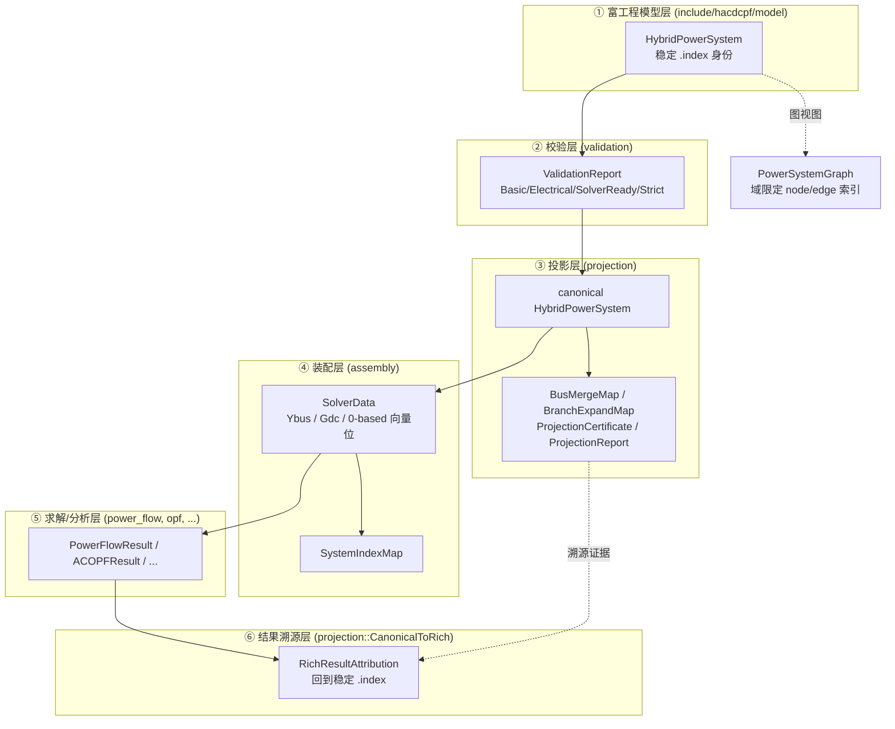
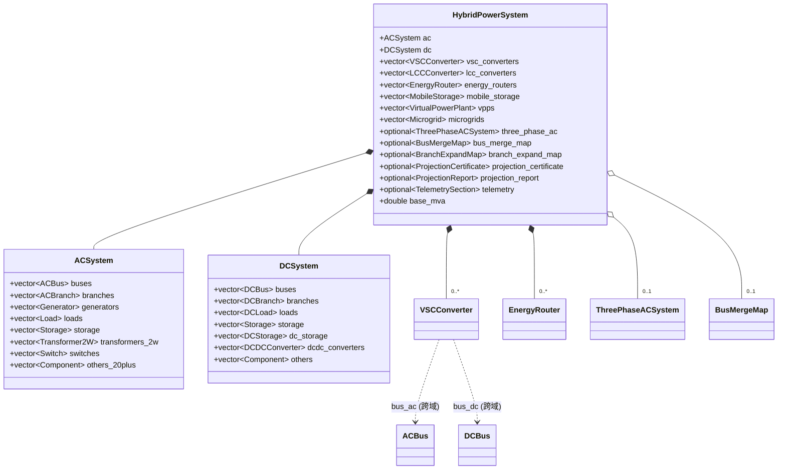
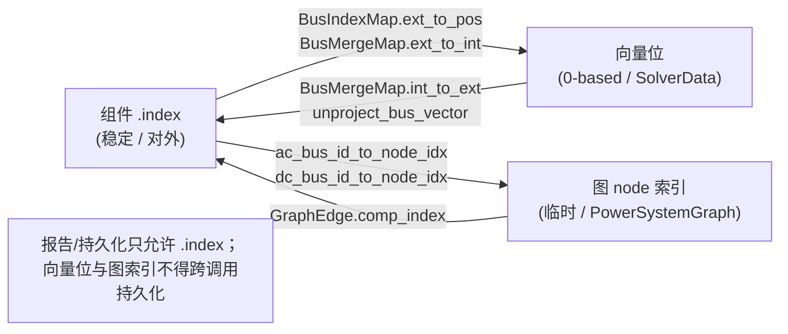
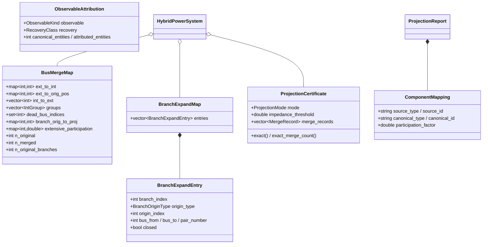
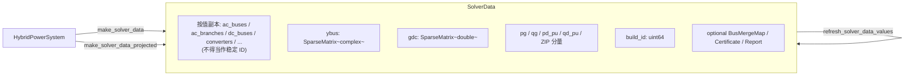

# 数据结构与 API 契约（面向未来应用）

Updated: 2026-08-17
Class: Contract（当前公共行为契约；行级细节在代码变更后需复核）

本文件是 HySim-XJTU-HRPES 全仓核心**数据结构**及其**关系**的可视化与 API 契约参考。
它回答三个问题：仓库里有哪些数据结构、它们如何相互引用、以及未来应用应当通过哪些
API/不变量来消费它们。运行时行为以 `include/`、`src/`、`tests/run_gui_server.cpp`、
`web/` 与已注册测试为准；本文件描述行为，不覆盖行为。

配套文档：

- 设计评审与潜在缺陷清单：[数据结构设计评审](data_structure_design_review.md)- 各分析模块内部数据结构（深化）：[各模块内部数据结构](module_data_structures.md)- 跨层"同一含义"语义契约：[模型/数据/结果语义契约](model_data_semantics_contract.md)
- 投影与结果溯源：[投影与结果归因](projection_and_results.md)
- 图与降阶：[图与降阶运行时契约](graph_runtime_contract.md)
- 可编辑参数：[参数系统](parameter_system.md)

---

## 1. 分层数据架构总览

整个仿真平台围绕一条数据流水线组织。每一层拥有**明确的身份空间**与**明确的所有权**，
层与层之间只通过显式的映射对象耦合。

三条贯穿全仓的**铁律**（见 [AGENTS.md](../AGENTS.md)）：

1. **AC/DC 域使用域限定映射**（`ac_bus_id_to_node_idx` / `dc_bus_id_to_node_idx`），
   禁止用裸 `int bus_id` 跨域传递。
2. **三类 ID 不混用**：组件 `.index`（对外稳定）、向量位（内部 0-based）、
   图 node/edge 索引（临时）。对外报告必须经映射回到稳定 ID。
3. **诚实结果口径**：近似 / fallback / time-limit / 模型覆盖不足必须写入 result 的
   `model_scope`、`ValidityFlags`、`model_limitations` 或 `RecoveryClass`。

---

## 2. 顶层容器与包含关系

`HybridPowerSystem` 是唯一的富模型根容器（[hybrid_power_system.hpp](../include/hacdcpf/model/hybrid_power_system.hpp)）。
它按域拆成 `ACSystem` / `DCSystem`，并在混合层直接持有跨域设备与聚合对象。

**所有权约定**（详见 [model_data_semantics_contract.md](model_data_semantics_contract.md)）：

| 概念 | 拥有者 | 说明 |
|---|---|---|
| 组件稳定身份 `.index` | 富模型 | 对外唯一稳定键；IO / GUI / 显式工作流可编辑 |
| 母线合并 / 支路展开映射 | 投影层 | 消费者视为**不可变证据**，不得改写 |
| 向量位、稀疏坐标 | 装配层 `SolverData` | 求解准备可刷新数值，绝不重定义公共身份 |
| 数值种子 `InitialState` | 求解器局部 | 仅初始化，绝不改动设定值或控制模式 |
| 结果证书 | 结果层 | 稳定 ID + 单位/索引空间 + 残差 + scope/validity |

---

## 3. 组件模型目录

所有组件为 **POD（聚合体）**，字段默认值即缺省语义（[defaults.hpp](../include/hacdcpf/model/defaults.hpp)
为常量唯一来源）。下表给出身份字段与跨对象耦合字段——这是理解关系图的关键。

### 3.1 AC 组件（[ac_components.hpp](../include/hacdcpf/model/ac_components.hpp)）

| 结构 | 语义角色 | 身份字段 | 耦合（引用）字段 |
|---|---|---|---|
| `ACBus` | AC 母线（PQ/PV/SLACK/ISOLATED） | `index` | — |
| `ACBranch` | π 型支路 / 展开支路 | `index` | `from_bus`, `to_bus` |
| `Transformer2W` / `Transformer3W` | 两/三绕组变压器 | `index` | `hv_bus`/`lv_bus`(/`mv_bus`) |
| `ExternalGrid` | 外部电网（松弛源） | `index` | `bus` |
| `Generator` | 同步机组（含成本/UC/惯量/次暂态） | `index` | `bus`, `is_slack` |
| `StaticGenerator` | 逆变型 DG（PV/风/CHP） | `index` | `bus` |
| `RenewableGen` | 不可调度新能源 | `index` | `bus` |
| `PVSystem` | 光伏+逆变器 | `index` | `bus` |
| `Load` | 一等负荷（ZIP/优先级/客户数） | `index` | `bus` |
| `FlexibleLoad` | 需求响应 | `index` | `bus` |
| `AsymmetricLoad` | 三相不平衡负荷 | `index` | `bus` |
| `Storage` | 储能（SOC/SOH/寿命，AC 与 DC 共用） | `index` | `bus` |
| `Switch` / `CircuitBreaker` | 开关 / 断路器 | `index` | `bus_from`, `bus_to` |
| `Shunt` | 并联电容/电抗 | `index` | `bus` |
| `AsynchronousMotor` | 异步电机（投影为等值负荷） | `index` | `bus` |
| `ChargingStation` / `Charger` | 充电站 / 充电桩 | `index` | `bus` / 归并入站 |
| `RegulatorControl` | 有载调压 / 调节器 | `index` | 目标支路/母线 |

### 3.2 DC 组件（[dc_components.hpp](../include/hacdcpf/model/dc_components.hpp)）

| 结构 | 语义角色 | 身份字段 | 耦合字段 |
|---|---|---|---|
| `DCBus` | DC 母线（DC_P / DC_V） | `index` | — |
| `DCBranch` | DC 支路（仅 `r_pu`） | `index` | `from_bus`, `to_bus` |
| `StaticGeneratorDC` | DC 侧源（PV/风/ESS） | `index` | `bus` |
| `PVArrayDC` | DC 光伏阵列 | `index` | `bus` |
| `DCLoad` | DC 负荷（ZIP/客户数） | `index` | `bus` |
| `DCStorage` | DC 储能（无无功；持久化表示） | `index` | `bus` |
| `DCCircuitBreaker` | DC 断路器 | `index` | `bus_from`, `bus_to` |

> **双表示注意**：`DCStorage` 是持久化 / IO / Web 表示；所有求解器消费 AC 风格的
> `Storage`。桥接由 `materialize_dc_storage()` 完成（幂等，把 `dc_storage` 追加进
> `dc.storage` 且清空原表）。详见 [model_data_semantics_contract.md](model_data_semantics_contract.md)
> 的 `dc_storage_execution_view()`。

### 3.3 换流器与能量路由（[converter_components.hpp](../include/hacdcpf/model/converter_components.hpp)）

| 结构 | 语义角色 | 身份字段 | 跨域耦合 |
|---|---|---|---|
| `VSCConverter` | AC-DC 电压源换流器（PQ/VDC_Q/GFM/限流 NCP） | `index` | `bus_ac`(AC), `bus_dc`(DC) |
| `LCCConverter` | 电网换相换流器（直流输电） | `index` | `ac_bus`(AC), `dc_bus`(DC) |
| `DCDCConverter` | DC-DC 变换器 | `index` | `bus_in`(DC), `bus_out`(DC) |
| `EnergyRouter` + `EnergyRouterPort` | 能量路由器（投影展开为 VSC+DCDC+内部 DC 母线） | `index`/`port.index` | 端口 `bus`+`port_type` |

`VSCConverter` 是全仓语义最重的结构，其 `p_set_mw` 的三重含义已被显式拆分为
`p_is_hard_constraint` / `p_schedule_mw` / `p_initial_mw`（多换流器模型 §16.3），并由
`model::resolve_gfm_norton_parameters` 作为 GFM 参数唯一优先级解析器。

### 3.4 三相与聚合

- 三相：`ThreePhaseACBus/Line/Transformer/Load/Generator/ExternalGrid/RegulatorControl`
  聚合于 `ThreePhaseACSystem`（`HybridPowerSystem::three_phase_ac` 可选）。
- 聚合：`VirtualPowerPlant`（投影为等值 `StaticGenerator`）、`Microgrid`（投影为等值源）。
- 共享：`DynamicModelProfile`（动态设备画像）、`TelemetrySection`（数字孪生遥测/状态种子）。

---

## 4. 三类 ID 与域限定映射

这是全仓最容易出错、也是设计上着力最多的地方。三类 ID 在 C++ 里都是 `int`，但语义不同：

`PowerSystemGraph`（[power_system_graph.hpp](../include/hacdcpf/graph/power_system_graph.hpp)）
同时提供：

- `bus_id_to_node_idx`：**遗留**共享映射，仅对 AC-only 消费者有效；AC/DC 同号母线时禁用。
- `ac_bus_id_to_node_idx` / `dc_bus_id_to_node_idx`：**权威**域限定映射，由
  `build_power_system_graph()` 填充；用 `ac_node_idx()` / `dc_node_idx()` 查询。
- `GraphEdge.edge_id`（图内位置）与 `GraphEdge.comp_index`（源模型 `.index`）严格区分；
  降阶器只按 `comp_index` 禁用模型组件。

### 4.1 强类型 ID（新代码边界，opt-in）

为在编译期隔离三类索引空间，[typed_ids.hpp](../include/hacdcpf/model/typed_ids.hpp)
提供三个轻量强类型（均包装 `int`，显式构造 + `.value()` 访问，**无隐式跨空间转换**）：

| 强类型 | 对应空间 | 可持久化/可上报 |
|---|---|---|
| `StableBusId` | 组件 `.index`（稳定/对外） | 是（唯一允许进入结果/JSON/GUI 的空间） |
| `VectorPos` | 0-based 求解/向量位 | 否（仅内部） |
| `NodeIdx` | `PowerSystemGraph` 节点索引 | 否（仅临时） |

**使用契约**：新增的公共 API 边界应用强类型参数（而非裸 `int`）以获得编译期保护；
存量代码保持 `int` 并可渐进迁移。隔离性由 `[typed_ids]` 回归（`static_assert` 不可隐式
转换）保障。默认值为负值"未设"哨兵，`valid()` 判定 `>=0`。

---

## 5. 投影与溯源类型

投影层（[canonical_network.hpp](../include/hacdcpf/projection/canonical_network.hpp)）
把富模型投影成 canonical 求解模型，并**随行携带**全部溯源证据。

**语义要点**（与 [projection_and_results.md](projection_and_results.md) 的 8 条不变量一致）：

- **强度量（intensive，如电压）** 在合并后**广播**回每个原始成员母线。
- **广延量（extensive）** 按参与因子**拆分**，绝不盲目广播。`BusVectorSemantics` 提供两种
  广延语义：`ExtensiveDemand`（= `Extensive`，负荷基 `extensive_participation`，如切负荷）与
  `ExtensiveGeneration`（发电基 `generation_participation`，如机组出力再分配）；两者基数为零时
  退化为等分。
- **小阻抗不构成节点同一性**：仅当开关/断路器语义或 `ACBranch::ideal_connectivity`
  显式声明时才收缩（投影主路径）。
- **尺寸不匹配是诊断**：`unproject_bus_vector` 在输入尺寸 ≠ `n_merged` 时抛异常，
  不做静默补零。
- **DC 死岛剥离与恢复**：`strip_dead_dc_islands` 移除无源 DC 孤岛（无换流器、无源、无
  连通路径的 DC 母线；停运换流器与闭合 DC 断路器仍算连通/保留），并在
  `ProjectionCertificate`（`n_prestrip_dc_buses` / `dc_prestrip_to_survivor` /
  `dc_dead_bus_indices` / `has_dc_strip()`）记录映射。`unproject_dc_bus_vector` 把 DC 结果
  向量恢复到授权 DC 母线序（被剥离母线→0 pu）；恢复已接入主 PF 门面、`solve_handle`、
  `solve_dc_power_flow` 与 AC OPF。无死岛时为恒等无操作。

结果回投影（[result_attribution.hpp](../include/hacdcpf/projection/result_attribution.hpp)）：
`RichToCanonicalOperator`（Π：Rich→Canonical，返回 `ProjectionBundle`）与
`CanonicalToRichOperator`（A_S：Obs(Π(S))→Obs(S)，返回 `RichResultAttribution`），
每个恢复值带 `RecoveryClass`（Strong / Approximate / AuditOnly / Unsupported）。

---

## 6. 装配层：SolverData

`SolverData`（[solver_data.hpp](../include/hacdcpf/assembly/solver_data.hpp)）是投影模型的
**扁平数值副本** + 预装配矩阵，供 PF/OPF 求解器直接消费。

- 头注释明确声明：向量位**不是**稳定 ID，公共身份与结果恢复仍归富模型 + 投影映射所有。
- `refresh_solver_data_values()` 是快路径：仅当富模型与既有 canonical 布局一一对应、
  且拓扑/网络参数未变时返回 `true`（重复潮流会话复用 `build_id`，避免重复符号分析）。
- 索引映射：`BusIndexMap` / `BranchIndexMap` / `SystemIndexMap`
  （[index_map.hpp](../include/hacdcpf/assembly/index_map.hpp)），`merge_map` 为非拥有指针。

---

## 7. 错误处理：Result&lt;T&gt;

`Result<T>` + `Error` + `ErrorCode`（[error.hpp](../include/hacdcpf/model/error.hpp)）
是无异常批处理的统一返回通道。

| 元素 | 契约 |
|---|---|
| `Result<T>` | `std::variant<T, Error>`，`operator bool`/`has_value()`/`value()`/`error()`/`value_or_throw()` |
| `ErrorCode` | 分段编码：结构 1000+、求解 2000+、IO 3000+、通用 9000+ |
| `Error` | `code` + `message` + `details`（校验问题列表）；工厂 `validation_failed`/`not_converged`/`parse_error` |

公共求解入口既有 `solve_*`（抛出/直接返回结果）也有 `safe_solve_*`（返回 `Result<T>`，
可选先做校验）。**外部集成优先用 `safe_*` 变体**。

---

## 8. 公共 API 契约

统一门面：[api/hacdcpf.hpp](../include/hacdcpf/api/hacdcpf.hpp)；运行时后端能力查询：
`get_solver_capabilities()`（[solver_capabilities.hpp](../include/hacdcpf/api/solver_capabilities.hpp)）。

| 能力 | 代表性入口 | 输入 → 输出 |
|---|---|---|
| 校验 | `validate_full(sys)` | `HybridPowerSystem` → `ValidationReport` |
| 投影 | `project_to_canonical_models(sys[, options])` | 富模型 → canonical 模型（+映射） |
| 潮流 | `solve_power_flow` / `safe_solve_power_flow` | 富模型 → `PowerFlowResult` / `Result<...>` |
| 直流潮流 | `solve_dc_power_flow` | → `DCPowerFlowResult` |
| 变体潮流 | `solve_power_flow_{adaptive,islanded,fdpf,helm,homotopy,newton_krylov}` | 各自声明适用域/拒绝条件 |
| 重复求解 | `PreparedPowerFlowSession` / `SolverHandle` | 复用投影/装配/符号分析 |
| 结果回投影 | `projection::CanonicalToRichOperator::apply(...)` | canonical 结果 → 稳定 ID 归因 |

**API 稳定性分级建议**（本文件确立，供未来演进遵循）：

- **Tier-1 稳定**：`HybridPowerSystem` 及所有组件 POD 的字段语义、`.index` 身份、
  `Result<T>`、`solve_power_flow`/`safe_solve_power_flow`、`project_to_canonical_models`、
  `BusMergeMap` 公共字段、`unproject_bus_vector` 契约。变更需走弃用周期。
- **Tier-2 演进**：`SolverData` 内部布局、`ProjectionReport` 诊断文本、变体求解器选项。
- **Tier-3 内部**：向量位、图 `edge_id`、求解器局部状态——不进入任何持久化/序列化。

---

## 9. 面向四类未来应用的 API 契约

针对本次确认的四个未来方向，给出应遵循的消费契约：

### 9.1 内部 C++ 复用（新增求解/分析模块）

- **入口**：富模型进（`const HybridPowerSystem&`），先 `project_to_canonical_models`
  再 `make_solver_data(_projected)`；绝不自行按 `bus.index-1` 手工建位映射，改用
  `BusIndexMap`/`SystemIndexMap`。
- **出口**：结果向量必须声明索引空间与单位；对外报告经 `unproject_bus_vector`
  （强度量 `Intensive`，广延量 `Extensive`）或 `CanonicalToRichOperator` 回到 `.index`。
- **诚实**：近似/覆盖不足写入 result 的 `model_scope`/`ValidityFlags`/`RecoveryClass`。

### 9.2 JSON 序列化 / GUI 前后端契约

- 只序列化 Tier-1 身份与工程字段；**禁止**把向量位/图索引写入 JSON。
- Schema 版本以 `Defaults::kSchemaVersion`（当前 `"1.1"`）为准；新增字段保持向后兼容默认值。
- GUI 结果帧（PF/OPF/TSPF）使用同一套 `.index` 组件键（见 projection 契约）。

### 9.3 外部集成（Python 绑定 / 第三方求解器 / 数据 I/O）

- 通过 `safe_*` + `Result<T>` 暴露无异常边界；`Error.code` 映射为宿主语言异常/错误码。
- 第三方求解器只消费 `SolverData`（Ybus/Gdc + 注入向量），身份恢复留给映射对象。
- I/O 适配器（MATPOWER/CIM/GridLAB-D/…）只写富模型的稳定字段，`ideal_connectivity`
  等投影提示由导入器显式置位，绝不用"小阻抗"推断。

### 9.4 可维护性 / 重构 / 稳定 ID 治理

- 新增组件类型时，同步登记到 `model::component_runtime_semantics()` /
  `io::component_io_mappings()` /（若跨层）`model_semantics.hpp`，并补齐投影/剥离/合并/
  终端流/装配五处的处理（见评审文档"变更放大"一节）。
- 任何"同一含义"跨层验证以 `model::module_data_contracts()` 为准入守卫。

---

## 10. 不变量与版本

| 不变量 | 位置 |
|---|---|
| 投影对已带证书的 canonical 模型幂等 | `project_in_place` 幂等守卫 |
| 合并 / 死岛映射**组合**而非覆盖 | `strip_dead_islands` 组合 `branch_orig_to_proj` |
| 强度量广播、广延量按参与因子拆分 | `unproject_bus_vector` |
| 尺寸不匹配抛异常，绝不静默补零 | `unproject_bus_vector` 尺寸检查 |
| 求解器按 `bus.index-1` 定位 ⇒ canonical 母线必须 1 基连续 | `merge_zero_impedance_buses_impl` |
| 域限定查询权威 | `PowerSystemGraph::ac/dc_node_idx` |

- Schema 版本：`Defaults::kSchemaVersion = "1.1"`；包版本：`kPackageVersion = "0.5.0"`。
- 常量唯一来源：[defaults.hpp](../include/hacdcpf/model/defaults.hpp)。
