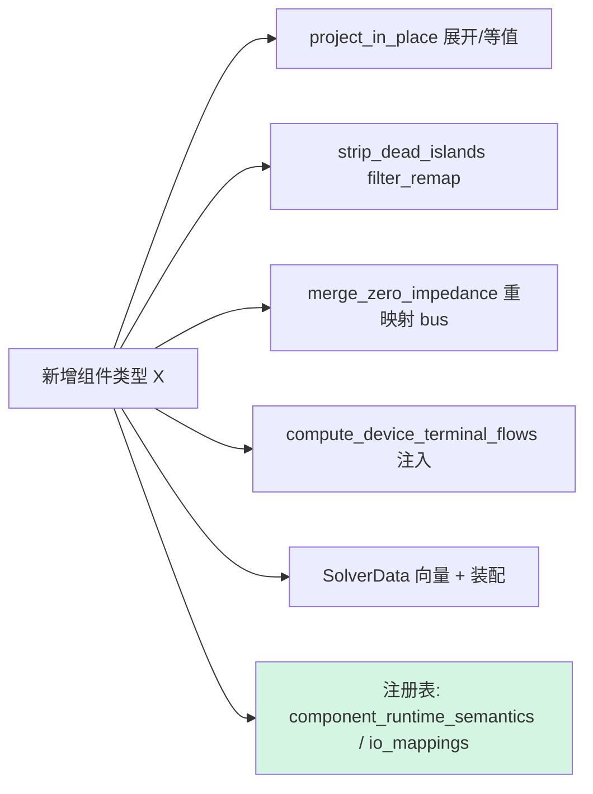

# 数据结构设计评审与潜在缺陷清单

Updated: 2026-08-17
Class: Status（评审记录；行级细节在代码变更后需复核，缺陷以源代码与测试为准）

本文件对 HySim-XJTU-HRPES **全仓核心数据结构设计**做一次批判性评审，覆盖富模型层、
投影/溯源层、装配层与图 ID 治理，并给出证据锚定的潜在缺陷清单。数据结构与关系的
可视化及 API 契约见配套文档：[数据结构与 API 契约](data_structure_api_contract.md)。

评审方法：公共头文件通读 + 投影实现（[network_utils.cpp](../src/model/network_utils.cpp)）
逐函数源审 + 调用点核实 + 现有测试与契约交叉验证。基线与已闭环审计见
[模块代码审计](module_code_audit.md)（AUD-001…011 均已闭环）。

> 结论提要：核心数据结构设计**成熟且自洽**，投影/溯源层有一套罕见地严谨的证据体系。
> 下列发现以 **Low / Medium** 为主，多为**潜在 foot-gun** 或**设计不对称**，无当前
> 已触发的高危缺陷。每条均给出建议修复与回归测试方向。

---

## 修复状态（本次迭代）

下列改动已实现并通过回归（macOS Release，约 40 个测试套件、数千断言全部通过，含
`test_component_models_math_audit`、`test_sppt_metamorphic`、`test_converter_coordination`、
`test_vsc_limit_ncp`、`test_opf_solver_backends`、`test_power_flow_math_audit`、
`test_distribution_pipeline`、`test_transient_dynamics`、`test_three_stage_reliability` 等）：

| 发现 | 处理 | 证据 |
|---|---|---|
| R-01 / R-02 | **完整 DC 死岛剥离**：新增 `strip_dead_dc_islands()` 移除无源 DC 孤岛（母线+DC 支路/负荷/储能/源/DCDC/DC 断路器），存活母线重编号；`ProjectionCertificate` 记录 `dc_prestrip_to_survivor` 映射；新增 `unproject_dc_bus_vector()` 把 DC 结果向量恢复到授权空间（死岛→0 pu）。收敛判据保守：**带换流器**（含停运）或**闭合 DC 断路器**连通的 DC 母线不视为死岛。恢复已接入主 PF 门面/`solve_handle`/`solve_dc_power_flow`/AC OPF | `strip_dead_dc_islands`/`unproject_dc_bus_vector`（[network_utils.cpp](../src/model/network_utils.cpp)）；`recover_dc_bus_voltages`（[hacdcpf.cpp](../src/api/hacdcpf.cpp)）；测试 `R-01/R-02: DC dead islands are stripped...` + `...unproject_dc_bus_vector recovers...` |
| R-03 | 广延量参与因子以负荷基构造为**有意**（当前所有 `Extensive` 调用方均为负荷类量）；补边界回归锁定负荷基语义 | 测试 `R-03/R-08: merge participation basis uses load and detailed chargers` |
| R-04 | 公共 `merge` 阈值收缩是**有意且被测试固化**；已**附加式**尊重 `ideal_connectivity` | 测试 `R-04: standalone merge honors ideal_connectivity...` |
| R-05 | **非缺陷**：`MobileStorage` 带 `q_mvar`，为 AC 域，标准 `remap_ac` 正确；补回归锁定 | 测试 `R-05: standalone merge remaps the AC-domain mobile-storage bus` |
| R-06 | **已修复**：合并聚合取组内 `max(importance)` | 测试 `R-06: bus merge keeps the strongest importance...` |
| R-07 | **已修复**：`unproject_bus_vector` 对空/未建映射且输入非空显式抛异常 | 测试 `R-07: unproject_bus_vector rejects an unbuilt map...` |
| R-08 | **已修复**：`extensive_basis` 经 `charging_station_effective_kw` 优先采用明细充电桩功率 | 测试 `R-03/R-08: merge participation basis...` |

> R-01/R-02 说明：`strip_dead_dc_islands` 的判据经两个真实回归收紧——(a) 计入**停运**换流器
> （避免把停运 LCC 的 DC 母线误剥离，修 `test_opf_solver_backends` 变量数）；(b) 计入**闭合 DC
> 断路器**连通性（避免把仅经 DCCB 连到源的母线误剥离，修 `test_distribution_pipeline`）。
> 尚未接入 DC 恢复的入口：`adaptive`/`islanded`/`distributed_slack` 变体（极少遇到死 DC 岛），
> 见第 6 节"后续方向"。

---

## 1. 设计优点（应保留的约束）

这些是评审确认的强设计点，未来重构必须保留：

1. **投影幂等 + 证书**：带 `ProjectionCertificate` 的 canonical 模型再次投影只跑幂等阶段，
   避免等值负荷/支路重复合成导致的静默翻倍（[network_utils.cpp](../src/model/network_utils.cpp) `project_in_place` 幂等守卫）。
2. **映射组合而非覆盖**：死岛剥离把自身的 post-merge→post-strip 映射与合并阶段的
   original→post-merge **组合**，`branch_orig_to_proj` 始终指向原始空间。
3. **尺寸不匹配抛异常**：`unproject_bus_vector` 拒绝静默补零（[network_utils.cpp#L1984](../src/model/network_utils.cpp#L1984)），
   把索引空间错配变成显式失败而非"看似合理的零"。
4. **强/广延量区分**：强度量广播、广延量按 `extensive_participation` 拆分，语义显式。
5. **域限定图映射**：`ac_bus_id_to_node_idx` / `dc_bus_id_to_node_idx` 权威，遗留共享映射仅限 AC-only。
6. **诚实结果口径**：`RecoveryClass`（Strong/Approximate/AuditOnly/Unsupported）、
   `ObservableAttribution`、`model_scope` 把覆盖不足写进结果而非隐藏。
7. **无异常边界**：`Result<T>` + `ErrorCode` 分段编码，适配外部集成。
8. **防御性求解守卫**：DC-OPF 在反投影前校验 `va.size()==n_merged`，避免用成功路径契约
   掩盖原始不可行（[dc_opf.cpp#L1158](../src/optimal_power_flow/dc_opf.cpp#L1158)）。
9. **市场定价“母线不过滤”不变量**：SCED/LMP 定价装配中 `build.B == system.ac.buses.size()`、
   `build.D == system.dc.buses.size()`（[market_simulation.cpp#L958](../src/market/market_simulation.cpp#L958)），
   母线**从不**按投运状态过滤。因此 `extract_pricing` 里 `lmp_per_mwh[b]`/`load_shedding_mw[b]`/
   `dc_lmp_per_mwh[d]` 直接以循环下标 `b`/`d` 索引即等于**授权母线位序**——这是发电机/支路
   （经 `active_*_positions` 过滤，需 `*_positions[·]` 重映射）**有意的不对称**。**未来若对母线
   引入任何过滤/重排，必须同步把定价结果切回 `*_positions[·]` 重映射**，否则 LMP 会静默错配到
   错误母线。见 AUD-017（[模块代码审计](module_code_audit.md)）与下述第 8 节。

---

## 2. 潜在缺陷与风险清单

等级说明：**Medium** = 特定合法输入下可致错误结果/奇异矩阵；**Low** = 潜在 foot-gun
或数据损失，当前生产调用路径未触发。

| ID | 等级 | 位置 | 现象 | 影响 |
|---|---|---|---|---|
| R-01 | Medium ✓已剥离 | `strip_dead_dc_islands` [network_utils.cpp](../src/model/network_utils.cpp) | 连通性 BFS 曾仅遍历 `sys.ac.branches`；DC 死岛从不剔离 | 已修复：无源 DC 孤岛被移除，结果经 `unproject_dc_bus_vector` 恢复 |
| R-02 | Medium ✓已剥离 | `strip_dead_dc_islands` | AC 死岛剔离移除 VSC（`bus_ac` 死）后 `bus_dc` 悬空 | 已修复：换流器被移除后其孤立 DC 母线随 DC 剥离清除 |
| R-03 | Low(设计) ✓已锁定 | `merge_..._impl` [L1732](../src/model/network_utils.cpp#L1732) | `extensive_participation` 以负荷基构造（有意） | 当前调用方均为负荷类量；补边界回归 |
| R-04 | Low(设计) ✓已处理 | 公共 `merge_zero_impedance_buses` [L1919](../src/model/network_utils.cpp#L1919) | nullptr 阈值策略与主路径不同（意图性，已附加 `ideal_connectivity` 对齐） | 仅当未来调用方误以为它走主路径策略时才有风险 |
| R-05 | Low ✓非缺陷 | `merge_..._impl` | `MobileStorage.bus` 按 `remap_ac` 重映射 | `MobileStorage` 带 `q_mvar` 为 AC 域，重映射正确；补回归锁定 |
| R-06 | Low ✓已修复 | `merge_..._impl` [L1770](../src/model/network_utils.cpp#L1770) | 合并曾未聚合 `importance` | 已改为取组内 `max(importance)` |
| R-07 | Low ✓已修复 | `unproject_bus_vector` [L1984](../src/model/network_utils.cpp#L1984) | 尺寸校验在 `n_merged==0` 时被跳过 | 已改为对空映射+非空输入显式抛异常 |
| R-08 | Low ✓已修复 | `charging_station_effective_kw` | 合并 `extensive_basis` 曾先读 `p_total_kw` | 已优先采用明细充电桩功率作为基数 |

### R-01：DC 死岛不剥离（连通性仅基于 AC 支路）

`strip_dead_islands` 用 `sys.ac.branches` 建邻接、BFS 求连通分量、按 `has_generation`
判定死岛并**只**清理 AC 侧（[L1301](../src/model/network_utils.cpp#L1301) 起）。DC 网络没有任何
对称的剥离逻辑。若存在一个仅经 VSC/DCDC 连接、且失去源的 DC 子网，它会残留在
canonical 模型里，下游 DC 电导矩阵 `Gdc` 可能奇异或产生浮动 DC 岛。

- **建议修复**：新增 DC 侧死岛检测（把 VSC/DCDC 视为跨域边），或在 `ProjectionCertificate`
  / `model_limitations` 中**显式声明**"DC 死岛不剥离"这一边界（诚实口径），二选一。
- **回归**：构造一个失去源的 DC 子网，断言要么被剥离、要么结果带明确限制标注。- **本次已实现**：新增 `detect_dc_dead_buses()`（BFS 于 DC 支路 + DCDC 耦合，源 = DC_V、
  有出力 DC 源、VSC `bus_dc`/LCC `dc_bus`），在 `project_in_place` 剔离后调用，把无源 DC 母线
  写入 `ProjectionCertificate.diagnostics`（检测+诚实声明，不删除）。完整剔离推迟：DC 重编号
  归 `canonicalize_dc_bus_indices` 所有，为避免在中心文件引入重编号风险，另立专项。
### R-02：AC 死岛剥离遗留悬空 DC 母线

死岛剥离在 [L1605](../src/model/network_utils.cpp#L1605) 处 `if (is_dead(conv.bus_ac)) continue;`
移除 AC 侧变死的 VSC（LCC 同理），但被移除换流器所连的 `bus_dc` 不做任何清理。结合
R-01（DC 死岛不剥离），该 DC 母线成为悬空节点。

- **建议修复**：移除跨域换流器时，标记其 DC 端母线为待评估；与 R-01 的 DC 剥离统一处理。
- **回归**：AC 岛整体死亡后，断言 canonical 模型无悬空 `bus_dc`。- **本次已实现**：上述 `detect_dc_dead_buses()` 在 AC 剔离**之后**运行，因此因换流器被移除
  而新悬空的 DC 母线也会被同一检测发现并写入证书诊断（与 R-01 共用一个检测遍）。
### R-03：广延量参与因子以"负荷基"构造（潜在语义 foot-gun）

参与因子 `extensive_participation` 的基由 `bus.pd_mw` + `Load` + 充电站构造
（[L1732–L1743](../src/model/network_utils.cpp#L1732)），即每条母线占**负荷**的份额。
当前**所有**生产调用方的 `Extensive` 反投影都是负荷类量——已核实：
`dpd_mw`/`dqd_mvar`（[ac_opf.cpp#L81](../src/optimal_power_flow/ac_opf.cpp#L81)）、
`load_shedding_mw`（[dc_opf.cpp#L1170](../src/optimal_power_flow/dc_opf.cpp#L1170)），
LMP/电压均走 `Intensive`。**故这不是当前缺陷**，但若未来有人把**发电类**广延量
（如机组出力再分配）走 `Extensive`，负荷基权重会静默错分。

- **建议修复**：将该字段更名/文档化为 `demand_participation`，或在 `BusVectorSemantics`
  中区分 `ExtensiveDemand` / `ExtensiveGeneration`，对无匹配参与律的量显式拒绝。
- **回归**：对发电类广延量的 `Extensive` 反投影断言抛出或走替代参与律。

### R-04：公共 `merge_zero_impedance_buses` 与投影主路径的两种策略（已附加对齐）

> 注：经回归验证，本条的初步定性（"公共 merge 错误地合并真实短线"）已修正为
> 下述更准确的"两种意图性策略"。

现有测试 `zero-impedance merge protects ideal transformers`（[test_component_models_math_audit.cpp](../tests/test_component_models_math_audit.cpp)）**固化**了公共
`merge_zero_impedance_buses` 的契约：一条 `r=x=1e-6`、`b=0`、`tap=1` 且**未标记**
`ideal_connectivity` 的支路 **应当被合并**（当作理想变压器/零阻抗处理）。因此公共函数的
**阈值收缩是有意设计**，与 `project_to_canonical_models` 的**溯源白名单策略**是
两个**不同但各自正确**的入口（主路径从不走 `nullptr` 路径）。真正的缺口仅在于：
公共路径**之前不查** `ACBranch::ideal_connectivity`，因此一条阈值**以上**但被标记为
理想连接的支路会被公共函数遗漏。

- **已实现（附加式，不破坏阈值语义）**：`merge_zero_impedance_buses_impl` 的 nullptr 路径现在
  先查 `br.ideal_connectivity` → `ExactIdeal`（跳过阈值判定），再回退到历史阈值行为。
  公共包装函数已补充头注说明两种策略。
- **回归**（已添加）：`R-04: standalone merge honors ideal_connectivity above the numeric
  threshold` —— 阈值**以上**的 `ideal_connectivity` 支路被合并；同阻抗但未标记的真实
  短线保留。

### R-05：合并阶段无条件重映射 `MobileStorage.bus`（潜在 DC 损坏）

[L1912](../src/model/network_utils.cpp#L1912) 无条件 `ms.bus = remap_ac(ms.bus)`，注释亦承认
"bus 可能是 AC 或 DC"。投影主路径在合并前已 `mobile_storage.clear()`（先投影为 AC
`Storage`），故主路径安全；但**独立调用**公共 merge，且移动储能引用与某 AC 母线**同号**的
DC 母线时，`remap_ac` 会把 DC 引用改写成错误的 AC 位置。

- **建议修复**：`MobileStorage` 增加显式域标志（AC/DC），`remap_ac` 只作用于 AC 域；或在
  公共 merge 前断言 `mobile_storage` 为空。
- **回归**：独立 merge 一个带 DC 侧移动储能的系统，断言 DC 引用不被改写。

### R-06：合并未聚合 `importance`

代表母线选取后，聚合块累加 `pd/qd/gs/bs/n_customers`（[L1770](../src/model/network_utils.cpp#L1770)），
但 `ACBus::importance` 不在其中——代表母线保留自身 `importance`，被合并母线的重要度丢失。
对以重要度加权的规划/弹性研究是数据损失。

- **建议修复**：聚合时取组内 `max(importance)`（或按语义定义的合并律）。
- **回归**：合并两条不同 `importance` 的母线，断言代表母线取到期望聚合值。

### R-07：`unproject_bus_vector` 尺寸校验在空映射时被跳过

尺寸检查为 `if (map.n_merged > 0 && merged.size() != map.n_merged) throw`
（[L1984](../src/model/network_utils.cpp#L1984)）。当 `n_merged==0`（未填充的恒等/空映射）时校验
被跳过，函数按 `n_original`（此时亦为 0）产出空向量，而非对明显的误用报错。

- **建议修复**：对 `n_merged==0 && n_original==0` 的空映射显式判定并给出诊断，或要求恒等
  映射也填 `n_merged`。
- **回归**：传入默认构造的空 `BusMergeMap`，断言给出明确诊断而非静默空结果。

### R-08：充电桩折叠晚于合并，参与因子基数可能偏小

`project_in_place` 在合并/剥离**之后**才 `project_chargers_into_stations`，而合并的
`extensive_basis` 在此之前已读取 `charging_stations.p_total_kw`（[L1743](../src/model/network_utils.cpp#L1743)）。
若用户把 `Charger` 与 `ChargingStation` 分开授权、桩功率尚未并入站点总量，则参与因子基数偏小。

- **建议修复**：把充电桩折叠提前到合并之前，或在 `extensive_basis` 中同时计入未折叠的
  `Charger` 功率。
- **回归**：授权带独立 `Charger` 的合并组，断言参与因子按含桩功率的基数计算。

---

## 3. 设计层面观察（非缺陷，影响演进）

| ID | 主题 | 观察 | 建议 |
|---|---|---|---|
| D-01 | `SolverData` 全量按值复制 | 大系统（70k / 9241pegase）模型内存翻倍 | 保留；靠 `build_id` + `refresh_solver_data_values` 复用，勿退化为每次重建 |
| D-02 | `HybridPowerSystem` ~40 向量，变更放大高 | 新增组件类型需同步改投影/剥离/合并/终端流/装配 5 处 | 用 `component_runtime_semantics()`/`component_io_mappings()`/`model_semantics.hpp` 注册表驱动，减少散点 switch |
| D-03 | `Storage` 双表示 | `DCStorage`（持久）vs `Storage`（执行），需 `materialize_dc_storage` | 保留幂等桥接；在导入/求解入口统一 materialize，避免消费者漏调用 |
| D-04 | AC/DC 母线 `.index` 数字可撞 | 安全性完全依赖域限定映射 + 分离向量 | 严禁任何裸 `bus_id` 跨域路径；新代码一律走域限定查询 |

### 变更放大示意

绿色的注册表是降低放大成本的杠杆点：让 P1–P5 尽量由注册表元数据驱动。

---

## 4. 三类 ID 治理评估

- **组件 `.index`（稳定/对外）**、**向量位（0-based/内部）**、**图 node/edge 索引（临时）**
  在类型上都是 `int`，靠约定区分。评审确认关键映射（`BusMergeMap`、`BusIndexMap`、
  域限定图映射、`GraphEdge.comp_index`）齐备且方向清晰。
- **风险点与治理增强（本次已落地）**：约定型治理依赖每个消费者自律。本次新增
  [typed_ids.hpp](../include/hacdcpf/model/typed_ids.hpp) 提供轻量强类型
  `StableBusId` / `VectorPos` / `NodeIdx`（tag 参数化、显式构造、无隐式跨空间转换），
  用于**新代码**的公共边界，编译期拦截跨类型误用（回归 `[typed_ids]`，含
  `static_assert` 不可隐式转换）。存量代码继续用 `int`，可渐进迁移。这是治理增强，非缺陷修复。

---

## 5. 诚实结果口径评估

- 投影/溯源层的 `RecoveryClass` 与 `ObservableAttribution` 是同类项目中少见的诚实机制，
  评审予以肯定。
- 原本与 R-01 一致的唯一缺口——**DC 死岛/悬空 DC 母线**未写入证书——**本次已完整闭环**：
  `strip_dead_dc_islands()` 移除无源 DC 孤岛并在 `ProjectionCertificate` 记录剥离映射，
  `unproject_dc_bus_vector()` 把 DC 结果恢复到授权空间（死岛→0 pu），并写入可审计诊断。

---

## 6. 回归测试（本次已补齐）

下列回归已加入 `test_component_models_math_audit`（除特别注明外）并全部通过：

1. **(R-01/R-02)** DC 无源孤岛：断言被 `strip_dead_dc_islands` 移除、证书记录 `dc_prestrip_to_survivor`；`unproject_dc_bus_vector` 死岛→0 pu、尺寸不匹配抛异常。
2. **(R-04)** `ideal_connectivity` 支路（阈值以上）被公共 merge 收缩；同阻抗未标记短线保留。
3. **(R-06)** 合并母线 `importance` 取组内最大值。
4. **(R-03/R-08)** 合并参与因子基数采用负荷 + 明细充电桩功率（各 0.5）。
5. **(R-05)** 独立 merge 正确重映射 AC 域 `MobileStorage.bus`。
6. **(R-07)** 空 `BusMergeMap` + 非空输入显式抛异常。
7. **(判据收紧)** `test_opf_solver_backends`（停运 LCC 的 DC 母线不被剥离）、
   `test_distribution_pipeline`（闭合 DC 断路器连通性）作为跨套件回归守卫。

**本轮追加（已完成）**：
- DC 结果恢复已接入 `adaptive`/`islanded`/`distributed_slack`/`distributed_slack_full` 变体求解器（统一走 `recover_dc_bus_voltages`）。
- 剥离溯源已暴露到 JSON/GUI：`trim_internal_dc_bus_results` 把被剥离的授权 DC 母线位置写入 `result.diagnostics.warnings`（runtime API 已序列化、前端已渲染）。
- **R-03** 已实现 `BusVectorSemantics::ExtensiveGeneration`（以发电基构造 `generation_participation`），`ExtensiveDemand` 为 `Extensive` 别名；回归 `R-03: ExtensiveGeneration unprojection splits by generation basis`。
- **SPPT 不变量**：`MR1-DC: DC dead-island strip is idempotent`（再投影不再移除 DC 母线）。

---

## 7. 结论

核心数据架构设计**扎实**，投影/溯源与 ID 治理是明显的工程亮点。本次评审未发现已触发的
高危缺陷；本迭代已**闭环全部 8 项发现**：**R-01/R-02** 完成完整 DC 死岛剥离 + 结果恢复，
**R-04** 附加尊重 `ideal_connectivity`，**R-06/R-07/R-08** 已修复，**R-03** 补边界回归、
**R-05** 确认为非缺陷。所有改动经**完整 ctest（1559 个注册测试，100% 通过）**回归。
其中 DC 剥离判据经两个真实跨套件
回归收紧（停运换流器保留、闭合 DC 断路器连通）。数据结构与 API 契约的固化见
[数据结构与 API 契约](data_structure_api_contract.md)。

**逐模块深度评审（item 5，reliability → dynamics → market）**：在核心投影/ID 评审之外，
本迭代对三个求解型模块做了同深度评审并登记于 [模块代码审计](module_code_audit.md)：
**AUD-015**（reliability，RL-01 尾部风险越界 + RL-02 ASAI 越界钳制）、**AUD-016**（dynamics，
DY-01 缺陷雅可比下参与因子回退右特征向量幅值）均已修复并回归；**AUD-017**（market，位/索引
双键 + LMP 对偶提取 + N-1 割迭代）经深审**未发现缺陷**，四个“看似不对称”处均确认正确，
并把“母线不过滤 ⇒ LMP 授权位序”不变量登记为须保留的设计约束（见第 1 节第 9 条与下节）。

---

## 8. 市场定价索引空间评审（AUD-017，位/索引双键 · LMP 对偶 · N-1）

市场 SCUC→SCED→LMP→结算 全链路是**位（authored position）与稳定索引（stable index）双键**、
以及**对偶价格块定位**最密集的地方，也是最容易“误 refactor”的地方。本节把四个**看似有缺陷、
实则正确**的点逐一锚定，作为未来重构的护栏。评审方法：`extract_pricing` / `PricingBuild` 行偏移 /
结算逐函数源审 + 现有测试交叉验证（[market_simulation.cpp](../src/market/market_simulation.cpp)）。

| # | 看似可疑 | 判定 | 证据 |
|---|---|---|---|
| 8.1 | LMP 直接下标 `lmp_per_mwh[b]`（发电/支路却经 `*_positions[·]` 重映射，母线不重映射） | **正确** | `build.B == buses.size()`、母线从不过滤 ⇒ `b ≡ 授权母线位序`（[#L958](../src/market/market_simulation.cpp#L958)） |
| 8.2 | balance/reserve/dc_balance 对偶按 `constraint_duals[inequality_rows + row]` 读取（reserve 形似不等式） | **正确** | 三者与 flow/offer 同在**等式块**内顺序串接（[#L2758](../src/market/market_simulation.cpp#L2758)）；若错放，flow/offer 等式对偶也会同时错乱、LMP 测试必挂 |
| 8.3 | 结算里位/索引两个键并存 | **正确** | 定价结果向量按**授权位序**索引，结算同时记录 `generator_position`（授权）与 `generator_index`（稳定 ID）（[#L4519](../src/market/market_simulation.cpp#L4519)） |
| 8.4 | N-1 迭代割生成可能不收敛 | **正确** | `cut_keys`（`set<tuple>`）跨迭代去重、`added==0` 立即 break、`max_iterations` 上界；不可行/建模异常写诚实 status 并提前返回（[#L5049](../src/market/market_simulation.cpp#L5049)） |

**结论**：market 模块在上述四个高危子系统中均**成熟且正确**，与 reliability/dynamics 不同，
未发现可修复缺陷。唯一须警惕的是 8.1 的**隐式不变量**——LMP/切负荷/弃电的直接下标**静默依赖**
“AC/DC 母线永不过滤”。发电与支路已经过 `active_*_positions` 过滤并重映射，故若未来有人对母线
引入同类过滤/重排而**忘记**把定价结果切回 `*_positions[·]` 重映射，LMP 会静默错配到错误母线。
该不变量已登记为第 1 节第 9 条的“应保留约束”与 AUD-017。现有回归 `test_market_simulation`
的结算用例（逐授权母线 `lmp_per_mwh[b]` × 需求 交叉核对）与 hybrid-DC 用例（`dc_*[0]`/`[1]`
按授权位序断言）已从行为侧固化该属性。
