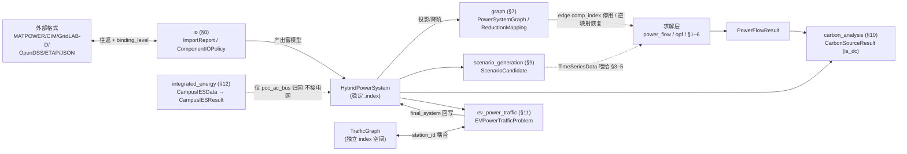

# 各分析模块内部数据结构（深化参考）

Updated: 2026-08-17
Class: Implementation reference（源代码派生；行级细节在代码变更后需复核）

本文件在 [数据结构与 API 契约](data_structure_api_contract.md)（核心骨干）之上，逐个
深入十二个**分析/求解/数据模块**的**内部公共数据结构**（选项 / 结果 / 记录 / DTO），说明它们如何
引用核心 `HybridPowerSystem`，以及贯穿全部模块的三大横切约定。这是"逐模块内部数据结构"
的落地参考。§1–§6 为求解型模块（dynamics/opf/time_series/reliability/resilience/market），
§7–§12 为图/数据/耦合模块（graph/io/scenario_generation/carbon_analysis/ev_power_traffic/
integrated_energy），§13 汇总三大横切约定。设计评审见 [数据结构设计评审](data_structure_design_review.md)。

## 0. 分析模块如何消费核心模型

所有分析模块统一"富模型进、稳定 ID 出"，中间层各自拥有临时索引空间：

```mermaid
flowchart TD
    HPS["HybridPowerSystem<br/>(稳定 .index)"]
    HPS --> DYN["dynamics<br/>DynamicSystem"]
    HPS --> OPF["optimal_power_flow<br/>ACOPFResult"]
    HPS --> TS["time_series<br/>AnnualProductionSimResult"]
    HPS --> REL["reliability<br/>ReliabilityParams / ComponentRef"]
    HPS --> RES["resilience<br/>DistributionResilience*"]
    HPS --> MKT["market<br/>PricingPeriod / Settlement"]
    DYN -. "结果回稳定 ID" .-> OUT["结果证书<br/>(.index / stable_id)"]
    OPF -. unproject + ComponentRef .-> OUT
    TS -. gen_index/storage_index .-> OUT
    REL -. ComponentRef.stable_id .-> OUT
    RES -. branch_index + AC/DC 限定 .-> OUT
    MKT -. position + index 双键 .-> OUT
```

上图是**求解型模块（§1–6）**的"消费—回溯"关系。**图/数据/耦合模块（§7–12）**与核心模型的
关系形态不同——`io` **生产** HPS、`graph` **变换** HPS、`scenario_generation` **喂养**求解层、
`carbon_analysis` **消费**潮流结果、`ev_power_traffic` 与交通图**双向耦合**、`integrated_energy`
基本**解耦**（仅 `pcc_ac_bus` 归因）：



> 两图共享同一条铁律 #1/#2：无论生产、变换还是消费，跨层身份一律经稳定 `.index`/`comp_index`
> 回溯，临时 index（graph 位、traffic index）绝不外泄。`integrated_energy` 的虚线刻意表达
> `CampusIESValidity` 对电网建模的逐项否认（honest scope）。

---

## 1. dynamics（机电暂态 DAE）

头文件：[DynamicSystem.hpp](../include/hacdcpf/dynamics/DynamicSystem.hpp)、
[DynamicSolverOptions.hpp](../include/hacdcpf/dynamics/DynamicSolverOptions.hpp)、
[DynamicResults.hpp](../include/hacdcpf/dynamics/DynamicResults.hpp)、
[SmallSignal.hpp](../include/hacdcpf/dynamics/SmallSignal.hpp)

| 结构 | 角色 | 身份 / 耦合 |
|---|---|---|
| `DynamicSystem` | 顶层暂态容器：`canonical_system` + `network` + `devices` + 微分态 `x` + 代数态 `y` + `options` + 因子缓存 | 持有投影后的 `HybridPowerSystem`；设备为 `unique_ptr<DynamicDevice>` 多态 |
| `DynamicNetwork` | 相节点网络：`Yac_base`/`Gdc_base`、相节点编号 `3*bus_pos+phase` | `ac_bus_pos_by_id` / `dc_bus_pos_by_id` 域限定位映射；`DynamicACBranch` 带 `from_pos`/`to_pos`（0-based）+ `from_bus`/`to_bus`（稳定） |
| `DynamicSolverOptions` | 求解器全部旋钮（求解器类型、DAE/Jacobian 策略、容差、保护、小信号开关） | 内嵌 `PowerFlowOptions`；`project_to_canonical` 默认 true |
| `DynamicResults` / `DynamicSnapshot` | 逐步轨迹 + 每步快照（相电压、频率、COI、设备输出） | 快照为向量；`DynamicInitializationSummary` 带稳定 ID 匹配 |
| `DynamicModalSummary` / `DynamicModalMode` | 小信号模态屏（特征值、阻尼、主导态） | `dominant_state` 为 `type#component:sLocal` 标签 |
| `SmallSignalResult` / `SmallSignalStateInfo` | 完整小信号分析（约化 Jacobian、参与因子） | `SmallSignalStateInfo` 带 `component_index`（稳定）+ `local_index`（设备内） |

> 关键：微分态**全局索引**是纯内部量；对外定位靠设备携带的 `component_index` 与
> `state_label`。DAE 铁律"求解器选择而非模型 bug"见 repo 记忆（显式 Heun 对刚性 AVR 发散）。

---

## 2. optimal_power_flow（OPF / RPO）

头文件：[opf_result.hpp](../include/hacdcpf/optimal_power_flow/opf_result.hpp)、
[opf_options.hpp](../include/hacdcpf/optimal_power_flow/opf_options.hpp)

| 结构 | 角色 | 身份 / 耦合 |
|---|---|---|
| `ACOPFResult` | AC/DC OPF 主结果：`vm/va/vdc/pg/qg/...` + LMP + IPM 续解态 | 结果向量经 `unproject_bus_vector` 回到**授权母线序**；`ComponentRef gen_map/ren_map/stor_map/...` 把向量位→`original_index`+`source_type` |
| `ACOPFResult::ComponentRef` | 结果向量位→源组件 | `original_index`（稳定）+ `source_type` |
| LMP 诚实字段 | `lmp_valid` + `lmp_validity_reason` | 仅当来自该表述的认证等式乘子才 `valid` |
| IPM 续解态 | `ipm_primal_state` 等 + `ipm_layout_signature` | 进程局部不透明；`layout_signature` 防维度兼容但语义错配的复用 |
| `ACOPFOptions` | 后端选择（Auto/ParityIPM/Ipopt/EconomicDispatch）+ 目标 + IPM 旋钮 + `warm_start` | `warm_start` 为**非拥有**指针，必须存活至 `solve_ac_opf` 返回 |
| `ACOPFObjective` | Economic / VoltageDeviation / ActiveLoss / VoltageDeviationAndLoss | RPO 用非 Economic 目标由内层 NLP 优化 |

---

## 3. time_series（UC→OPF→PF / 年度生产模拟）

头文件：[time_series_pf.hpp](../include/hacdcpf/time_series/time_series_pf.hpp)、
[annual_production_sim.hpp](../include/hacdcpf/time_series/annual_production_sim.hpp)

| 结构 | 角色 | 身份 / 耦合 |
|---|---|---|
| `TimeSeriesPFOptions` | UC→OPF→PF 流水线控制（UC 求解器/目标、网络约束、跟踪带、周期 SOC） | 内嵌 `PowerFlowOptions` + `ACOPFOptions`；`fixed_commitment_schedule` / `precomputed_uc_schedule` 为**非拥有**指针 |
| `AnnualProductionSimResult` | 完整年度结果：逐步 + 月块 + 组件年统计 + 采样 PF 快照 | 组件统计带 `gen_index`/`storage_index`/`ren_index`（稳定） |
| `AnnualStepResult` / `BlockSummary` | 逐步 / 逐块聚合量（发电/负荷/新能源/储能/ENS/成本） | 标量聚合，无组件身份 |
| `PFSnapshot` | 仪表盘可视化采样（`vm`/`vdc`/`branch_flows`/`vsc_transfers`） | 向量为**授权序**；`VSCTransfer` 带稳定 VSC/母线 ID |
| `AnnualProductionSimOptions` | L0-L3 分解（块类型、并行日、每日模式） | 内嵌 `ts_pf_options`；`DailySimMode`=SCUC/DynamicSCED/DynamicOPF |
| `UCSchedule` | UC 完整调度（承诺 + 出力 + SOC 轨迹） | `gen_commit[g_active][t]` 按在役机组自然序 |

> 年度分层：L0 年计划 → L1/L2 月/周滚动 UC → L3 日 OPF/PF 回放；每日"能量中性 + 周期 SOC"
> 使日间独立、可并行（`enforce_terminal_soc_cyclic`）。

---

## 4. reliability（可靠性 / FMEA / 信息物理）

头文件：[reliability_assessment.hpp](../include/hacdcpf/reliability/reliability_assessment.hpp)、
[failure_mode.hpp](../include/hacdcpf/reliability/failure_mode.hpp)

| 结构 | 角色 | 身份 / 耦合 |
|---|---|---|
| `ReliabilityRawFields` → `ReliabilityParams` | 统一解析器输入/输出：把异构可靠性字段归一为 λ/repair/unavailability | `resolve_reliability_params()` 单一解析；`data_source`="case/template/default/missing" 诚实标注 |
| `ReliabilityDataPolicy` | 缺失数据策略（StrictCaseDataOnly / MissingOnly / OverwriteTemplate）+ MTBF 约定 | GUI 默认 StrictCaseDataOnly（不发明数据） |
| `ReliabilityOptions` | MC/SEQ 迭代、CoV、尾部风险、分布指标、并行 | 内嵌 `DCOPFOptions` + `data_policy` |
| `ComponentRef` | **可靠性稳定组件引用** | `element_index`（0-based 位）+ `component_index`（稳定）+ `stable_id`（如 `ac_branch:5`）——双键+字符串 ID 典范 |
| `FailureModeRef` / `FailureModeReliability` | 故障模式（激活类/成因类/后果类）+ 解析参数 + 三阶段时长 | `mode_id`（如 `vsc_converter:12/grid_forming_lost`）；成因含 Cyber/Protection |
| `FailureModeParameterOverride` / `ProtectionConfiguration` | 用户覆盖（`optional` 叠加）/ 保护链 | 覆盖绝不写回源模型；保护链用稳定组件 ID |
| `DistributionIndices` / `TailRiskMetrics` | SAIFI/SAIDI/ASAI + VaR/CVaR | `nodal_cif`/`nodal_cid` 按母线序（DC 感知，见 repo 记忆） |

---

## 5. resilience（弹性恢复 / 认证恢复）

头文件：[resilience_assessment.hpp](../include/hacdcpf/resilience/resilience_assessment.hpp)、
[certified_restoration.hpp](../include/hacdcpf/resilience/certified_restoration.hpp)、
[resilience_dynamic_certification.hpp](../include/hacdcpf/resilience/resilience_dynamic_certification.hpp)

| 结构 | 角色 | 身份 / 耦合 |
|---|---|---|
| `DistributionResilienceOptions` | 多时段研究配置（模型、时域、重构、MESS、负荷/新能源曲线） | 负荷曲线三套映射：`*_by_position` / `*_by_index` / `*_by_bus`（域限定） |
| `DistributionResilienceMIPOptions` | 严格 MIP 骨架（电压界、切负荷优先级罚、开关/MESS 成本、gap/时限） | 求解器 Native/HiGHS/Gurobi |
| `DistributionResilienceModelStats` + `ValidityFlags` | 模型规模 + **诚实能力声明** | `model_scope`="hybrid-acdc-restoration-milp"；`ValidityFlags` 逐特征声明是否真正建模 |
| `DistributionResilienceFault` | 单支路故障 | `branch_kind`（**AC/DC 限定**）+ `branch_index`；`ac_branch_index` 为遗留兼容 |
| `CertifiedRestorationAction` | 恢复动作 + 动态事件 + 赛博命令链 + MESS 契约 | 携带 `dynamics::DynamicEvent`；MESS `mess_storage_index`/`mess_target_ac_bus` |
| `MultiFidelityCertificate` | 多保真证书（L1/L2 采样 Jacobian、L3 全 DAE 阈值）+ 残差/Lipschitz/margin | `label`=Safe/Unsafe/Unresolved/Failed；`limitations` 显式 |
| `CertifiedRestorationResult` / `...DAECertificateResult` | 主 MIP + 认证结果 | `model_scope` 显式；`proof_valid` 仅限所模拟场景 |

---

## 6. market（日前/实时市场 / 重复博弈）

头文件：[market_simulation.hpp](../include/hacdcpf/market/market_simulation.hpp)

| 结构 | 角色 | 身份 / 耦合 |
|---|---|---|
| `MarketParticipant` / `ParticipantBehavior` | 市场主体 + 行为策略（加价/withholding） | `generator_positions` 对齐 `ac.generators`，提交时审计 |
| `GeneratorOffer` / `OfferSegment` | 机组报价（分段能量 + 承诺 + 备用） | `generator_position`（位）+ `generator_index`（稳定）**双键并存** |
| `PricingPeriod` | 固定承诺 SCED + 价格（逐区间） | 全部向量按**授权序**并显式 DC 限定（`dc_lmp`/`dc_bus_voltage`/`vsc_*`/`dcdc_*`/两类 dc_storage） |
| `MarketModelScope` | **诚实能力声明** | `model_scope`="ac-dc-linear-v1"；逐项 `*_modelled` 标志 + `energy_prices_valid` |
| `UnsupportedMarketAsset` | 当前表述无法表示的在役资产 | 显式列出（`component_position`+`component_index`+`reason`），避免泛化 scope 失败 |
| 结算族 | `GeneratorSettlement`/`DCStorageSettlement`/`ParticipantSettlement`/`SettlementLedger` | 位+索引双键；真成本与报价成本分离防串味 |
| 安全族 | `SecurityResult`/`N1Violation`/`ComponentContingencyCheck`/`ACContingencyCheck` | 支路 outage/monitored 均带 position+index |
| `MarketPerformanceProfile` | 规模估计 + 各阶段墙钟 | 可扩展性审计用 |

---

## 7. graph（图建模 / 拓扑 / 降阶）

头文件：[power_system_graph.hpp](../include/hacdcpf/graph/power_system_graph.hpp)、
[reduction_mapping.hpp](../include/hacdcpf/graph/reduction_mapping.hpp)、
[topology_analysis.hpp](../include/hacdcpf/graph/topology_analysis.hpp)、
[result_recovery.hpp](../include/hacdcpf/graph/result_recovery.hpp)

| 结构 | 角色 | 身份 / 耦合 |
|---|---|---|
| `PowerSystemGraph` | HPS→图：`nodes`（AC/DC 母线）+ `edges`（支路/开关/断路器/变压器/VSC/DCDC 虚边）+ 邻接表 | 域限定 `ac_bus_id_to_node_idx`/`dc_bus_id_to_node_idx` 权威；`bus_id_to_node_idx` 仅 AC-only 遗留 |
| `GraphNode` | 一个 AC/DC 母线节点 + 注入/设备标志 | `bus_id`（原始）+ `domain`（AC/DC）；`has_generator`/`has_load`/`has_vsc_ac`/`has_vsc_dc`/`has_dcdc`… |
| `GraphEdge` | 一条支路/耦合边 | **`edge_id`（图内位序 0…E-1，第三类 ID）vs `comp_index`（源模型 `.index`）**——降阶器按 `comp_index` 停用模型组件，**绝不用 `edge_id`**；`from_node`/`to_node`（图位）+ `from_bus_id`/`to_bus_id`（原始） |
| `ReductionMapping` | 全降阶步骤的可逆映射（结果恢复基础） | 双域母线映射 `ac_/dc_original_to_reduced_bus`；`original_to_reduced_branch`（-1=消除）；四类记录 Switch/Series/Pendant/Kron |
| `SeriesReductionRecord` / `PendantReductionRecord` | 串联消去 / 悬挂消去记录（带 `domain` AC/DC） | `r_eq/x_eq/b_eq` 或 `p/q_load_absorbed`；结果恢复靠这些记录逆运算 |

> 关键：图层是**第三类 ID**（graph node/edge index）的唯一合法居所——临时、投影后即弃；
> 对外一律经 `comp_index`/`bus_id` 回稳定空间。降阶铁律：按 `comp_index` 停用组件，
> 结果经 `ReductionMapping` 逆映射恢复到原始拓扑。

---

## 8. io（导入导出 / 往返 / 数字孪生）

头文件：[import_report.hpp](../include/hacdcpf/io/import_report.hpp)、
[component_io_mapping.hpp](../include/hacdcpf/io/component_io_mapping.hpp)、
[roundtrip.hpp](../include/hacdcpf/io/roundtrip.hpp)、
[schema_version.hpp](../include/hacdcpf/io/schema_version.hpp)

| 结构 | 角色 | 身份 / 耦合 |
|---|---|---|
| `ImportReport` | **统一机读导入诊断契约**（JSON/MATPOWER/GridLAB-D/OpenDSS/ETAP/CIM 共用） | `binding_level`（Rich/Canonical）诚实声明是否重建富结构；`unit_assertion`（Asserted/Inferred/BestEffort）降级 provenance |
| `ImportRecord` | 单条源对象诊断 | `source_locator`（行/表格/xpath）+ `target_ref`（组件引用，拒绝时空）+ `disposition`/`reason_code`/`severity` 全枚举 |
| `ImportMode` | Strict / Permissive | Strict：未知字段/无效枚举/强制转换即拒绝导入 |
| `ComponentIOPolicy` 家族 | 每组件类型 × 目标格式的语义保持策略 | Exact/Equivalent/Aggregated/BoundaryInjection/Projected/InternalOnly/Unsupported + `NumericalVerificationScope` 声明验证证据 |
| `ComponentStandardFamily` | 标准/规范族标注 | HACDCPF/IEC61970CIM/IEC61850/IEC60909/IEEE1547/… |

> 关键：IO 层把"外部 ID → 稳定 `.index`"的绑定与"绑定层级/单位来源/语义保持策略"全部**机读化**，
> 是数字孪生诚实口径的入口（`binding_level=Canonical` 降级、`unit=BestEffort` 降级 provenance）。

---

## 9. scenario_generation（场景生成 / 聚类）

头文件：[scenario_generation.hpp](../include/hacdcpf/analysis/scenario_generation.hpp)（注意：头文件位于 `analysis/`）

| 结构 | 角色 | 身份 / 耦合 |
|---|---|---|
| `ScenarioGenerationOptions` | 三族（Regular/Reliability/Resilience）+ 扰动 + 台风影响 + 聚类 配置 | 内嵌各族 options + `ScenarioFamily` |
| `ScenarioCandidate` | 单条候选场景 | `id` + `family` + `probability` + `TimeSeriesData` + 可选 `ContingencyDefinition`/`ResilienceEventDefinition` + `outage_signature` + `features` |
| `ContingencyDefinition` | 一个故障定义 | `ContingencyComponentType`（AC/DC 限定，20+ 类型）+ `component_index`（稳定）+ `affected_*` 稳定 ID 字符串列表 |
| `ResilienceEventDefinition` | 台风事件（Holland 风场采样） | 故障集 `DistributionResilienceFault` + 轨迹/风险 + 多源乘子曲线；`used_category_fallback`/`used_approximate_repair_order` 诚实标注 |
| `ScenarioCluster` | 聚类代表 | `representative`（medoid）+ `member_ids` + 概率；`tail_anchor`/`frozen_medoid` 尾部锚定 |
| `RegularScenarioResult` / `ReliabilityScenarioResult` / `ResilienceScenarioResult` | 三族结果 | 各带 `audit` JSON 可追溯 |

> 关键：场景族刻意**对齐已实现的** reliability FMEA 目录与 resilience 台风能力（options 里的
> `include_*` 兼容位不扩目录）；聚类保留尾部 5% 锚点、概率守恒。

---

## 10. carbon_analysis（碳流追踪）

头文件：[carbon_analysis.hpp](../include/hacdcpf/carbon_analysis/carbon_analysis.hpp)、
[annual_carbon_analysis.hpp](../include/hacdcpf/carbon_analysis/annual_carbon_analysis.hpp)

| 结构 | 角色 | 身份 / 耦合 |
|---|---|---|
| `CarbonAnalysisOptions` | 比例追踪（BFS）+ 矩阵法 配置 | `loss_allocation_alpha`（损耗碳发/收侧分配）+ `max_matrix_condition_estimate` 病态门 |
| `CarbonSourceResult` | 一个碳源（发电/外部网） | `source_id` + `source_type` + `component_index`（稳定）+ `is_dc`（域）+ `emission_factor` + `is_balancing` |
| `LoadCarbonResult` | 负荷碳 | `load_index` + `bus` + `carbon_intensity` + `generator_supply_mw`（碳源 ID→MW 溯源） |
| `BranchCarbonResult` | 支路损耗碳 | `branch_index` + `generator_loss_mw`（碳源 ID→MW 溯源） |
| `EmissionsSummary` / `NodePowerBalanceError` | 全网排放平衡 / 节点不平衡诊断 | `balance_error_tco2`/`balance_error_pct` 诚实残差；`mismatch_mw`（负=缺源，正=缺汇）+ `is_dc` |

> 关键：碳流需**已收敛** `PowerFlowResult` + HPS 排放因子；溯源用碳源 ID（稳定），
> 母线/支路结果带 `is_dc` 域限定；平衡误差显式暴露而非隐藏。

---

## 11. ev_power_traffic（EV-交通耦合 Formulation A–H）

头文件：[types.hpp](../include/hacdcpf/ev_power_traffic/types.hpp)、
[simulation.hpp](../include/hacdcpf/ev_power_traffic/simulation.hpp)、
[ltm_network.hpp](../include/hacdcpf/ev_power_traffic/ltm_network.hpp)、
[options.hpp](../include/hacdcpf/ev_power_traffic/options.hpp)

| 结构 | 角色 | 身份 / 耦合 |
|---|---|---|
| `EVPowerTrafficProblem` | 顶层耦合问题：`HybridPowerSystem system` + `TrafficGraph traffic` + routes/demands/sessions/prices | **双网并置**：电力网（稳定 `.index`）与交通网（TrafficNode/Link index）经充电站 `station_id` 耦合 |
| `TrafficGraph` / `TrafficNode` / `TrafficLink` | 交通网（BPR 延迟、CTM 元胞） | 交通侧**独立 index 空间**；`drive_energy_kwh_per_veh_km` 连接 SOC |
| `EVDemand` / `ICVDemand` | OD 需求（EV 带 SOC / ICV 多类共享路容） | `candidate_route_indices`；SOC/reserve 能量约束；`VehicleClass` |
| `ChargingStationParams` | 充电站（排队/服务/回溢） | `id`（站）+ `access_link_id`（交通链）；站↔电力母线经 HPS 充电站组件 |
| `EVPowerTrafficResult` | 聚合结果 + 逐步 + 回写系统 | `final_system`/`system_by_step`（耦合后 HPS 快照）；**诚实验证**：`mathematical_model_verified` + `mathematical_model_verification_status`（"simulation 入口含启发式/分解层→未验证"）+ `optimization_is_mip`/`proven_optimal` |

> 关键：EVPT 是全仓唯一"**电力网 + 交通网双图**"模块；耦合面是充电站（power 侧 `ChargingStation`
> 组件 ↔ traffic 侧 `station_id`/`access_link`）。simulation 顶层入口刻意声明含启发式层"未数学验证"，
> 精确研究走 `SystemOptimalLP`/`MILP` 或 `solve_joint_social_welfare`。

---

## 12. integrated_energy（园区电-热-氢多能流 MILP）

头文件：[integrated_energy_system.hpp](../include/hacdcpf/integrated_energy/integrated_energy_system.hpp)、
[integrated_energy_options.hpp](../include/hacdcpf/integrated_energy/integrated_energy_options.hpp)、
[integrated_energy_result.hpp](../include/hacdcpf/integrated_energy/integrated_energy_result.hpp)

| 结构 | 角色 | 身份 / 耦合 |
|---|---|---|
| `CampusIESData` | 园区多能流输入（电/热/氢/燃料负荷 + DER + 三级氢储 + 效率/CCUS/碳预算） | 扁平 POD；`pcc_ac_bus` **仅用于归因 PCC 交换，solve 不接电网**；`fixed_power_factor` 保留（≠1 拒绝） |
| `CampusIESResult` | 多载体调度结果 | 逐时向量：电/热/氢/燃料/交通 + 三级氢储（日/周/季）+ CCUS + `sankey_flows` |
| `CampusIESValidity` | **诚实能力声明** | `electrical_network_coupled=false`/`reactive_power_modelled=false`/`voltage_and_branch_limits_enforced=false` 明示不建模电网 |
| `CampusIESSankeyFlow` | 能流桑基图边 | `source`/`target`/`carrier` |

> 关键：`model_scope="isolated-campus-multi-carrier-milp"`——多载体能量平衡 + 聚合 PCC 有功，
> 但**显式不耦合电气网络**（无无功/电压/支路约束）。三级氢储（日→周→季）用效率损耗建模
> 跨时间尺度转移。这是"honest scope"典范：结果结构自带 `CampusIESValidity` 逐项否认电网建模。

---

## 13. 三大横切约定（跨全部模块）

评审确认以下三条约定在全部模块中一致落地，是全仓数据结构最值得保留的工程规范：

1. **位 + 稳定索引双键**：`reliability::ComponentRef`（`element_index`+`component_index`+`stable_id`）、
   `market::GeneratorOffer`/结算族（`*_position`+`*_index`）、`opf::ACOPFResult::ComponentRef`
   （`original_index`+`source_type`）、`graph::GraphEdge`（`edge_id` 图位 + `comp_index` 稳定，
   降阶器按 `comp_index` 停用组件）。凡对外报告一律用稳定键，向量位/图位仅内部。对应
   [铁律 #2](data_structure_api_contract.md#4-三类-id-与域限定映射)。

2. **诚实能力声明**：`resilience::ValidityFlags`+`model_scope`、`market::MarketModelScope`
   +`UnsupportedMarketAsset`、`opf` 的 `lmp_valid`/`lmp_validity_reason`、
   `reliability` 的 `data_source`/`ReliabilityDataQuality`、`dynamics` 的 `DynamicModalSummary`、
   `io::ImportReport`（`binding_level`/`unit_assertion`）、`integrated_energy::CampusIESValidity`
   （逐项否认电网建模）、`ev_power_traffic` 的 `mathematical_model_verified` + 验证状态串、
   `carbon` 的 `balance_error_pct`。近似/覆盖不足写进结果而非隐藏。对应
   [铁律 #3](data_structure_api_contract.md#1-分层数据架构总览)。

3. **非拥有调度/热启动指针**：`opf::ACOPFOptions::warm_start`、
   `time_series` 的 `precomputed_uc_schedule`/`fixed_commitment_schedule`、
   `market::MarketOptions` 的 `*_dispatch_schedule_mw`。约定统一为"**必须存活至调用返回**"，
   避免大对象拷贝，同时不获取所有权。

此外，**域限定**在中间层同样贯穿：`dynamics` 的 `ac_bus_pos_by_id`/`dc_bus_pos_by_id`、
`resilience` 负荷曲线的 `by_position`/`by_index`/`by_bus` 三套映射、`market`/`opf` 结果向量
的 AC/DC 分列、`graph` 的 `ac_bus_id_to_node_idx`/`dc_bus_id_to_node_idx`、`carbon`/`scenario`
结果的 `is_dc` 与 AC/DC 限定故障类型，均遵循[铁律 #1](data_structure_api_contract.md#1-分层数据架构总览)。
