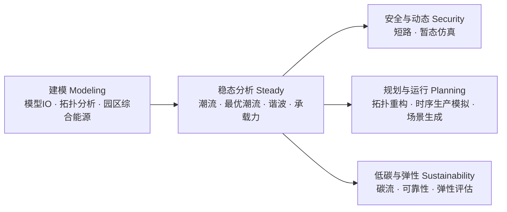

> Documentation Sync (2026-07-09)
> Scope: the live single-page GUI in `web/` served by `tests/run_gui_server.cpp`.
> Status: design note tracking implementation. Phases 1, 2, 4, and 5 are
>   implemented and covered by `tests/e2e/gui_scale_features_e2e.mjs`; Phase 3
>   (async/LOD mid-band rendering) and the follow-ups noted inline remain open.
> Source of truth: when text and implementation diverge, treat `web/`, `src/`,
>   `include/`, and `tests/run_gui_server.cpp` as authoritative.

# Canvas GUI — Efficiency & Usability Upgrade Design

Scope: the browser front-end (the ETAP-style single-line-diagram studio) that
drives the hybrid AC/DC engine. The GUI has grown to host **15 functional
modules** on a single canvas-centric screen. This note first documents the
*current* design as it exists in the code, then states the concrete efficiency
and usability problems, and finally proposes a phased upgrade. It is
implementation-anchored: every claim points at a file or symbol so the plan can
be executed incrementally without guesswork.

Implementation anchors inspected:

- `web/index.html` — layout skeleton (toolbars, canvas, panels, modals).
- `web/js/app.js` (~14.2k lines) — API calls, module wiring, tables, results.
- `web/js/canvas.js` (~6.4k lines) — SVG single-line diagram engine.
- `web/js/components.js` — component library metadata (symbols, ports, defaults).
- `web/css/style.css` — layout and theming.
- `tests/run_gui_server.cpp` — static file server + `/api/session/*` endpoints.

The engine (`src/`, `include/`) is **out of scope**: the changes proposed here
are localized to front-end orchestration, rendering, and UX, consistent with the
project constraints in `AGENTS.md`.

---

## 1. Current Architecture (as built)

### 1.1 Screen anatomy

The application is a single HTML document (`web/index.html`) with a fixed,
always-visible layout:

```
┌───────────────────────────────────────────────────────────────────────┐
│ Bar 1  #topToolbar   canvas tools (select/connect/zoom/layout/rotate…)  │
│ Bar 2  #moduleBar    15 function modules (potential flow … carbon)      │
│ Bar 3  #subToolbar   contextual controls for the active module          │
├──────────┬──────────────────────────────────────────────┬──────────────┤
│ #component│                                             │ #rightPanel  │
│   Lib     │        #canvas  (SVG single-line diagram)    │  属性/拓扑/结果 │
│ (元件库)  │   layers: connections/components/results/temp│  tabs         │
├──────────┴──────────────────────────────────────────────┴──────────────┤
│ 控制台  #consoleLog   (timestamped log)                                  │
└───────────────────────────────────────────────────────────────────────┘
```

The 15 modules on `#moduleBar` are: `模型IO`, `潮流计算`, `最优潮流`,
`短路计算`, `谐波潮流`, `暂态仿真`, `拓扑重构`, `拓扑分析`,
`时序生产模拟`, `园区综合能源`, `承载力分析`, `可靠性分析`,
`场景生成`, `弹性评估`, `碳流分析`. Each module reveals its own
`.sub-section` in Bar 3 and its own `.result-group` in the right panel.

### 1.2 The canvas is a *view*, not the model of record

This is the single most important architectural fact, and the upgrade leans on
it heavily:

- Loading a case (`/api/session/load_builtin`, `load_matpower`, `load_json_string`,
  ETAP/GLM/DSS/PSD importers) populates a **backend session** that is the source
  of truth for every calculation.
- The front-end then calls `Canvas.loadFromSystemJson(sys)` purely to *draw* the
  network, and sets `_canvasDirty = false` (`web/js/app.js`).
- `syncToBackend(force)` is the only bridge from canvas → backend. When the
  canvas has not been edited (`!_canvasDirty`) it **skips the round-trip**
  entirely, so analyses run against the already-loaded backend system.
- Result tables in the right panel are rendered from the API response
  (`showPowerFlowResultsTables`, etc.), **not** from the canvas. The canvas only
  adds optional overlays (`Canvas.showPowerFlowResults`).

Consequence: the diagram is optional for computation. This is what makes a
"no-canvas" mode for very large systems feasible without losing any capability.

### 1.3 Rendering cost

`Canvas.renderComponent()` builds, per element, an SVG `<g>` with a symbol, an
invisible hit-rectangle, and one `<g>` per port; `renderConnection()` adds a
routed path. A case therefore materializes on the order of
`buses + branches + 2·devices` SVG glyphs plus event wiring. Existing mitigation
is viewport culling (`CULL_THRESHOLD = 1500` in `canvas.js`) which hides
off-screen glyphs on pan/zoom — but the **initial** `loadFromSystemJson` still
creates every node. Measured on this machine, force-rendering `case1354pegase`
(≈5.4k glyphs / 6.0k wires) takes **~5.5 s**; `case9241pegase` (~35k glyphs)
freezes the tab. This is the concrete motivation for Phase 1.

### 1.4 Code shape

`app.js` is a single ~14.2k-line IIFE (`const App = (() => { … })()`) that mixes
API transport, DOM wiring for all 15 modules, topology tables, per-module result
renderers, unit conversion, and chart drawing. `canvas.js` is a second ~6.4k-line
IIFE. There is no module boundary, no shared state store, and no event bus;
cross-cutting state lives in closure-scoped `let`s (`_lastPfData`,
`_canvasDirty`, …).

---

## 2. Problem Statement

### 2.1 Cognitive overload (usability)

Everything is visible at once: 3 toolbars, a 15-item module bar, a component
library with 6+ categories, a 3-tab inspector, and a console. A new user cannot
tell **where to start** or **what depends on what**. Module ordering on the bar
is essentially historical, not a workflow.

### 2.2 Implicit inter-module dependencies

Several modules require a prior result but only fail *after* the user tries them:
`碳流分析` needs a converged `潮流计算`; `动态碳流` needs `时序生产模拟`;
`最优潮流`/`短路` want a synced network. These preconditions exist in code
(`runCarbonFlow` guards on `_lastPfData`) but are invisible in the UI until an
error toast appears.

### 2.3 Scale ceiling (efficiency)

Two hard walls appear as systems grow:

1. **Diagram rendering** — the O(n) SVG build blocks the main thread (§1.3).
2. **Auxiliary O(n) UI** — `updateTopologyTables()` builds one `<tr>` per element
   (and per element with a click handler), and `renderComponentCurveTargets()`
   builds one button per load/DER. Both are unbounded.

Below these walls the app is fine (hundreds of buses); above them it is unusable.

### 2.4 Editing & navigation at scale

Property editing is only reachable by clicking a glyph on the canvas. For a
2,000-bus feeder there is no "go to bus 1487", no search, no filter, no
bulk-edit. The `拓扑` tab is read-oriented and (previously) unbounded.

### 2.5 Maintainability

A 14.2k-line file with no internal boundaries makes every change risky and slow
to review; adding the 16th module compounds the problem. (See the repository
memory note about a corrupted multi-edit — large monolithic files amplify edit
hazards.)

---

## 3. Design Principles

1. **Keep the backend as the model of record.** The canvas stays a disposable
   view; never make computation depend on glyph existence. (Already true; the
   upgrade must preserve it.)
2. **Render only what the human can perceive.** For anything beyond a few
   hundred nodes, prefer summaries, tables, search, and on-demand sub-diagrams
   over a full single-line drawing.
3. **Progressive disclosure.** Show the few controls relevant to the current
   task; hide the rest behind workflow groups.
4. **Make dependencies explicit.** Surface analysis prerequisites and freshness
   as first-class status, not as after-the-fact errors.
5. **Refactor behind stable seams.** Split the monolith without changing the
   `Canvas.*` / `App.*` public surfaces that already exist.

---

## 4. Phase 1 — Large-system headless (no-canvas) mode  *(implemented)*

**Goal (from the request): for very large problems we do not import to the
canvas, yet keep every calculation method.**

### 4.1 Mechanism

`Canvas.loadFromSystemJson(jsonSys, opts)` now measures the system first
(`summarizeSystemJson`) and, when it exceeds a threshold
(`shouldGoHeadless` → `HEADLESS_BUS_THRESHOLD = 600` buses or
`HEADLESS_ELEMENT_THRESHOLD = 2500` total elements), enters **headless mode**:

- It skips all SVG glyph creation (`state.components` stays empty).
- It keeps a normalized deep copy of the system in `state.headlessSystem`.
- `buildSystemJson()` returns that stored system (normalized onto the full
  `ac`/`dc` skeleton) instead of reading the empty canvas — so every labeling
  helper, `updateTopologyTables()`, and any `syncToBackend()` keep working.
- An HTML overview (`#canvasHeadlessOverlay`) replaces the diagram with a summary
  card and a **`仍然绘制单线图`** (render-anyway) escape hatch
  (`forceRenderCurrentSystem`).

Because loaders set `_canvasDirty = false`, analyses continue to run directly
against the authoritative backend session with **no** resync.

### 4.2 Supporting changes

- `updateTopologyTables()` caps every table at `TOPO_ROW_CAP = 500` rows and
  appends a truncation note; the full data remains available through `模型IO`
  export.
- `renderComponentCurveTargets()` short-circuits in headless mode (per-glyph
  curve editing needs a diagram) instead of deep-cloning a huge system.
- `setMode()` blocks `place`/`connect` while headless with a hint.
- A persisted policy (`localStorage: canvasHeadlessPolicy` ∈
  `auto | force-headless | force-canvas`) plus `getSystemSummary()` /
  `isHeadless()` are exposed on the `Canvas` API.

### 4.3 Validation (browser, `run_gui_server --port 8099`)

| Case | Buses | Result |
|------|-------|--------|
| `case2869pegase` | 2,869 | headless, 0 glyphs, PF converged (14 it); DC-OPF converged, obj≈132,437 |
| `case9241pegase` | 9,241 | headless, 0 glyphs, PF converged (16 it), instant load |
| `case14` (after big) | 14 | auto-returns to canvas mode: 51 glyphs, overlay hidden |
| `case1354pegase` force-render | 1,354 | 5,360 glyphs in ~5.5 s (opt-in) — quantifies why headless is needed |

Net effect: the previously unusable cases become fully analyzable, and small
cases are unchanged.

---

## 5. Phase 2 — Information architecture & workflow guidance  *(implemented)*

**Regroup the 15 modules into five task-oriented ribbon groups** (progressive
disclosure). The module set stays identical; only the top-level grouping and
default visibility change.

> Status: shipped in commit `update the GUi org`. `#workflowBar` (5 groups) +
> per-button `data-group`, `#dependencyStrip` chips, and `#globalElementSearch`
> are wired in `web/js/app.js` (`setActiveWorkflow`, `updateDependencyChips`,
> `ensurePowerFlowForCarbonFlow`) and styled in `web/css/style.css`. Validated
> live: all 15 modules map to exactly one group (3/4/2/3/3); chips track
> backend/canvas/PF/TSPF/carbon freshness; clicking `静态碳流分析` with no PF
> auto-runs PF first, then carbon.



Concrete, low-risk steps:

1. Add a group row (or dropdown) above `#moduleBar`; assign each existing
   `.module-btn` a `data-group`. Show one group's modules at a time. No change to
   the per-module `.sub-section` / `.result-group` wiring.
2. **Dependency chips.** Introduce a small status strip (reuse `#statusBadge`
   styling) that shows the freshness of shared prerequisites — e.g.
   `PF: 已收敛 @14it` / `PF: 已失效`. Drive it from the existing
   `_lastPfData` / `invalidateAnalysisResults()` signals.
3. **Guided run.** For modules that guard on a precondition (e.g. `runCarbonFlow`
   requires `_lastPfData.converged`), offer a one-click "run prerequisites first"
   that chains `runPowerFlow()` → the requested analysis, instead of a blocking
   toast.

Deliverable: a first-run user can follow 建模 → 稳态 → (安全/规划/低碳)
without prior knowledge, and never hit a silent precondition failure.

---

## 6. Phase 3 — Rendering scalability (medium systems, ~600–5,000)

Headless mode is the right answer above a few thousand nodes, but the
**600–5,000** band deserves a drawable-yet-fast path so users still get a
picture.

1. **Chunked / async initial render.** Replace the synchronous
   `forEach(addComponent)` in `loadFromSystemJson` with a `requestIdleCallback`
   /`requestAnimationFrame` batch loop (e.g. 300 glyphs per frame) plus a
   progress indicator, so the main thread never blocks and the user can cancel.
2. **Level-of-detail (LOD).** At low zoom, draw buses as 1–2px rectangles and
   suppress labels/ports (extend the existing `updateViewportCulling` with a
   zoom-based detail tier). Labels and ports appear only when zoomed in.
3. **Static layer flattening.** Render the connection layer to a single cached
   path/`<image>` when not editing; re-inflate on edit. Connections dominate the
   glyph count on meshed transmission cases.
4. **Optional WebGL/Canvas2D backend** (larger effort) behind the same
   `Canvas.*` API for the upper end of the band. Keep SVG for small,
   interaction-heavy cases.

Success metric: `case1354pegase` interactive (< 1 s to first paint, smooth pan)
instead of the current ~5.5 s blocking build.

---

## 7. Phase 4 — Navigation, search & bulk editing at scale  *(implemented)*

Make large systems *inspectable and editable* without a full diagram — this is
what turns headless mode from "compute-only" into a real workflow.

1. **Element index / command palette.** *(implemented)* A search box
   (`#globalElementSearch`: "bus 1487", "dc bus 3", "gen 12", name substrings)
   that pans-and-selects in canvas mode (`Canvas.panToComponent` via
   `getCompBusMap()`), or switches to the `拓扑` tab, shows a summary banner
   (`#topologySearchResult`), and scroll-highlights the row in headless mode
   (backed by `Canvas.buildSystemJson()` over the stored `headlessSystem`).
   The registry moved to `web/js/search_registry.js` (`window.HACDCSearch`) as
   the first modularization seam.
2. **Virtualized, editable `拓扑` tables.** *(implemented)* `fillTable` now
   renders through a fixed-height windowed virtualizer (`TOPO_ROW_H`, spacer
   rows) — only ~20 `<tr>` are materialized regardless of size, so the
   `TOPO_ROW_CAP` truncation is gone (verified: all 2,869 rows of
   `case2869pegase` reachable; search highlights row 2,499). Generator (Pg/Qg/
   Vg/Pmax/Pmin) and load (P/Q/Scaling) cells are inline-editable on double-click
   and commit to the backend session — headless via
   `Canvas.updateHeadlessSystem()` mutating the stored system, canvas via the
   glyph's `params` — then `syncToBackend(force=true)`. (Multi-row edit / sort /
   filter remain a follow-up.)
3. **On-demand sub-diagram.** *(implemented)* `邻域图` extracts the k-hop
   neighborhood of a bus (`buildSystemGraph` BFS over branches/transformers/VSC/
   DC-DC, capped at `SUBDIAGRAM_MAX_NODES`) and draws it with a ring layout in a
   read-only modal (`#subDiagramModal`) — the main canvas, headless state, and
   backend are never touched.
4. **Minimap** *(implemented)* — a scaled overview with a viewport rectangle in
   `#canvasContainer` (`renderMinimapDots`/`updateMinimapViewport`); click/drag
   recenters. Shown only for canvas-mode diagrams (≥ `MINIMAP_MIN_COMPONENTS`);
   hidden in headless mode.

---

## 8. Phase 5 — Results & front-end code architecture  *(implemented)*

### 8.1 Results UX  *(implemented)*

- A unified results dock action bar carries **全部结果导出**
  (`exportAllCachedResults`) and a generalized run **comparison** slot
  (`对比快照` → `captureResultSnapshot`/`renderResultComparison`): each pin
  snapshots the current PF/OPF/time-series/carbon key metrics into a side-by-side
  `#resultComparison` table, so different cases or settings compare without
  leaving the panel (verified: two cases pinned, 3 columns).
- Result tables render from API responses, independent of the canvas, so
  headless systems show full result tables.

### 8.2 Modularization (behind stable seams)  *(started)*

The first extraction landed: the pure element-search registry + query parsers
moved to `web/js/search_registry.js` (`window.HACDCSearch`), loaded before
`app.js`, which binds them to unchanged local names — demonstrating the seam with
zero call-site churn and no behavior change (the e2e suite still passes). The
remaining monolith is split incrementally along the same pattern:

```
web/js/
  search_registry.js  (done: SOURCES + pure parsers)
  core/       api.js  state.js (tiny store)  bus.js (events)  units.js  log.js
  canvas/     engine.js  render.js  layout.js  headless.js  overlays.js
  analysis/   powerflow.js  opf.js  …  timeseries.js  carbon.js  …
  panels/     properties.js  topology_tables.js  results.js
  app.js      (thin bootstrap that wires the above)
```

Migration stays mechanical: move one module's functions into its file, re-export
for compatibility, delete the old copy, re-run the e2e suite. Prefer sequential
single-file edits over multi-file batch edits (repository memory: batch edits on
large JS files have silently corrupted paired read/write logic before).

### 8.3 Front-end smoke tests  *(implemented)*

`tests/e2e/gui_scale_features_e2e.mjs` is a standalone Node + Playwright driver
(registered in `tests/CMakeLists.txt` as `gui_scale_features_e2e`, gated on
`node`, label `browser`). It starts the server and asserts the whole scalability
contract in one run: headless transitions, headless PF/OPF, windowed tables +
beyond-cap search highlight, inline editing, sub-diagram isolation, canvas-mode
minimap, the time-series 时序潮流/时序生产模拟 split, and the results comparison
— 21 checks, all passing. This codifies the manual validation so future
refactors keep the contract.

---

## 9. Phased roadmap & risk

| Phase | Theme | Effort | Risk | Status |
|-------|-------|--------|------|--------|
| 1 | Headless large-system mode | S | Low | **Done** |
| 2 | Module grouping + dependency chips + guided run | S–M | Low | **Done** |
| 3 | Async/LOD rendering for 600–5k | M | Medium | Proposed |
| 4 | Search + virtualized editable tables + sub-diagram + minimap | M–L | Medium | **Done** (multi-row edit/sort/filter follow-up) |
| 5 | Results dock + comparison + FE tests + modularization | L | Medium | **Done** (modularization ongoing, incremental) |

> Domain refinement (shipped): the old `时序生产模拟` module was split so that
> **时序潮流 (TSPF)** lives under `安全与动态` (a time-stepped feasibility/security
> study) while **时序生产模拟 (annual production simulation)** stays under
> `规划与运行`. Both share one sub-section + modeling controls; the active module
> only toggles which action group (`.ts-tspf-actions` vs `.ts-annual-group`) is
> shown, avoiding any duplicated control IDs.

Sequencing rationale: Phase 1 removes the hard ceiling immediately; Phase 2 is
pure UX with no engine risk; Phases 3–4 restore visual/editing capability in the
mid-band; Phase 5 pays down maintenance debt so a 16th module is cheap. Every
phase preserves the §1.2 invariant (backend is the model of record) and the
existing `Canvas.*`/`App.*` API seams, so phases can ship independently.

---

## 10. Acceptance criteria

- **Scale:** any bundled case up to `case_ACTIVSg70k` loads and runs PF/OPF
  without freezing the tab (Phase 1 covers this via headless; Phases 3–4 add
  drawable/inspectable coverage in the mid-band).
- **Guidance:** a first-time user completes 建模 → 潮流 → 碳流 with no silent
  precondition failure (Phase 2).
- **Editability:** a user can locate and edit "bus N" in a 2,000-bus system in
  headless mode (Phase 4).
- **Invariant:** computation never depends on canvas glyph existence; result
  tables are identical in canvas and headless modes.
- **Maintainability:** no single front-end file exceeds a few thousand lines
  after Phase 5; public `Canvas.*`/`App.*` surfaces unchanged.
