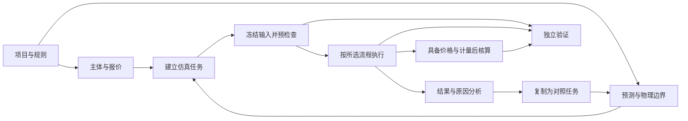
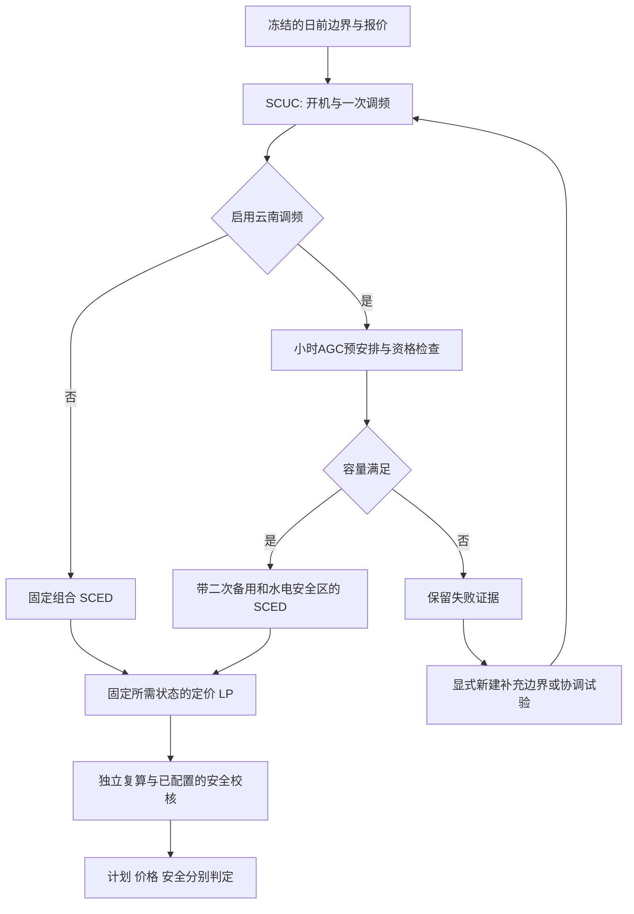

# 电力市场模块系统设计

设计基线：2026-09-07。**本文为目标设计与迁移契约，不是当前GUI/API能力清单。**
当前行为以[南方执行契约](southern_execution_contract.md)、[实时契约](southern_real_time.md)、
[辅助服务契约](yunnan_ancillary_markets.md)和源码为准；正确性证据见[AEMO验证](aemo_validation.md)。
七工作区、持久任务和跨市场自动衔接仍为目标。当前已先落实“南方规则 / 通用AC/DC”模型分组、
故障试验与边界页职责隔离、分步教程和Canvas来源隔离；当前操作见[用户教程](../../guides/market_simulation_workflow.zh.md)。

## 1. 设计结论

以一个明确的**研究任务**组织所有输入、计算和分析：
“哪个系统、哪套规则、哪批报价、什么边界、哪段时间、哪个场景、哪个结果”。
用户无须根据求解器模块名称猜测下一步，也不能因切换页面改变当前结果来源。

分开四种概念：

| 维度 | 内容 | 展示位置 |
|---|---|---|
| 业务操作 | 数据准备、申报、边界、运行、分析、结算、验证 | 一级工作区 |
| 市场品种 | 日前电能量、云南调频、实时电能量 | 仿真任务内的流程模板及阶段 |
| 研究方式 | 单场景、逐日滚动、故障/来水对照、联合概率采样、行为博弈 | 任务类型；按模型能力准入 |
| 计算实现 | SCUC、SCED、定价LP、AC、N-1、求解器及割策略 | 阶段详情与高级设置 |

不能把以上四种概念全作为平级导航，也不能把全部功能强行串成一条每次都要执行的链。
结算和验证都是具备前提后可执行的分支；单场景物理研究无需实际计量和月度账本。

## 2. 改造前混杂的来源

| 改造前已核实的问题 | 对操作和分析的影响 | 目标处理 |
|---|---|---|
| `web/index.html`的8个市场导航项同时包含“运行模拟”“实时市场”“安全校核” | 页面名不能表达操作层级 | 按操作组织导航，品种进入任务流程 |
| `marketWorkflowSteps`只有5步，“市场出清”同时标注日前/实时/辅助 | 五步与八页面、运行模拟四步不一致 | 一级导航用于定位，仅任务内部展示执行步骤 |
| `marketStudyWorkspace`同时属于behavior/boundary/operation/clearing/security/settlement六个scope | 相同实验配置在多个页面重复，挤占结果空间 | 实验只在任务区配置；其他页面只看选定结果 |
| `southernMarketWorkspace`与通用市场结果共享多个scope | 相邻结果可能来自不同模型 | 当前任务明确绑定规则配置和引擎，结果显示来源 |
| 通用模型调用`run_market_clearing/run_real_time_market/run_repeated_market_game` | 通用双结算/博弈容易误认为南方规则链 | 保留“通用AC/DC研究”规则配置，明确覆盖差异 |
| 南方日前、周月、预测、试验、实时、调频分别保有job/result | 读取“最新结果”无法唯一识别一次研究 | 引入任务/场景/阶段结果引用，不依赖全局latest |
| 实时和调频保存配置会递增`southern_revision` | 其他任务可因共用版本号而失效 | 迁移期尊重现有409；后续分开各输入版本 |
| 当前Yunnan `run`自行执行SCUC，实时从边界创建job | 不能声称点击调频/实时已消费此前看到的日前结果 | 显式记录上游来源；自动衔接须实现并测试后开放 |

实现证据：`web/js/app.js::setActiveModule/renderSubToolbar`，
`web/js/core/market_{operation,forecast,study,ancillary,realtime}.js`，
`tests/run_gui_server.cpp`的市场session字段及对应生产路由。

## 3. 目标信息架构

“电力市场”下设七个工作区，每个工作区只有一个主要职责。默认进入“仿真任务”，
有任务时恢复上次选择；无任务时直接显示任务列表与新建操作，不设置介绍型首页。

| 工作区 | 主要操作 | 主要展示 | 不能混入的内容 |
|---|---|---|---|
| 项目与数据 | 选择IEEE118/2000节点/自定义系统，导入和检查数据，选择规则配置 | 设备清单、节点网络、水库/流域关系、来源与时间覆盖 | 各市场阶段的运行按钮 |
| 主体与报价 | 主体归属、逐设备报价、成本/水价值假设、策略参数、申报封存 | 全机组报价曲线、容量档、负荷购电/补偿报价分别展示 | 检修、来水等物理边界；默认触发策略博弈 |
| 预测与边界 | 组织预测、规则边界、联合分布/区间、版本差异 | 预测带、场景样本、边界目录与覆盖 | 求解结果作为已知预测；重复定义物理设备 |
| 仿真任务 | 选择流程、日/周/月、场景组合、求解策略，启动/暂停/终止 | 任务列表、真实阶段进度、失败点、求解质量 | 全设备结果表与完整账本 |
| 结果分析 | 选择任务/场景/时点，比较计划、价格、安全及原因 | 曲线、热力图、Canvas、设备详情、对照实验 | 直接修改已完成任务输入 |
| 结算账本 | 选择匹配的出清/价格/计量，核算、对账、月汇总与更正 | 条件性研究账本、规则核算账本、缺失前提 | 把计划电量或预测价当成实际计量/正式价格 |
| 模型验证 | 选择验证协议并运行，检查独立残差及失败证据 | 手算/穷举/变异/规则回归/外部数据证据矩阵 | 将“测试通过”渲染成“全部市场功能正确” |

规则配置先支持两个明确的入口：
“南方规则研究：2025 V1.0，可选云南2025调频”和“通用AC/DC市场研究”。
模型覆盖由后端能力报告决定，不能靠页面选择将不支持的设备自动删除。
黑启动在规则与验证目录显示“仅规则提取”，没有可点击的假运行入口。

### 一个任务的操作路线



导航跳转不代表计算完成。用户可以直接进入结果或验证，但没有匹配数据时展示缺失条件；
“复制为对照任务”产生新输入版本，不能覆盖原任务和已出账记录。

## 4. 输入与市场边界

输入分成设备、交易申报、物理边界、观测/预测四组，通过稳定引用关联。
字段编辑器归属唯一；任务页展示所引用版本及差异，不再复制整套编辑表。

| 输入组 | 内容与组织 | 来源与约束 |
|---|---|---|
| 设备与拓扑 | AC/DC母线、线路/变压器、机组、储能、可控负荷、关口 | 保留域、组件类别、稳定ID；电气拓扑与水系图分开 |
| 水电组织 | 流域→水库→电厂/机组关系，上下游连通、滞后、共享出流 | 流域为分组；水库间关系才产生水量耦合，不按表格排列推断上下游 |
| 交易申报 | 能源分段报价、启动/空载费、储能双向报价、AGC申报、响应负荷补偿 | 不同产品的单位和资格分开；AEMO能源LOAD不等于响应补偿 |
| 负荷与新能源 | 统调预测、母线预测、风/光预测及非市场新能源安排 | 保留原始值和统调一致性调整后的有效值；记录调整规则 |
| 跨区与非市场计划 | 跨省跨区送电下限、联络计划、非现货主体出力 | 不与主体自愿报价混同；规则来源单独记录 |
| 运行与检修 | 发电/输变电检修、启停/出力/爬坡/最小持续时间、储能初态 | 逐时有效、覆盖前瞻窗口，缺数据不能默认无限可用 |
| 安全边界 | 拓扑、线路/断面、备用/一次调频、事故备用、裕度 | 按规则品种适用；PTDF对应有效拓扑及参数 |
| 水电约束 | 水库运用、天然来水、库位、泄流、生态/防洪、优化调度、振动区 | 分离实测初态、预测来水、运行硬界、优化目标和外部计划 |

日前分类沿用现有细则2.3/2.4边界目录，不因页面简化删减条款；交易申报2.5单列。
实时使用第3章目录，不能将日前字段按新时间点数简单复制为实时边界。
每个目录项显示：已给定/明确不适用/缺失/未支持、对应设备数量、来源、单位及规则条款。
“不适用”需要明确依据，不以空数组自动判定规则已覆盖。

联合采样对象包含风、光、负荷、来水、机组报价及可控负荷补偿报价；
分别保存边缘分布、时空/主体相关结构、采样种子、样本权重、截断/拒绝条件。
区间和确定性故障组合没有自然概率，默认不显示“发生概率”。
数据必须区分`issued_at`、`valid_interval`、`available_at`、时区、来源及单位；
官方事后快照可用于结构实验，不能自动成为日前可见预测。

## 5. 仿真执行流程

### 5.1 任务类型与流程模板

创建任务固定五步：**选算例与规则→选流程与时间→选输入与场景→检查并冻结→运行**。
成功创建后运行按钮只在任务工作区出现；其他工作区通过“查看任务”回到同一任务。
时间跨度、计算间隔、预测分辨率、执行间隔四个概念分别显示。

| 任务类型 | 调度组织 | 特别限制 |
|---|---|---|
| 单日基准 | 一个日前日窗 | 96个15分钟点+下一日2个代表点 |
| 日/周/月滚动 | 一个场景内按日顺序；N日执行需要N+1日预测 | 月长度按日历；末日展望不得悄悄重复 |
| 故障/来水对照 | 一个基准及具名变更场景，相同初态独立运行 | 不自动赋概率；故障恢复按事件区间发生 |
| 联合概率/区间 | 有限样本集合，各样本内逐日滚动 | 记录采样/缩减权重；失败样本不当零结果 |
| 实时滚动 | 24×5分钟出清，8×15分钟定价，每次执行3点 | 目前最多8轮及6小时输入，超范围显式拒绝，周/月实时暂不开放 |
| 行为博弈 | 主体策略更新→出清→收益→停止条件 | 当前限通用引擎；达到轮数上限不代表均衡 |

任务类型与品种不是任意组合。初期日前周/月仅复用现有日窗实现；
逐日云南调频及整周日前→实时联动需要新增状态/数据接口，未验收前不能出现可运行选项。

### 5.2 日前及调频



该图是业务依赖图，不要求挪动既有求解器内部安全割循环：
某引擎的安全约束若参与出清/定价，必须在它的最终结果被接纳前完成相应循环；
仅事后AC审计的结果则保持“事后未修正计划”口径。不能以末端一个绿色检查替代内部安全机制。

当前辅助服务接口的`run`自行重算SCUC，属于完整替代流程。
首期明确展示这一行为；目标阶段才支持消费一个具名、版本匹配的前序SCUC产物。
AGC不足时默认停止；重新选择机组或提高容量需要形成新任务和可见变更，不能偷偷must-on。
定价须引用最终SCED的组合/备用/允许区间，不能拿修改之前的价格配修改之后的出力。

### 5.3 实时及跨日承接

实时输入包括封存能源报价、最新可见预测、当前实测/模拟已执行状态、故障拓扑以及具名外部辅助预留。
“来自日前计划”“来自遥测”“来自上次实时执行”必须显式选择并记录来源。
SCUC/SCED优化0–2小时，独立LP定价，2–4小时窗口为参考；仅0–15分钟状态推进。
窗口内预测末态不得覆盖已执行状态；定价失败与排程失败分别处理。

日前下一日承接机组开停历史、功率、储能SOC、水位及梯级泄流历史等当前实现支持的状态；
从前96点末态承接，不使用两个展望点末态。目标增加交接产物的时间戳/单位检查与来源哈希。
跨日前/实时的辅助预留应验证设备、产品、时域、方向和同一资源容量的占用关系；
先不提供没有该验证的“日前+调频+实时一键全部完成”。

### 5.4 求解与规模

默认SCUC相对GAP=1e-2；后端能力决定HiGHS、native、Gurobi实际可选项。
高级设置统一放在任务配置：时限、线程、模型形式、根节点cuts、等价裁剪、AC/N-1范围。
不能在每页复制求解器列表，也不能通过选择空字符串静默回退。

预检查显示设备/时点、模型变量/整数/约束规模及可用内存估计的计算依据；
运行中显示真实阶段和已经完成的日窗，未提供后端进度时不虚构百分比或ETA。
性能结果同时包含建模、求解、定价、安全复核、总时间、内存、incumbent、bound及gap。
默认保留全拓扑；减少火电是算例变更，约束等价消元是求解配置，二者在变更记录中分开。
PTDF按拓扑、支路电气参数、baseMVA、参考/平衡方案和模型版本缓存；
同一拓扑可复用因子，跨岛按岛处理。移相造成的常量潮流单列，不能只存灵敏度矩阵。
案例“2000节点”不是性能保证；超预算有可行解、未得解、已证不可行分别呈现。

## 6. 数据归属、版本与状态

以下对象为拟建逻辑契约，初期可用轻量适配器映射现有JSON，不要求先重写求解内核。

| 对象 | 最少身份与内容 | 更新规则 |
|---|---|---|
| Project | 工程系统版本、规则配置与版本、资产映射、数据集引用 | 切换规则建立新的任务配置 |
| BidSnapshot | 主体、设备、产品、有效时域、封存时间、价量单位、来源 | 封存后不可改写，变更产生新版本 |
| BoundarySnapshot | 原始边界、有效边界、变更清单、来源/覆盖、初态 | 原始声明与规范化后的值同时保留 |
| ScenarioSet | 基准引用、场景变更、概率/区间语义、种子/权重 | 不写入全局基准，不修改已有结果 |
| Run | 精确输入引用、任务类型、求解选项、代码/二进制身份 | 冻结后只追加执行状态/产物；重跑有新ID |
| StageArtifact | 上游产物ID、输入哈希、状态、结果、质量/限制 | SCUC/SCED/LMP/安全/计量分别归属 |
| Settlement | 出清、价格、计量及规则引用、对账、账本更正链 | 缺前提禁止规则核算；更正追加而非覆盖 |
| ValidationEvidence | 协议、公式、程序/测试、实际产物哈希、误差/失败 | 外部实证与合成验证标记清楚 |

跨页选择上下文统一为：
`project / run / scenario / day-or-window / stage / time / asset / reference-run`。
设备身份为`domain + component_kind + stable_id`，支持一个图形对应多个稳定别名。
没有相同时点/设备的对照时显示缺失，不按vector位置凑配。

变化失效规则：拓扑/资产影响其下游全部阶段；能源报价影响相应出清与定价；
AGC配置影响启用该产品的流程；计量变更只产生结算更正，不能改写历史SCUC。
失效指“不能作为当前输入的结果使用”，历史产物仍可打开复核。初期session尚无持久化，
明确提示保存范围；持久任务库未实现前不能宣称跨重启恢复或多用户隔离。

任务生命周期与计算结论分开：

```text
任务：draft -> ready -> running -> completed / failed / cancelled
控制：请求暂停 -> 当前原子日窗/轮次结束 -> paused -> running
输入：current / stale（与生命周期正交）
质量：schedule、pricing、linear_audit、ac_base、n1、accounting各自保存结论
```

质量值包含`passed / failed / not_run / unsupported / unknown`；
求解器另外记录最优/有可行解未达gap/未得解/已证不可行/异常。
不统一压缩为一个`success`。一项验证通过只解除对应门控；
诊断松弛可行可进入分析，不能自动获得物理安全或正式结算资格。

## 7. 图形化结果与分析

### 7.1 固定的阅读顺序

先选择任务和场景，再看总览，最后定位异常设备/时段：

```text
顶栏：算例 | 规则 | 任务 | 场景/对照 | 日期/窗口 | 有效性
侧栏：七个工作区；不重复放运行按钮
结果区：总览 / 运行计划 / 价格收益 / 安全异常 / 水系与储能 / 对照归因
主区：当前分析图表或任务阶段
联动区：可展开的电网Canvas / 水系图 / 设备明细
底部：共用时间轴；表格和完整日志按需打开
```

结果页默认给图表更大空间，Canvas可折叠；拓扑/安全任务可反向扩大Canvas。
2000节点默认局部邻域，保持完整设备检索与导出。曲线点击定位时间，异常列表点击定位设备，
Canvas点击打开设备全周曲线。电气线路和水库梯级不能叠画成同一张无区分网络。
移动端为图表/网络/详情单视图切换，不将三列压窄叠加。

| 视图 | 主图 | 明细及边界 |
|---|---|---|
| 总览 | 分类型功率、负荷、弃电、缺额/越限时间线 | 求解/价格/安全状态分列；无结果为空而非0 |
| 全设备计划 | 机组开停机热力图，选定设备功率与上下界/备用带 | 周/月分段加载；备用贡献与中标量使用不同名称 |
| 价格与收益 | 节点价格曲线、跨场景分位带、持续曲线 | 指明节点、币种、品种、时间网格和定价有效样本 |
| 安全异常 | 节点ΔP热力图、线路ΔPij/负载率、AC电压/MVA异常 | 线性残差、诊断松弛、AC越界与未收敛分别展示 |
| 水系与储能 | 流域/水库图、库位与上下界、入/出流、SOC曲线 | 多机共享总泄流、梯级滞后、初态/末态及单位 |
| 场景对比 | 基准与试验曲线、差值、异常持续时间、分布 | 明确只变更了什么，以及哪些场景失败/缺失 |

### 7.2 指标口径

令`d`为缺额、`s`为富余、`z+ / z-`为线路正反松弛，单位MW，时长`dt`为小时。

| 指标 | 定义 | 禁止的解释 |
|---|---|---|
| 节点有符号松弛 | `DeltaP=d-s`，另报`d+s` | 不把加入松弛后的平衡方程残差当DeltaP；净抵消不能掩盖缺额 |
| 缺额/富余能量 | `sum(d*dt)`与`sum(s*dt)`分别统计 | 不计入未执行展望点，不计无解为0 |
| 线路越限 | `DeltaPij=z+ + z-`，同时由潮流和限额独立重算 | 全线路越限积分虽单位MWh，不是失供电量 |
| 线路负载率 | AC用`max(abs(Sfrom),abs(Sto))/rate`；线性用有向限额 | 有功占限比不冒充AC MVA负载率；零限额显示特殊状态 |
| 新能源利用率 | 同一集合/时域`sum(P*dt)/sum(Pavailable*dt)` | 分母0为不适用，不平均各时段百分比 |
| 事件概率 | `sum_s(w_s*I(event_s))`，明确节点/线路/时段或全周事件 | 区间/笛卡尔组合默认没有概率；日概率不能相加成周概率 |
| 价格分布 | 同节点/市场/币种/时点的有效价格及样本权重 | 不混合5分钟出清点与15分钟定价，也不把AEMO RRP当本模型LMP |
| 可行性比例 | 单独报告已求解、无解、超时、未执行及权重 | 仅有效样本均值不是全体无条件期望 |

概率样本缺失时，保留原权重：已知事件质量为概率下界，上界再加未知样本质量；
另报有效样本条件统计。求解器超时不是随机物理故障。以上为目标统计契约，
新增实现需以非零/失败混合样本手算验证，不以当前全零场景通过替代。

### 7.3 原因分析分级

1. **直接证据**：异常时刻的具体约束、限额/实际值、拓扑变化、出力/备用/水位等。
2. **对照证据**：同一输入快照仅恢复某个因素后重算，报告ΔP、ΔPij、价格等变化。
3. **统计关联**：跨样本相关/回归/敏感度，报告样本数、权重、控制条件和不确定性。

界面必须注明证据等级。某约束绑定不自动等于唯一原因；相关性也不能当作因果。
反事实比较需要重优化，保持其他因素、初态、规则、求解容差及配对随机样本一致；
对随机输入使用共同随机数以降低差值噪声。多个因素交互不能简单相加解释。
对照仍未得有效解时记录“无法判定”，不能输出零贡献。

## 8. 结算与验证分工

结算工作区分为三类产品账本：条件性研究账本、通用日前/实时双结算、云南调频核算。
每一类明确规则配置与输入引用，不把各自“最新”结果自动相加。
计量未提供时只能展示计划价量分析；四季度价格不齐则该小时缺价；
调频账本所需AGC计量/执行指令、日历范围和更正历史依规则契约准入。
满足程序核算条件也不代表法定实际结算获认证。

模型验证独立呈现四层证据：

| 层级 | 目的 | 当前可复用材料 |
|---|---|---|
| 数学基准 | 验证目标/约束/价格定义 | 两母线解析、UC全枚举、价量积分 |
| 实现不变量 | 独立守恒、ID/时域、变异检测 | 水量/SOC/线路/节点复算，12种变异 |
| 业务流程 | 阶段交接、失败门控、封存、重复/失效请求 | C++规则回归、市场GUI/API E2E |
| 外部实证 | 核对真实数据及行为表达能力 | AEMO报价/调度校验；未解释FCAS语义明确保留 |

验证工作区读取具有产物哈希的证据报告，不先创建新的测试执行器或重复求解器。
发布状态区分尚未运行、证据通过、发现反例、资料不足；显示本次运行二进制与验证二进制是否一致。
当前已发现的AC失败、调频不足和FCAS字段差异应成为长期回归案例。

## 9. 后端与GUI映射

迁移期复用现有端点，新增适配层只规范身份/选择/状态，不改市场方程。
以下路径均为已核实生产路由；尚不存在的统一任务API不在本表中虚构。

| 目标领域 | 现有后端入口（均在`/api/session/`下） | 现有前端承接 | 迁移时新增契约 |
|---|---|---|---|
| 南方数据/边界 | `southern_market`，含schema/revision/boundary/effective_boundary | `southern_market.js` | 唯一编辑器、来源版本及适用规则 |
| 南方单日 | `run_southern_market` | `southern_market.js` | 一个任务的一组SCUC/SCED/LMP产物 |
| 手工周月 | `market_operation` | `market_operation.js` | 日窗、输入差异、carry及阶段来源 |
| 概率/区间 | `market_forecast` | `market_forecast.js` | 样本语义/权重、失败质量、统一选择 |
| 故障/来水 | `market_study` | `market_study.js` | 单一配置入口、具名基准与变更 |
| 实时 | `southern_realtime` | `market_realtime.js` | 封存输入引用、执行/参考区分、上游来源 |
| 云南调频/账本 | `yunnan_ancillary` | `market_ancillary.js` | 运行/日内/核算/入账分别归属任务与账本 |
| 通用市场 | `run_market_clearing`、`run_real_time_market`、`run_repeated_market_game` | `app.js`内市场函数 | 独立规则配置，不能自动映射为南方产物 |
| 拓扑/PTDF | `market_ptdf` | `market_operation.js`及相关拓扑面板 | 当前任务的有效拓扑指纹、时间、参考方案 |
| 图表/Canvas | 读取相应产物JSON，无新求解 | `market_weekly_plan.js`、`market_canvas.js` | 统一域/ID/场景/时段选择上下文 |
| 验证证据 | 当前为本地报告，无统一HTTP验证路由 | 当前为文档与脚本 | 后续只读证据适配器；不伪造在线运行能力 |

HTTP状态、实际求解器、模型范围与原始payload保留。不能把不支持的动作在前端转成成功。
共享状态只包括已选择身份和轻量摘要；全周全部设备数据按阶段/日期懒加载，
显示抽稀不删数值证据。异步响应带请求上下文，切任务后的旧响应不得覆盖新图表。

## 10. 分期改造与验收

| 顺序 | 可交付改动 | 必须满足的验收 |
|---|---|---|
| 1 导航与职责整理 | 七工作区；统一任务头；故障试验只保留一个入口；通用/南方来源显式区分 | 所有旧入口有迁移去向，深链接兼容；切页不运行/改边界；无旧结果串页 |
| 2 输入与任务适配 | 唯一编辑器、规则能力准入、任务/场景上下文、输入快照引用 | 报价/边界往返不丢字段；409/缺失/未支持正确呈现；无效选项不能运行 |
| 3 结果与诊断统一 | 共用时间轴、任务状态矩阵、曲线/Canvas/设备联动、概率分母统一 | 所有设备可达；状态/缺失非零填充；图表导出与独立复算一致 |
| 4 可追溯流程衔接 | SCUC/调频/SCED/实时显式产物交接、分域版本、保存/恢复 | 上游哈希/时域/成员不符拒绝；已执行状态承接；变更不覆盖旧账本 |
| 5 结算与验证入口 | 产品账本分开、只读证据展示及验证协议入口 | 缺计量/缺价禁止规则结算；失败样本保留；证据与当前二进制匹配 |

首期不以重写内核为前提；后续改动数值/状态承接时必须重新走公式—源码—测试—数值闭环。
保留现有市场E2E并逐步重定向页面定位断言，不能通过删除失败断言获得“新框架通过”。

核心验收路径：

1. IEEE118多资源单日：配置→冻结→出清→全设备图形→安全结论→条件性账本，来源始终一致。
2. 一周：7个96+2日窗、末日展望和跨日水/SOC/开停状态；只统计672个已执行15分钟点。
3. 正常/故障×干/丰来水：独立同初态、变更清单、曲线差值、正ΔP/ΔPij及AC失败证据。
4. 概率/区间：非零事件、部分失败、不同权重、分母为零、缺价格；确认概率和缺失口径。
5. 调频不足与可行对照：不得隐式修改UC，双向备用/振动区及报价封存均独立复核。
6. 实时四轮：24/8网格、仅3点承接、小时缺价/补齐、过期任务及报价篡改拒绝。
7. 通用市场和南方任务来回切换：不串账、不复用不兼容状态；AC/DC同号稳定ID正确定位。
8. 桌面1440/移动390与768：文本无覆盖、表格独立滚动、Canvas/曲线点击准确，旧深链接可恢复。
9. 2000节点：设备分页、摘要/详情传输、任务失效/取消与超时状态；运行性能另按实测验收，
   不以页面能显示全部设备认定SCUC性能通过。

每期验收记录更新[开发状态](../../overview/development_status.md)。本设计文档中的新增导航、
对象和交接流程在对应实现及测试通过前，均保持“设计目标”身份。
