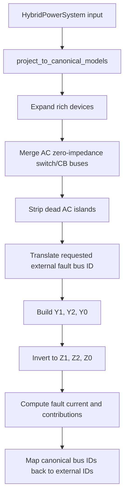

> Documentation Sync (2026-07-12)
> Scope: reviewed against current repository structure, CMake presets/options, and registered test targets.
> Status: implementation-backed reference.
> Source of truth: when text and implementation diverge, treat src/, include/, tests/, and CMake files as authoritative.

# Short-Circuit Derivation and Rich AC/DC Implementation Audit

This note derives the short-circuit formulation used for rich hybrid AC/DC
distribution systems, then maps the derivation to the current C++ module.  It
is written for cross-validation of IEC 60909-style AC short-circuit analysis,
the simplified DC bolted-fault estimator, and the protection behavior of
circuit breakers and converters.

The key implementation answer is:

- The detailed AC short-circuit analysis is performed after
  `project_to_canonical_models(sys)`, so rich AC devices are flattened and bus
  IDs are translated into canonical space before sequence matrices are built.
- The overview AC path also runs after canonical projection, but for
  unbalanced faults it still uses a simplified `Z1 = Z2 = Z0` approximation.
- The DC fault-level path is a resistive stiff-source estimator on the raw DC
  branch graph. It does not yet apply DC circuit breaker open/closed state,
  converter current limiting, capacitor discharge, or DC protection tripping
  inside the calculation.

## 1. Scope

The module currently covers these analysis layers:

1. AC three-phase and unbalanced bus faults using an IEC 60909-style equivalent
   voltage source and sequence-network method.
2. Detailed AC outputs for selected fault buses:
   `I_k''`, positive/negative-sequence indicators, source contributions, peak
   current `i_p`, breaking current `I_b`, steady-state current `I_k`, thermal
   equivalent current `I_th`, remaining voltage, and branch currents.
3. A simplified DC bus bolted-fault level:
   line-resistance-limited current from `DC_V` buses.
4. Converter short-circuit models on the AC side:
   grid-following/current-limited sources and AC-grid-forming voltage sources
   behind impedance.
5. Rich-model projection before AC short-circuit analysis:
   transformers, switches, AC circuit breakers, motors, VPPs, microgrids, and
   mobile storage are represented by canonical elements when applicable.

The module is not a protection-coordination simulator. It estimates fault
levels for equipment screening and analysis. Breaker trip time curves, dynamic
converter controls, arc models, DC capacitor discharge, and post-trip topology
updates must be modeled by additional workflows.

## 2. Base Quantities and Notation

For an AC bus with line-to-line base voltage `U_b` in kV and system base power
`S_b` in MVA:

```math
I_b = \frac{S_b}{\sqrt{3} U_b} \quad [\mathrm{kA}]
```

```math
Z_b = \frac{U_b^2}{S_b} \quad [\Omega]
```

For a DC bus with pole-to-pole base voltage `U_{dc,b}` in kV:

```math
I_{dc,b} = \frac{S_b}{U_{dc,b}} \quad [\mathrm{kA}]
```

Per-unit impedances are converted with the usual base relation:

```math
Z_{pu,system} = Z_{\Omega}/Z_b
```

The IEC voltage factor is written as `c`. In the detailed implementation:

```math
c =
\begin{cases}
\text{explicit } c\_\text{factor}, & c\_\text{factor} > 0 \\
c_{\max}(U_n), & \text{maximum calculation} \\
c_{\min}(U_n), & \text{minimum calculation}
\end{cases}
```

The implemented helper returns approximately:

- maximum: `1.10` for `U_n > 1 kV`, `1.10` for LV above 0.1 kV, and `1.05`
  for very-low-voltage cases;
- minimum: `1.00` for `U_n > 1 kV`, `0.90` for LV above 0.1 kV, and `0.95`
  for very-low-voltage cases.

## 3. AC Equivalent-Voltage-Source Derivation

IEC 60909 replaces the pre-fault network by an equivalent source at the fault
location. Non-rotating loads are neglected for short-circuit injection unless
they carry explicit motor-fraction short-circuit data. Rotating machines and
grid-forming sources are represented by internal impedances.

For a fault at bus `k`, build sequence admittance matrices:

```math
Y_1, \quad Y_2, \quad Y_0
```

and invert or solve them to obtain sequence bus impedance matrices:

```math
Z_1 = Y_1^{-1}, \quad Z_2 = Y_2^{-1}, \quad Z_0 = Y_0^{-1}
```

At the faulted bus:

```math
Z_{1k}=Z_1(k,k), \quad Z_{2k}=Z_2(k,k), \quad Z_{0k}=Z_0(k,k)
```

Fault impedance is represented as `Z_f`. In the current C++ options this is a
real per-unit resistance:

```math
Z_f = R_f + j0
```

### 3.1 Three-Phase Fault

A balanced three-phase fault uses only the positive-sequence network:

```math
I_{k3}'' = \frac{c}{Z_{1k} + Z_f} I_b
```

The effective per-unit impedance used by the code is:

```math
Z_{k,3} = Z_{1k} + Z_f
```

so the reported magnitude is:

```math
|I_{k3}''| = \frac{c}{|Z_{k,3}|} I_b
```

### 3.2 Single-Line-to-Ground Fault

For a single-phase-to-ground fault, the sequence networks are in series:

```math
I_{k1}'' =
\frac{3c}{Z_{1k} + Z_{2k} + Z_{0k} + 3Z_f} I_b
```

The code uses an effective impedance:

```math
Z_{k,1} =
\frac{Z_{1k} + Z_{2k} + Z_{0k} + 3Z_f}{3}
```

so:

```math
|I_{k1}''| = \frac{c}{|Z_{k,1}|} I_b
```

This explains why a single-phase short-circuit current can be higher than a
three-phase current. If the zero-sequence path is low impedance, then:

```math
\left|\frac{Z_1 + Z_2 + Z_0}{3}\right| < |Z_1|
```

and therefore:

```math
|I_{k1}''| > |I_{k3}''|
```

For the common simplified case `Z_2 = Z_1`, the condition is roughly:

```math
|2Z_1 + Z_0| < 3|Z_1|
```

This is realistic in effectively grounded systems with a strong neutral or
grounding transformer path. It is not a numerical bug by itself.

### 3.3 Line-to-Line Fault

For a two-phase fault:

```math
I_{k2}'' =
\frac{\sqrt{3}c}{Z_{1k} + Z_{2k}} I_b
```

The implemented effective impedance is:

```math
Z_{k,2} = \frac{Z_{1k} + Z_{2k}}{\sqrt{3}}
```

### 3.4 Two-Phase-to-Ground Fault

The rigorous sequence formula uses the parallel combination of negative and
zero sequence. The implementation uses:

```math
Z_{k,2E} = Z_{1k} + \left(Z_{2k} \parallel Z_{0k}\right) + Z_f
```

where:

```math
Z_{2k} \parallel Z_{0k} =
\frac{Z_{2k} Z_{0k}}{Z_{2k} + Z_{0k}}
```

The reported magnitude is:

```math
|I_{k2E}''| = \frac{c}{|Z_{k,2E}|} I_b
```

This is a compact engineering approximation for the positive-sequence
equivalent. If phase-resolved currents `I_L2`, `I_L3`, and ground current are
needed, the implementation should be extended to carry the full sequence
current reconstruction rather than only the effective current magnitude.

## 4. Sequence Matrix Construction

The detailed path builds sparse sequence matrices in
`build_sc_admittance_matrices(...)`. It never forms a full `Zbus`. For a fault
at bus `k`, the implementation factors each required sequence matrix once and
solves `Y_s z_k=e_k`; `z_k` is the selected inverse column. Non-fault current
metrics additionally require selected inverse diagonal entries, which are
extracted with bounded dense RHS blocks while retaining only each block's
diagonal.

### 4.1 Passive Branches

For each in-service AC branch:

```math
z_1 = r + jx
```

```math
y_1 = \frac{1}{z_1}
```

Positive and negative sequence use the same branch impedance unless an active
device model supplies a different negative-sequence value. With off-nominal tap
`t`, the branch is inserted as the standard pi/tap admittance block.

Zero sequence uses branch fields:

```math
z_0 = r_0 + jx_0
```

when either `r0_pu` or `x0_pu` is available. If zero-sequence data is missing
for an element, that element does not provide a zero-sequence path, except where
projection explicitly fills a fallback value.

### 4.2 External Grid

An external grid can be specified in three ways:

1. Direct short-circuit current `ikq_ka` and `x_r`.
2. Direct per-unit impedance `r_pu`, `x_pu`.
3. Short-circuit powers `s_sc_max_mva`, `s_sc_min_mva` and ratios
   `rx_max`, `rx_min`.

For direct `ikq_ka`:

```math
Z_{ext,\Omega} = \frac{c U_{nQ}}{\sqrt{3} I_{kQ}''}
```

and then it is converted to per unit on the system base:

```math
Z_{ext,pu} = Z_{ext,\Omega} \frac{S_b}{U_b^2}
```

For short-circuit power:

```math
|Z_{ext,pu}| = \frac{c S_b}{S_{sc}}
```

with `S_sc = s_sc_max_mva` for maximum calculation or `s_sc_min_mva` for
minimum calculation when provided.

Zero-sequence external-grid impedance uses explicit `r0_pu`, `x0_pu` if
available; otherwise it falls back to the positive-sequence impedance.

### 4.3 Synchronous Generators

For an in-service generator:

```math
z_G'' = (r_a + jx_d'') \frac{S_b}{S_{rG}}
```

The implementation applies an IEC-like generator correction:

```math
K_G = \frac{c}{1 + x_d'' \sin\varphi_r}
```

and inserts:

```math
z_{G,corr}'' = K_G z_G''
```

as a shunt admittance:

```math
y_G = \frac{1}{z_{G,corr}''}
```

For steady-state current `I_k`, the code switches from `x_d''` to `x_d` when
`x_d` is available.

Zero sequence uses explicit `r0_pu`, `x0_pu` and an analogous correction:

```math
K_{G0} = \frac{c}{1 + x_0 \sin\varphi_r}
```

### 4.4 Transformers

Rich two-winding transformers are projected into equivalent AC branches before
the detailed short-circuit calculation. From `vk_percent`, `vkr_percent`,
`sn_mva`, and system base:

```math
z_T = \frac{vk\_\%}{100} \frac{S_b}{S_{rT}} \left(\frac{U_{rTLV}}{U_{base,LV}}\right)^2
```

```math
r_T = \frac{vkr\_\%}{100} \frac{S_b}{S_{rT}} \left(\frac{U_{rTLV}}{U_{base,LV}}\right)^2
```

```math
x_T = \sqrt{z_T^2 - r_T^2}
```

The factor `(U_rTLV / U_base,LV)²` converts the nameplate impedance (given on
the transformer rated base `S_rT`, `U_rT`) onto the LV bus voltage base of the
per-unit system; it equals 1 when the LV nameplate voltage matches the bus
base voltage. It is required by IEC 60909, which refers all impedances with
the transformer *rated* ratio (e.g. 33/6.3 kV) regardless of the bus nominal
voltage (6 kV). The same factor applies to the zero-sequence impedance
(`z0_percent`, `x0_r0`). The ideal-tap part of the canonical branch carries
the off-nominal ratio `(U_rTHV/U_rTLV)/(U_base,HV/U_base,LV)` times the OLTC
position. When the LV bus carries no usable `base_kv`, the factor is skipped
(legacy unscaled behaviour).

The detailed short-circuit builder then uses branch provenance to apply the
transformer correction:

```math
K_T = \frac{0.95c}{1 + 0.6x_T^{(Tbase)}}
```

where `x_T^{(Tbase)}` is the reactance on the transformer *nameplate* base
(without the voltage-base factor):

```math
x_T^{(Tbase)} = |x_{T,pu,system}| \frac{S_{rT}}{S_b}
```

The corrected branch impedance is:

```math
z_{T,corr} = K_T z_T
```

For zero sequence:

```math
z_{0,T,corr} = K_{T0} z_{0,T}
```

using `z0_percent` and `x0_r0` when available. If zero-sequence transformer
data is missing, projection currently falls back to positive-sequence leakage
for the equivalent branch. Transformer vector-group blocking of zero-sequence
paths is not fully represented; this is a known modeling limitation.

Three-winding transformers are projected to pair/star equivalent branches.
The positive and negative sequence passive networks use the pair-equivalent
impedances. Zero-sequence pair impedances and vector-group constraints are
currently simplified.

### 4.5 Asynchronous Motors

Dedicated rich `AsynchronousMotor` elements are projected into canonical loads
with:

```math
P_M = S_{rM} \cos\varphi
```

```math
Q_M = S_{rM} \sin\varphi
```

The projected load carries:

- `sn_mva = S_rM`
- `motor_percent = 1.0`
- `sc_source_type = "AsynchronousMotor"`
- `r_sc_pu`, `x_sub_pu`
- `motor_poles`
- `motor_efficiency`

The detailed short-circuit matrix then treats the motor as a subtransient source
only when its active contribution exceeds the implemented threshold:

```math
P_M \ge 0.05 \ \mathrm{MW}
```

For load motor fractions, the motor part is:

```math
S_{M,load} = S_{load} \cdot motor\_fraction
```

and:

```math
z_M = (r_{sc} + jx_{sub}) \frac{S_b}{S_{M,load}}
```

The motor contributes to positive and negative sequence. Zero sequence is used
only when explicit zero-sequence motor data exists for the dedicated motor path;
projected load-motor zero-sequence handling is limited.

### 4.6 Static Generators and Inverter-Based DG

AC static generators are modeled as IEC 60909 current-limited sources:

```math
I_{sgen}'' = k I_r
```

where:

```math
I_r = \frac{S_{r}}{\sqrt{3} U_n}
```

The current contribution is transferred from the generator bus to the fault bus
through the positive-sequence transfer ratio.

This is appropriate for many inverter-based distributed generators that enforce
a current ceiling. It is not a detailed dynamic PLL/current-controller model.

## 5. Converter Short-Circuit Model

The VSC model has two important flags:

- `grid_forming`: DC-side voltage forming.
- `ac_grid_forming`: AC-side voltage forming.

The short-circuit module must distinguish them. DC-side voltage forming alone
does not make the converter an AC voltage source.

### 5.1 Grid-Following VSC

A grid-following converter is modeled as a current-limited source:

```math
I_{VSC}'' = k_{VSC} I_r
```

where:

```math
I_r = \frac{P_{rated}}{\sqrt{3} U_{ac}}
```

The multiplier is selected as:

```math
k_{VSC} =
\begin{cases}
i\_max\_pu, & i\_max\_pu > 0 \text{ and } i\_max\_pu \ne 1 \\
i\_ac\_max\_pu, & i\_ac\_max\_pu > 0 \\
i\_max\_pu, & i\_max\_pu > 0 \\
1, & \text{otherwise}
\end{cases}
```

The current source is added to source-contribution accounting, not inserted as
a shunt impedance in `Y_1`.

### 5.2 AC-Grid-Forming VSC

An AC-grid-forming VSC is modeled as a voltage source behind short-circuit
impedance:

```math
z_{VSC,1} = (r_{sc} + jx_{sc}) \frac{S_b}{P_{rated}}
```

and inserted into the positive-sequence matrix as:

```math
y_{VSC,1} = \frac{1}{z_{VSC,1}}
```

For negative sequence:

```math
z_{VSC,2} = (r_{2,sc} + jx_{2,sc}) \frac{S_b}{P_{rated}}
```

if `r2_sc_pu` or `x2_sc_pu` is provided; otherwise the positive-sequence VSC
impedance is reused.

The implementation does not currently add a VSC zero-sequence source path.
That is reasonable for many transformer-isolated converters, but it should be
made explicit in validation cases when grounding transformers or converter
transformer vector groups matter.

### 5.3 DC/DC Converters and Energy Routers

DC/DC converters are part of the DC network model for power-flow and resilience
workflows, but the DC short-circuit estimator does not currently model their
fault-current contribution, blocking behavior, or current limit. Energy routers
are expanded for steady-state canonical modeling, but short-circuit behavior of
multi-port converter internals remains an aggregate/static representation.

## 6. Protection and Circuit Breaker Modeling

### 6.1 AC Switches and AC Circuit Breakers

Before AC short-circuit analysis, rich AC switches and AC circuit breakers are
projected into equivalent AC branches:

```text
Switch or AC CB -> ACBranch
```

The topology rule is:

- closed and in-service: equivalent low-impedance branch;
- open or out-of-service: out-of-service branch, electrically disconnected.

Closed ideal elements are assigned a tiny impedance so they can participate in
zero-impedance bus merging. After projection:

```text
closed switch/CB group -> merged canonical AC bus
```

This means a fault at any bus in the merged group is solved at the same
canonical node. The result is mapped back to original external bus IDs through
`BusMergeMap`.

Important protection implication:

- AC CB state affects topology before the fault calculation.
- The short-circuit calculation does not simulate CB opening after current is
  detected.
- Branch current results are produced for canonical AC branches. If a switch or
  CB branch is merged into a self-loop and removed, there may be no branch-flow
  row for that physical closed breaker. Protection-duty checks should use the
  adjacent branch/source current and the original breaker rating metadata.

### 6.2 DC Circuit Breakers

`DCCircuitBreaker` is stored, serialized, displayed, validated, and used by
graph/resilience workflows. However, the DC short-circuit estimator currently
builds its conductance matrix only from `dc.branches`. It does not:

- add a closed DCCB as a conductive edge;
- remove or split topology based on an open DCCB;
- add DCCB resistance `r_ohm`;
- compare fault current with `i_breaking_ka`;
- simulate trip time or current interruption.

Therefore, for DC short-circuit correctness with DCCBs, the input model must
already encode the DCCB topology in `dc.branches`, or the estimator must be
extended. A robust extension would add a DC canonical projection step:

```text
DCCircuitBreaker -> DC conductance edge when closed
DCCircuitBreaker -> no edge when open
```

with:

```math
r_{DCCB,pu} =
\frac{r_{\Omega}}{U_{dc,b}^2/S_b}
```

and then run the same conductance reduction on that canonical DC graph.

### 6.3 Breaker Duty Checks

For equipment screening, a breaker at voltage `U_n` should be checked against:

- initial symmetrical current `I_k''`;
- peak current `i_p`;
- breaking current `I_b` at the chosen opening time;
- thermal equivalent current `I_th`;
- DC breaker steady or transient current, depending on the technology.

The current module computes these AC quantities, but it does not automatically
fail or trip breakers based on `i_breaking_ka`. That rating check should be a
separate post-processing layer:

```math
\text{pass} \iff I_{duty} \le I_{breaking,rated}
```

with `I_duty` selected according to the equipment class and study purpose.

## 7. Canonical-Space Data Flow

The detailed AC short-circuit path follows this pipeline:



Projection includes:

- `Transformer2W -> ACBranch`
- `Transformer3W -> ACBranch` pair/star equivalents
- `Switch -> ACBranch`
- `CircuitBreaker -> ACBranch`
- `AsynchronousMotor -> Load` with motor short-circuit fields
- `VirtualPowerPlant -> StaticGenerator`
- `Microgrid -> StaticGenerator`
- selected mobile/charging abstractions into canonical loads/storage/stations

The branch provenance map records transformer and switch-origin branches:

```text
BranchExpandMap: ACBranch index -> origin type/index
```

AC circuit breakers are currently recorded under `BranchOriginType::Switch`,
so code that wants to distinguish switch versus breaker needs extra origin
typing in the future.

## 8. DC Short-Circuit Derivation

The DC estimator solves a resistive Thevenin problem.

Collect in-service DC buses, excluding isolated buses. Build the nodal
conductance matrix from in-service DC branches:

```math
g_{ij} = \frac{n_{parallel}}{r_{ij,pu}}
```

For each branch between buses `i` and `j`:

```math
G_{ii} \mathrel{+}= g_{ij}
```

```math
G_{jj} \mathrel{+}= g_{ij}
```

```math
G_{ij} \mathrel{-}= g_{ij}, \quad G_{ji} \mathrel{-}= g_{ij}
```

`DC_V` buses are treated as ideal voltage sources. Partition the matrix into
non-source buses `N` and source buses `S`:

```math
G_{NN} V_N = -G_{NS} V_S
```

The reduced inverse gives the resistance matrix:

```math
R_{red} = G_{NN}^{-1}
```

For fault bus `k`:

```math
R_{th,k} = R_{red}(k,k)
```

The pre-fault voltage is:

```math
V_{pre,k} = V_N(k)
```

Fault current is:

```math
I_{f,pu} =
\frac{V_{pre,k}}{R_{th,k} + R_f}
```

and:

```math
I_{f,kA} = I_{f,pu} \frac{S_b}{U_{dc,b}}
```

This is a line-resistance-limited bolted-fault estimate. It is useful for
screening DC cables and breakers, but it is not a complete DC protection model.

## 9. Peak, Breaking, Steady-State, and Thermal Currents

### 9.1 Peak Current

At the fault bus the module applies IEC 60909-0 formula (59): the peak is the
sum of the per-contribution peaks,

```math
i_p = \sqrt{2}\Big(\kappa_{net} I_{k,net}'' + \sum_i \kappa_i I_{k,i}''\Big)
```

with a per-contribution factor (before the clamping described below)

```math
\kappa_i = 1.02 + 0.98e^{-3R_i/X_i}
```

taken from each contribution's own R/X ratio:

- the network part (branches + external grids) uses the Thévenin impedance of
  the network with all machine shunts removed;
- each generator / motor / load-motor / grid-forming converter contribution
  uses its own source impedance;
- current sources (static generators, grid-following converters) have no
  decaying DC component and are added without κ (κ = 1).

This reproduces the IEC TR 60909-4:2021 §6.2 worked example
(`tests/test_short_circuit_iec60909_4.cpp`).

At non-fault buses the transferred current keeps the single-κ approximation

```math
i_p = \kappa \sqrt{2} I_{k,1}''
```

where κ uses the fault-point R/X ratio. One clamping rule applies uniformly
to every κ in this step — the fault-bus `kappa_net` and per-contribution
`kappa_of(z_src)` values as well as the non-fault-bus single κ: for method B
in a meshed network the code multiplies by `1.15` and caps the result at
`1.8` (`κ = min(1.8, 1.15κ)`, no lower clamp), while every other
method/topology combination clamps `1.0 ≤ κ ≤ 2.0`
(`src/short_circuit/short_circuit.cpp:kappa_of（lambda）`, and the adjacent
non-fault-bus κ in `run_short_circuit_detailed_impl`).

### 9.2 Breaking Current

The code applies a simplified IEC-style decay treatment.

For synchronous generator contribution:

```math
I_{bG} = \mu I_{kG}''
```

For motor contribution:

```math
I_{bM} = \mu q I_{kM}''
```

The implemented `\mu` depends on current ratio and `breaking_time_s`. The motor
factor `q` depends on motor rated active power per pole pair and breaking time.
Grid-following converter current sources pass through as part of the non-motor
current accounting.

### 9.3 Steady-State Current

For steady-state current `I_k`, the detailed path rebuilds the sequence
matrices in steady-state mode:

- generators use `x_d` when available;
- motors are not included as subtransient sources;
- converter behavior remains simplified.

Generator steady-state contribution uses a `lambda_max` rule based on `x_d/x_q`.

### 9.4 Thermal Equivalent Current

The implementation reports:

```math
I_{th} = I_k'' \sqrt{m+n}
```

with a simplified DC component heat factor `m` and `n \approx 1` for the AC
component. This is adequate as a screening indicator but should be validated
before using it as a final equipment-duty calculation.

## 10. Implementation Cross-Check

### 10.1 What Matches the Theory

- Detailed AC selected-bus analysis runs in canonical space.
- Fault bus IDs are translated from original external IDs to canonical bus IDs,
  including non-contiguous and merged bus cases.
- Positive, negative, and zero sequence matrices are built separately in the
  detailed path.
- External-grid max/min source-strength selection is implemented.
- IEC voltage factor and explicit `c_factor` scaling are implemented.
- Transformer correction is applied after transformer projection by using
  branch provenance.
- Rich motors are converted to load-based motor short-circuit sources and are
  kept in motor contribution accounting.
- Static generators and grid-following converters are current-limited sources.
- AC-grid-forming converters are voltage sources behind impedance.
- DC-side `grid_forming` alone does not become an AC voltage source.
- AC switch and AC CB closed/open states affect canonical topology before the
  AC short-circuit solve.

### 10.2 Important Gaps

1. The overview AC API is not equivalent to the detailed API for unbalanced
   faults. It approximates `Z1 = Z2 = Z0`; the detailed API should be preferred
   for SLG, LL, and LLG studies.
2. The GUI selected-fault route deliberately omits non-fault bus current
   metrics and returns zero for those fields. It still returns complete
   fault-bus duties, source contributions, the full remaining-voltage profile,
   and optional branch currents. The C++ API keeps
   `compute_nonfault_currents=true` by default when full self-impedance data is
   required.
3. Transformer vector groups do not fully block or pass zero-sequence paths.
   This affects SLG and LLG correctness for delta, grounded-wye, zigzag, and
   grounding-transformer cases.
4. Projected load motor fractions do not carry a full zero-sequence motor model.
5. AC circuit breakers are recorded in `BranchExpandMap` as `Switch` origins,
   so protection-result attribution cannot yet distinguish switches from CBs
   using the enum alone.
6. Closed AC switch/CB branches may be merged away. This is correct
   electrically for zero-impedance topology, but branch-current rows for the
   physical breaker may disappear.
7. DC short-circuit does not use DCCB topology or breaker resistance.
8. DC short-circuit does not model converter current limiting, DC/DC converter
   blocking, capacitor discharge, batteries, PV array I-V curves, or source
   internal impedance.
9. Converter behavior is quasi-static. It does not simulate current-controller
   saturation dynamics, PLL behavior, negative-sequence control modes, ride
   through, or protection blocking time.
10. Protection coordination is not simulated. Ratings and trip curves require
    post-processing or a dedicated protection module.

### 10.3 Sparse Solve and Runtime Contract

`SparseInverseSolver` uses SuiteSparse KLU when the Release build provides it,
with Eigen SparseLU as the portable fallback. Detailed batch analysis builds
one shared sparse context and reuses the sequence-network symbolic/numeric
factors across requested fault buses. Cooperative cancellation is checked
between inverse-diagonal RHS blocks and between fault locations; an in-flight
sparse factorization or triangular solve remains indivisible.

The production HTTP contracts are intentionally distinct:

- `/api/session/sc`: positive-sequence overview for all buses; returns
  `Sk`, `Ik''`, and driving-point impedance with
  `model_scope=overview-positive-sequence`.
- `/api/session/sc_detailed`: complete selected-fault duties and full voltage
  profile with `model_scope=selected-fault-complete-voltage-profile`; the GUI
  disables non-fault current metrics because it does not consume them.
- `run_short_circuit_detailed(...)`: full C++ result by default, including
  non-fault self-impedance current metrics.

On the Release/KLU Yunnan case (4512 authored buses, 3927 canonical buses), the
measured HTTP wall times were `74.2 ms` for all-bus overview and `29.7 ms` for
one selected detailed fault. The former implementation exceeded 90 seconds.

## 11. Recommended Correctness Criteria

### 11.1 AC Three-Phase Cases

For simple radial systems, verify:

```math
Z_{th}(downstream) = \sum z_{series} + z_{source}
```

and:

```math
I_k'' = \frac{c}{|Z_{th}|} I_b
```

Fault current should decrease downstream in a radial feeder unless a local
source dominates.

### 11.2 Ground Fault Cases

For SLG faults, verify:

```math
I_{SLG}'' =
\frac{3c}{|Z_1 + Z_2 + Z_0 + 3Z_f|} I_b
```

Then test both regimes:

- high `Z0`: SLG lower than three-phase;
- low `Z0`: SLG can exceed three-phase.

This directly addresses the observed "single-phase current higher than
three-phase" concern.

### 11.3 Transformer Cases

Use a two-winding transformer with known `vk_percent`, `vkr_percent`, and
`sn_mva`, then verify:

```math
z_{T,corr} = K_T z_T
```

Also test explicit `z0_percent` and `x0_r0`:

```math
r_0 = \frac{z_0}{\sqrt{1+(x_0/r_0)^2}}
```

```math
x_0 = r_0 (x_0/r_0)
```

Add future tests for vector-group zero-sequence blocking.

### 11.4 Motor Cases

Use one motor below and one motor above `0.05 MW`.

Expected:

- below threshold: no motor contribution;
- above threshold: `ikss_motor_contrib_ka > 0`;
- projected rich motor appears as motor contribution, not generic load
  contribution.

### 11.5 Converter Cases

Use the two canonical converter tests:

Grid-following or DC-side-forming-only VSC:

```math
I_{conv}'' = i_{max} \frac{P_{rated}}{\sqrt{3}U_{ac}}
```

AC-grid-forming VSC:

```math
I_{conv}'' \approx \frac{c}{|z_{sc}|} I_b
```

The AC-grid-forming contribution should be much larger when `z_sc` is small,
and DC-side `grid_forming = true` alone must not switch to the voltage-source
model.

### 11.6 DC Cases

For a radial DC source:

```text
DC_V -- r12 -- bus2 -- r23 -- bus3
```

verify:

```math
R_{th,bus2} = r_{12}
```

```math
R_{th,bus3} = r_{12} + r_{23}
```

and:

```math
I_f = \frac{V_{pre}}{R_{th}+R_f} \frac{S_b}{U_{dc,b}}
```

Then add DCCB topology tests after the estimator is extended to include DCCB
canonical projection.

## 12. Existing Validation Assets

The current validation cases live under:

```text
external_data/short_circuit_example
```

Hand-calculable cases cover:

- two-bus source and line;
- three-bus radial feeder;
- SLG with low zero-sequence impedance;
- external-grid max/min source strength;
- transformer correction;
- grid-following converter current limit;
- AC-grid-forming converter voltage-source behavior.

Practical stress cases cover:

- industrial transformer/motor/DG systems;
- meshed urban feeders;
- hybrid AC/DC inverter microgrids;
- grounded transformer feeders with SLG current exceeding three-phase current.

These cases should remain the first regression layer for changes to the
short-circuit module.

## 13. Recommended Next Engineering Steps

1. Extend DC canonical projection so `DCCircuitBreaker` participates in DC
   fault topology.
2. Add DC breaker duty post-processing:
   compare `I_f` with `i_breaking_ka`, `i_rated_ka`, and technology-specific
   interruption assumptions.
3. Add transformer vector-group zero-sequence rules for SLG and LLG studies.
4. Split `BranchOriginType::Switch` into distinct `Switch` and
   `CircuitBreaker` origins.
5. Add explicit converter fault model metadata to results:
   `grid_following_current_source`, `ac_grid_forming_voltage_source`,
   `dc_side_forming_not_ac_source`, or `not_modeled`.
6. Add a protection-result layer that maps branch/source currents to AC CBs,
   DCCBs, fuses, and converter blocking thresholds without changing the
   electrical short-circuit solve.

## 14. Code Reference Map

- `src/short_circuit/short_circuit.cpp`
  - `compute_short_circuit(...)`: overview AC short-circuit API.
  - `run_short_circuit_detailed(...)`: detailed selected-bus AC API.
  - `build_sc_admittance_matrices(...)`: detailed sequence matrices.
  - `compute_Zk(...)`: effective fault impedance for each fault type.
- `src/short_circuit/dc_short_circuit.cpp`
  - `dc_bus_fault_level(...)`: resistive DC bolted-fault estimator.
- `src/model/network_utils.cpp`
  - rich-to-canonical projection.
  - AC switch and AC CB equivalent branch creation.
  - rich motor projection to load short-circuit source.
  - AC zero-impedance bus merging.
- `include/hacdcpf/model/converter_components.hpp`
  - VSC short-circuit fields and AC/DC grid-forming flags.
- `include/hacdcpf/model/device_control_role.hpp`
  - role resolution used to identify AC-grid-forming converters.
- `include/hacdcpf/analysis/short_circuit.hpp`
  - detailed AC short-circuit options and result fields.
- `include/hacdcpf/analysis/dc_short_circuit.hpp`
  - DC fault estimator assumptions.
- `external_data/short_circuit_example/README.md`
  - validation case descriptions.
