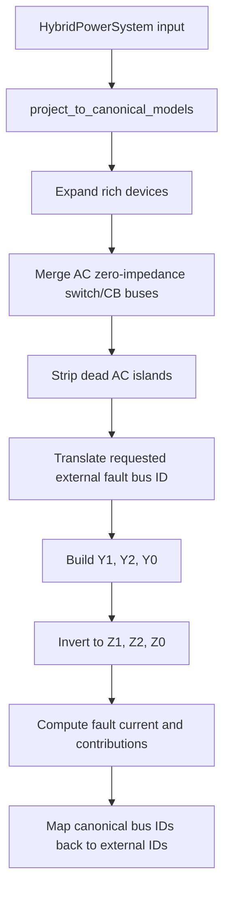

> 本文档为 [short_circuit_rich_acdc_derivation.md](short_circuit_rich_acdc_derivation.md) 的中文译文，供 GUI 帮助中心使用；两者冲突时以原文与代码为准。

> 文档同步（2026-07-12）
> 范围：已对照当前仓库结构、CMake presets/选项以及已注册的测试目标进行审查。
> 状态：有实现支撑的参考文档。
> 事实来源：当文字与实现不一致时，以 src/、include/、tests/ 与 CMake 文件为准。

# 短路推导与富模型 AC/DC 实现审计

本文推导用于富模型交直流混合配电系统的短路计算公式，并将推导映射到当前
C++ 模块。本文用于交叉验证 IEC 60909 风格的交流短路分析、简化的直流金属性
故障估算器，以及断路器与换流器的保护行为。

关键的实现结论是：

- 详细的交流短路分析在 `project_to_canonical_models(sys)` 之后执行，因此在
  构建序网矩阵之前，富模型交流设备已被展平，母线 ID 已被转换到 canonical
  空间。
- 概览（overview）交流路径同样在 canonical 投影之后运行，但对于不平衡故障
  仍使用简化的 `Z1 = Z2 = Z0` 近似。
- 直流故障水平路径是在原始直流支路图上的电阻性刚性源估算器。它在计算内部
  尚未应用直流断路器的分/合状态、换流器限流、电容放电或直流保护跳闸。

## 1. 范围

该模块目前覆盖以下分析层次：

1. 采用 IEC 60909 风格等值电压源与序网法的交流三相及不平衡母线故障。
2. 针对选定故障母线的详细交流输出：
   `I_k''`、正序/负序指标、电源贡献、峰值电流 `i_p`、开断电流 `I_b`、
   稳态电流 `I_k`、热等效电流 `I_th`、残余电压以及支路电流。
3. 简化的直流母线金属性故障水平：
   由 `DC_V` 母线出发、受线路电阻限制的电流。
4. 交流侧换流器短路模型：
   跟网型/限流型电流源，以及阻抗后的交流构网型电压源。
5. 交流短路分析前的富模型投影：
   变压器、开关、交流断路器、电动机、虚拟电厂（VPP）、微电网与移动储能在
   适用时均以 canonical 元件表示。

该模块不是保护配合仿真器。它估算用于设备校核与分析的故障水平。断路器跳闸
时间曲线、换流器动态控制、电弧模型、直流电容放电以及跳闸后拓扑更新必须由
其他工作流建模。

## 2. 基准量与符号约定

对于线电压基准值为 `U_b`（kV）、系统基准功率为 `S_b`（MVA）的交流母线：

```math
I_b = \frac{S_b}{\sqrt{3} U_b} \quad [\mathrm{kA}]
```

```math
Z_b = \frac{U_b^2}{S_b} \quad [\Omega]
```

对于极间基准电压为 `U_{dc,b}`（kV）的直流母线：

```math
I_{dc,b} = \frac{S_b}{U_{dc,b}} \quad [\mathrm{kA}]
```

标幺阻抗按常规基准关系换算：

```math
Z_{pu,system} = Z_{\Omega}/Z_b
```

IEC 电压系数记为 `c`。在详细实现中：

```math
c =
\begin{cases}
\text{explicit } c\_\text{factor}, & c\_\text{factor} > 0 \\
c_{\max}(U_n), & \text{maximum calculation} \\
c_{\min}(U_n), & \text{minimum calculation}
\end{cases}
```

实现中的辅助函数近似返回：

- 最大值：`U_n > 1 kV` 时为 `1.10`；0.1 kV 以上低压（LV）为 `1.10`；
  极低电压情形为 `1.05`；
- 最小值：`U_n > 1 kV` 时为 `1.00`；0.1 kV 以上低压为 `0.90`；
  极低电压情形为 `0.95`。

## 3. 交流等值电压源推导

IEC 60909 用故障点处的等值电源替换故障前网络。除非非旋转负荷带有显式的
电动机份额短路数据，否则其短路注入被忽略。旋转电机与构网型电源以内阻抗
表示。

对于母线 `k` 处的故障，构建序导纳矩阵：

```math
Y_1, \quad Y_2, \quad Y_0
```

并对其求逆或求解，得到序母线阻抗矩阵：

```math
Z_1 = Y_1^{-1}, \quad Z_2 = Y_2^{-1}, \quad Z_0 = Y_0^{-1}
```

在故障母线处：

```math
Z_{1k}=Z_1(k,k), \quad Z_{2k}=Z_2(k,k), \quad Z_{0k}=Z_0(k,k)
```

故障阻抗表示为 `Z_f`。在当前 C++ 选项中它是一个实的标幺电阻：

```math
Z_f = R_f + j0
```

### 3.1 三相故障

平衡三相故障只使用正序网络：

```math
I_{k3}'' = \frac{c}{Z_{1k} + Z_f} I_b
```

代码使用的有效标幺阻抗为：

```math
Z_{k,3} = Z_{1k} + Z_f
```

因此报告的幅值为：

```math
|I_{k3}''| = \frac{c}{|Z_{k,3}|} I_b
```

### 3.2 单相接地故障

对于单相接地故障，各序网络串联：

```math
I_{k1}'' =
\frac{3c}{Z_{1k} + Z_{2k} + Z_{0k} + 3Z_f} I_b
```

代码使用有效阻抗：

```math
Z_{k,1} =
\frac{Z_{1k} + Z_{2k} + Z_{0k} + 3Z_f}{3}
```

因此：

```math
|I_{k1}''| = \frac{c}{|Z_{k,1}|} I_b
```

这解释了为什么单相短路电流可能高于三相短路电流。如果零序通道为低阻抗，
则：

```math
\left|\frac{Z_1 + Z_2 + Z_0}{3}\right| < |Z_1|
```

从而：

```math
|I_{k1}''| > |I_{k3}''|
```

对于常见的简化情形 `Z_2 = Z_1`，该条件大致为：

```math
|2Z_1 + Z_0| < 3|Z_1|
```

在具有强中性点或接地变压器通道的有效接地系统中，这是符合实际的。它本身
并不是数值错误。

### 3.3 两相故障

对于两相故障：

```math
I_{k2}'' =
\frac{\sqrt{3}c}{Z_{1k} + Z_{2k}} I_b
```

实现中的有效阻抗为：

```math
Z_{k,2} = \frac{Z_{1k} + Z_{2k}}{\sqrt{3}}
```

### 3.4 两相接地故障

严格的序网公式使用负序与零序的并联组合。实现中使用：

```math
Z_{k,2E} = Z_{1k} + \left(Z_{2k} \parallel Z_{0k}\right) + Z_f
```

其中：

```math
Z_{2k} \parallel Z_{0k} =
\frac{Z_{2k} Z_{0k}}{Z_{2k} + Z_{0k}}
```

报告的幅值为：

```math
|I_{k2E}''| = \frac{c}{|Z_{k,2E}|} I_b
```

这是针对正序等值的一种紧凑工程近似。如果需要分相电流 `I_L2`、`I_L3` 以及
接地电流，实现应当扩展为携带完整的序电流重构，而不仅仅是有效电流幅值。

## 4. 序网矩阵构建

详细路径在 `build_sc_admittance_matrices(...)` 中构建稀疏序网矩阵。它从不
形成完整的 `Zbus`。对于母线 `k` 处的故障，实现对每个所需的序网矩阵只做
一次分解，并求解 `Y_s z_k=e_k`；`z_k` 即所选逆矩阵列。非故障点电流指标
还需要选定的逆矩阵对角元，这些对角元通过有界的稠密右端项（RHS）块提取，
且每个块只保留其对角线。

### 4.1 无源支路

对于每条在运交流支路：

```math
z_1 = r + jx
```

```math
y_1 = \frac{1}{z_1}
```

正序与负序使用相同的支路阻抗，除非有源设备模型提供了不同的负序值。带有
非额定变比 `t` 时，支路按标准的 pi/变比导纳块插入。

零序使用支路字段：

```math
z_0 = r_0 + jx_0
```

前提是 `r0_pu` 或 `x0_pu` 可用。如果某元件缺少零序数据，则该元件不提供
零序通道，除非投影显式填充了回退值。

### 4.2 外部电网

外部电网可以用三种方式指定：

1. 直接给出短路电流 `ikq_ka` 与 `x_r`。
2. 直接给出标幺阻抗 `r_pu`、`x_pu`。
3. 短路功率 `s_sc_max_mva`、`s_sc_min_mva` 以及比值 `rx_max`、`rx_min`。

对于直接给定 `ikq_ka`：

```math
Z_{ext,\Omega} = \frac{c U_{nQ}}{\sqrt{3} I_{kQ}''}
```

然后换算到系统基准下的标幺值：

```math
Z_{ext,pu} = Z_{ext,\Omega} \frac{S_b}{U_b^2}
```

对于短路功率：

```math
|Z_{ext,pu}| = \frac{c S_b}{S_{sc}}
```

其中最大计算取 `S_sc = s_sc_max_mva`，最小计算在提供时取
`s_sc_min_mva`。

外部电网零序阻抗优先使用显式的 `r0_pu`、`x0_pu`；否则回退为正序阻抗。

### 4.3 同步发电机

对于在运发电机：

```math
z_G'' = (r_a + jx_d'') \frac{S_b}{S_{rG}}
```

实现应用了 IEC 风格的发电机修正：

```math
K_G = \frac{c}{1 + x_d'' \sin\varphi_r}
```

并插入：

```math
z_{G,corr}'' = K_G z_G''
```

作为并联导纳：

```math
y_G = \frac{1}{z_{G,corr}''}
```

对于稳态电流 `I_k`，代码在 `x_d` 可用时从 `x_d''` 切换为 `x_d`。

零序使用显式的 `r0_pu`、`x0_pu` 以及类似的修正：

```math
K_{G0} = \frac{c}{1 + x_0 \sin\varphi_r}
```

### 4.4 变压器

富模型双绕组变压器在详细短路计算之前被投影为等效交流支路。由
`vk_percent`、`vkr_percent`、`sn_mva` 与系统基准：

```math
z_T = \frac{vk\_\%}{100} \frac{S_b}{S_{rT}} \left(\frac{U_{rTLV}}{U_{base,LV}}\right)^2
```

```math
r_T = \frac{vkr\_\%}{100} \frac{S_b}{S_{rT}} \left(\frac{U_{rTLV}}{U_{base,LV}}\right)^2
```

```math
x_T = \sqrt{z_T^2 - r_T^2}
```

因子 `(U_rTLV / U_base,LV)²` 把铭牌阻抗（在变压器额定基准 `S_rT`、`U_rT`
上给出）换算到标幺系统的低压母线电压基准；当低压铭牌电压与母线基准电压
一致时该因子等于 1。IEC 60909 要求所有阻抗按变压器*额定*变比（例如
33/6.3 kV）归算，而不论母线标称电压（6 kV），因此该因子是必需的。同样的
因子也适用于零序阻抗（`z0_percent`、`x0_r0`）。canonical 支路的理想变比
部分携带非额定变比 `(U_rTHV/U_rTLV)/(U_base,HV/U_base,LV)` 乘以 OLTC
（有载调压）档位。当低压母线没有可用的 `base_kv` 时，该因子被跳过（遗留
的不缩放行为）。

随后详细短路构建器利用支路来源（provenance）应用变压器修正：

```math
K_T = \frac{0.95c}{1 + 0.6x_T^{(Tbase)}}
```

其中 `x_T^{(Tbase)}` 是变压器*铭牌*基准下的电抗（不含电压基准因子）：

```math
x_T^{(Tbase)} = |x_{T,pu,system}| \frac{S_{rT}}{S_b}
```

修正后的支路阻抗为：

```math
z_{T,corr} = K_T z_T
```

对于零序：

```math
z_{0,T,corr} = K_{T0} z_{0,T}
```

在可用时使用 `z0_percent` 与 `x0_r0`。如果缺少变压器零序数据，投影目前
对等效支路回退为正序漏抗。变压器接线组别对零序通道的阻断尚未完整表示；
这是一个已知的建模局限。

三绕组变压器被投影为成对/星形等效支路。正序与负序无源网络使用成对等效
阻抗。零序成对阻抗与接线组别约束目前做了简化。

### 4.5 异步电动机

专用的富模型 `AsynchronousMotor` 元件被投影为 canonical 负荷，带有：

```math
P_M = S_{rM} \cos\varphi
```

```math
Q_M = S_{rM} \sin\varphi
```

投影后的负荷携带：

- `sn_mva = S_rM`
- `motor_percent = 1.0`
- `sc_source_type = "AsynchronousMotor"`
- `r_sc_pu`、`x_sub_pu`
- `motor_poles`
- `motor_efficiency`

详细短路矩阵随后仅当其有功贡献超过实现中的阈值时才把电动机作为次暂态
电源处理：

```math
P_M \ge 0.05 \ \mathrm{MW}
```

对于负荷电动机份额，电动机部分为：

```math
S_{M,load} = S_{load} \cdot motor\_fraction
```

并且：

```math
z_M = (r_{sc} + jx_{sub}) \frac{S_b}{S_{M,load}}
```

电动机对正序与负序有贡献。零序仅在专用电动机路径存在显式零序电动机数据
时使用；投影负荷电动机的零序处理是有限的。

### 4.6 静态发电机与逆变器型分布式电源

交流静态发电机（static generator）按 IEC 60909 限流型电流源建模：

```math
I_{sgen}'' = k I_r
```

其中：

```math
I_r = \frac{S_{r}}{\sqrt{3} U_n}
```

电流贡献通过正序转移比从发电机母线转移到故障母线。

这适用于许多强制执行电流上限的逆变器型分布式发电机（DG）。它不是详细的
动态 PLL（锁相环）/电流控制器模型。

## 5. 换流器短路模型

VSC（电压源换流器）模型有两个重要标志：

- `grid_forming`：直流侧电压构网。
- `ac_grid_forming`：交流侧电压构网。

短路模块必须区分它们。仅直流侧电压构网并不会使换流器成为交流电压源。

### 5.1 跟网型 VSC

跟网型换流器建模为限流型电流源：

```math
I_{VSC}'' = k_{VSC} I_r
```

其中：

```math
I_r = \frac{P_{rated}}{\sqrt{3} U_{ac}}
```

倍率按如下规则选择：

```math
k_{VSC} =
\begin{cases}
i\_max\_pu, & i\_max\_pu > 0 \text{ and } i\_max\_pu \ne 1 \\
i\_ac\_max\_pu, & i\_ac\_max\_pu > 0 \\
i\_max\_pu, & i\_max\_pu > 0 \\
1, & \text{otherwise}
\end{cases}
```

该电流源计入电源贡献统计，而不是作为并联阻抗插入 `Y_1`。

### 5.2 交流构网型 VSC

交流构网型 VSC 建模为短路阻抗后的电压源：

```math
z_{VSC,1} = (r_{sc} + jx_{sc}) \frac{S_b}{P_{rated}}
```

并按如下形式插入正序矩阵：

```math
y_{VSC,1} = \frac{1}{z_{VSC,1}}
```

对于负序：

```math
z_{VSC,2} = (r_{2,sc} + jx_{2,sc}) \frac{S_b}{P_{rated}}
```

前提是提供了 `r2_sc_pu` 或 `x2_sc_pu`；否则复用正序 VSC 阻抗。

实现目前没有添加 VSC 零序电源通道。对于许多经变压器隔离的换流器这是
合理的，但当涉及接地变压器或换流变压器接线组别时，应在验证算例中显式
说明。

### 5.3 DC/DC 换流器与能量路由器

DC/DC 换流器在潮流与弹性工作流中属于直流网络模型的一部分，但直流短路
估算器目前不对其故障电流贡献、阻断行为或限流建模。能量路由器在稳态
canonical 建模中被展开，但多端口换流器内部的短路行为仍是聚合/静态表示。

## 6. 保护与断路器建模

### 6.1 交流开关与交流断路器

在交流短路分析之前，富模型交流开关与交流断路器被投影为等效交流支路：

```text
Switch or AC CB -> ACBranch
```

拓扑规则为：

- 闭合且在运：等效低阻抗支路；
- 断开或退出运行：退出运行的支路，电气上断开。

闭合的理想元件被赋予极小阻抗，以便参与零阻抗母线合并。投影之后：

```text
closed switch/CB group -> merged canonical AC bus
```

这意味着合并组内任一母线上的故障都在同一个 canonical 节点上求解。结果
通过 `BusMergeMap` 映射回原始外部母线 ID。

重要的保护含义：

- 交流断路器状态在故障计算之前影响拓扑。
- 短路计算不模拟检测到电流之后断路器的开断。
- 支路电流结果针对 canonical 交流支路产生。如果开关或断路器支路被合并为
  自环并被移除，则该物理闭合断路器可能没有对应的支路潮流行。保护校核
  应使用相邻支路/电源电流以及原始断路器额定值元数据。

### 6.2 直流断路器

`DCCircuitBreaker` 会被存储、序列化、展示、校验，并被图/弹性工作流使用。
然而，直流短路估算器目前仅从 `dc.branches` 构建其电导矩阵。它不会：

- 把闭合的直流断路器（DCCB）作为导电边加入；
- 根据断开的 DCCB 移除或拆分拓扑；
- 加入 DCCB 电阻 `r_ohm`；
- 将故障电流与 `i_breaking_ka` 比较；
- 模拟跳闸时间或电流开断。

因此，要使含 DCCB 的直流短路计算正确，输入模型必须已经把 DCCB 拓扑编码
进 `dc.branches`，或者必须扩展估算器。一个稳健的扩展是增加直流 canonical
投影步骤：

```text
DCCircuitBreaker -> DC conductance edge when closed
DCCircuitBreaker -> no edge when open
```

并带有：

```math
r_{DCCB,pu} =
\frac{r_{\Omega}}{U_{dc,b}^2/S_b}
```

然后在得到的 canonical 直流图上运行相同的电导归约。

### 6.3 断路器校核

对于设备校核，电压为 `U_n` 的断路器应对照以下各项检查：

- 初始对称电流 `I_k''`；
- 峰值电流 `i_p`；
- 所选开断时刻的开断电流 `I_b`；
- 热等效电流 `I_th`；
- 直流断路器的稳态或暂态电流，取决于技术类型。

当前模块会计算这些交流量，但不会基于 `i_breaking_ka` 自动判定断路器失效
或跳闸。该额定值检查应当是单独的后处理层：

```math
\text{pass} \iff I_{duty} \le I_{breaking,rated}
```

其中 `I_duty` 按设备类别与研究目的选取。

## 7. Canonical 空间数据流

详细的交流短路路径遵循以下流水线：



投影包括：

- `Transformer2W -> ACBranch`
- `Transformer3W -> ACBranch` 成对/星形等效
- `Switch -> ACBranch`
- `CircuitBreaker -> ACBranch`
- `AsynchronousMotor -> Load`，带电动机短路字段
- `VirtualPowerPlant -> StaticGenerator`
- `Microgrid -> StaticGenerator`
- 选定的移动/充电抽象映射为 canonical 负荷/储能/充电站

支路来源映射记录变压器与开关来源的支路：

```text
BranchExpandMap: ACBranch index -> origin type/index
```

交流断路器目前记录在 `BranchOriginType::Switch` 之下，因此未来想要区分开关
与断路器的代码需要额外的来源类型。

## 8. 直流短路推导

直流估算器求解一个电阻性戴维南（Thevenin）问题。

收集在运直流母线，排除孤立母线。由在运直流支路构建节点电导矩阵：

```math
g_{ij} = \frac{n_{parallel}}{r_{ij,pu}}
```

对于母线 `i` 与 `j` 之间的每条支路：

```math
G_{ii} \mathrel{+}= g_{ij}
```

```math
G_{jj} \mathrel{+}= g_{ij}
```

```math
G_{ij} \mathrel{-}= g_{ij}, \quad G_{ji} \mathrel{-}= g_{ij}
```

`DC_V` 母线被视为理想电压源。将矩阵按非电源母线 `N` 与电源母线 `S`
分块：

```math
G_{NN} V_N = -G_{NS} V_S
```

约化逆矩阵给出电阻矩阵：

```math
R_{red} = G_{NN}^{-1}
```

对于故障母线 `k`：

```math
R_{th,k} = R_{red}(k,k)
```

故障前电压为：

```math
V_{pre,k} = V_N(k)
```

故障电流为：

```math
I_{f,pu} =
\frac{V_{pre,k}}{R_{th,k} + R_f}
```

并且：

```math
I_{f,kA} = I_{f,pu} \frac{S_b}{U_{dc,b}}
```

这是受线路电阻限制的金属性故障估算。它可用于直流电缆与断路器的校核，
但不是完整的直流保护模型。

## 9. 峰值、开断、稳态与热等效电流

### 9.1 峰值电流

在故障母线处，模块应用 IEC 60909-0 公式 (59)：峰值为各贡献峰值之和，

```math
i_p = \sqrt{2}\Big(\kappa_{net} I_{k,net}'' + \sum_i \kappa_i I_{k,i}''\Big)
```

其中每个贡献的系数（未取下文所述钳制前）为

```math
\kappa_i = 1.02 + 0.98e^{-3R_i/X_i}
```

取自各贡献自身的 R/X 比：

- 网络部分（支路 + 外部电网）使用移除所有电机并联支路后的网络戴维南
  阻抗；
- 每个发电机/电动机/负荷电动机/构网型换流器贡献使用其自身电源阻抗；
- 电流源（静态发电机、跟网型换流器）没有衰减直流分量，按 κ = 1 无 κ
  计入。

这复现了 IEC TR 60909-4:2021 §6.2 的算例
（`tests/test_short_circuit_iec60909_4.cpp`）。

在非故障母线处，转移电流保留单 κ 近似

```math
i_p = \kappa \sqrt{2} I_{k,1}''
```

其中 κ 使用故障点的 R/X 比。同一条钳制规则统一作用于本步的所有 κ——
故障母线的 `kappa_net`、逐贡献的 `kappa_of(z_src)` 以及非故障母线的单
κ：对于网状网络中的方法 B，代码乘以 `1.15` 并将结果封顶为 `1.8`
（`κ = min(1.8, 1.15κ)`，无下限钳制），而其余方法/拓扑组合均钳制到
`1.0 ≤ κ ≤ 2.0`（`src/short_circuit/short_circuit.cpp:kappa_of（lambda）`，
以及 `run_short_circuit_detailed_impl` 中相邻的非故障母线 κ）。

### 9.2 开断电流

代码应用简化的 IEC 风格衰减处理。

对于同步发电机贡献：

```math
I_{bG} = \mu I_{kG}''
```

对于电动机贡献：

```math
I_{bM} = \mu q I_{kM}''
```

实现中的 `\mu` 取决于电流比与 `breaking_time_s`。电动机系数 `q` 取决于
电动机每对极的额定有功功率与开断时间。跟网型换流器电流源作为非电动机
电流统计的一部分直接通过。

### 9.3 稳态电流

对于稳态电流 `I_k`，详细路径以稳态模式重建序网矩阵：

- 发电机在可用时使用 `x_d`；
- 电动机不作为次暂态电源计入；
- 换流器行为保持简化。

发电机稳态贡献使用基于 `x_d/x_q` 的 `lambda_max` 规则。

### 9.4 热等效电流

实现报告：

```math
I_{th} = I_k'' \sqrt{m+n}
```

其中直流分量热系数 `m` 为简化值，交流分量取 `n \approx 1`。这作为校核
指标是足够的，但在用作最终设备校核计算之前应加以验证。

## 10. 实现交叉核对

### 10.1 与理论一致的部分

- 详细的交流选定母线分析在 canonical 空间中运行。
- 故障母线 ID 从原始外部 ID 转换到 canonical 母线 ID，包括非连续编号与
  合并母线的情形。
- 正序、负序、零序矩阵在详细路径中分别构建。
- 外部电网最大/最小电源强度选择已实现。
- IEC 电压系数与显式 `c_factor` 缩放已实现。
- 变压器修正在变压器投影之后利用支路来源应用。
- 富模型电动机被转换为基于负荷的电动机短路电源，并保留在电动机贡献
  统计中。
- 静态发电机与跟网型换流器是限流型电流源。
- 交流构网型换流器是阻抗后的电压源。
- 仅直流侧 `grid_forming` 不会变成交流电压源。
- 交流开关与交流断路器的闭合/断开状态在交流短路求解之前影响 canonical
  拓扑。

### 10.2 重要差距

1. 概览交流 API 对于不平衡故障不等价于详细 API。它近似 `Z1 = Z2 = Z0`；
   单相接地（SLG）、两相（LL）与两相接地（LLG）研究应优先使用详细 API。
2. GUI 选定故障路由有意省略非故障母线电流指标，对这些字段返回零。它仍
   返回完整的故障母线校核量、电源贡献、完整的残余电压分布以及可选的支路
   电流。C++ API 在需要完整自阻抗数据时默认保持
   `compute_nonfault_currents=true`。
3. 变压器接线组别不会完整阻断或导通零序通道。这影响三角形、接地星形、
   曲折形（zigzag）以及接地变压器情形下 SLG 与 LLG 的正确性。
4. 投影的负荷电动机份额不携带完整的零序电动机模型。
5. 交流断路器在 `BranchExpandMap` 中记录为 `Switch` 来源，因此保护结果
   归因目前仅凭该枚举无法区分开关与断路器。
6. 闭合的交流开关/断路器支路可能被合并掉。这对于零阻抗拓扑在电气上是
   正确的，但物理断路器的支路潮流行可能消失。
7. 直流短路不使用 DCCB 拓扑或断路器电阻。
8. 直流短路不建模换流器限流、DC/DC 换流器阻断、电容放电、电池、光伏
   阵列 I-V 曲线或电源内阻抗。
9. 换流器行为是准稳态的。它不模拟电流控制器饱和动态、PLL 行为、负序
   控制模式、故障穿越（ride through）或保护闭锁时间。
10. 不模拟保护配合。额定值与跳闸曲线需要后处理或专用保护模块。

### 10.3 稀疏求解与运行时契约

`SparseInverseSolver` 在 Release 构建提供 SuiteSparse KLU 时使用 KLU，以便
携的 Eigen SparseLU 作为回退。详细批量分析构建一个共享稀疏上下文，并在
各请求故障母线之间复用序网的符号/数值因子。协作式取消在逆对角 RHS 块
之间以及故障位置之间检查；进行中的稀疏分解或三角求解保持不可拆分。

生产环境 HTTP 契约有意做了区分：

- `/api/session/sc`：全部母线的正序概览；返回 `Sk`、`Ik''` 与驱动点阻抗，
  带 `model_scope=overview-positive-sequence`。
- `/api/session/sc_detailed`：完整的选定故障校核量与完整电压分布，带
  `model_scope=selected-fault-complete-voltage-profile`；GUI 禁用非故障
  电流指标，因为它不消费这些指标。
- `run_short_circuit_detailed(...)`：默认返回完整 C++ 结果，包括非故障
  自阻抗电流指标。

在 Release/KLU 云南算例（4512 个原始母线，3927 个 canonical 母线）上，
实测 HTTP 墙钟时间为：全母线概览 `74.2 ms`，单个选定详细故障
`29.7 ms`。此前的实现超过 90 秒。

## 11. 推荐的正确性判据

### 11.1 交流三相算例

对于简单辐射状系统，验证：

```math
Z_{th}(downstream) = \sum z_{series} + z_{source}
```

以及：

```math
I_k'' = \frac{c}{|Z_{th}|} I_b
```

除非本地电源占主导，辐射状馈线上的故障电流应向下游递减。

### 11.2 接地故障算例

对于 SLG 故障，验证：

```math
I_{SLG}'' =
\frac{3c}{|Z_1 + Z_2 + Z_0 + 3Z_f|} I_b
```

然后测试两种情形：

- 高 `Z0`：SLG 低于三相；
- 低 `Z0`：SLG 可以超过三相。

这直接回应了观察到的"单相电流高于三相"的疑问。

### 11.3 变压器算例

使用已知 `vk_percent`、`vkr_percent` 与 `sn_mva` 的双绕组变压器，验证：

```math
z_{T,corr} = K_T z_T
```

同时测试显式的 `z0_percent` 与 `x0_r0`：

```math
r_0 = \frac{z_0}{\sqrt{1+(x_0/r_0)^2}}
```

```math
x_0 = r_0 (x_0/r_0)
```

未来补充接线组别零序阻断的测试。

### 11.4 电动机算例

使用一个低于、一个高于 `0.05 MW` 的电动机。

预期：

- 低于阈值：无电动机贡献；
- 高于阈值：`ikss_motor_contrib_ka > 0`；
- 投影的富模型电动机表现为电动机贡献，而不是一般负荷贡献。

### 11.5 换流器算例

使用两个 canonical 换流器测试：

跟网型或仅直流侧构网的 VSC：

```math
I_{conv}'' = i_{max} \frac{P_{rated}}{\sqrt{3}U_{ac}}
```

交流构网型 VSC：

```math
I_{conv}'' \approx \frac{c}{|z_{sc}|} I_b
```

当 `z_sc` 较小时，交流构网型贡献应明显更大，且仅直流侧
`grid_forming = true` 不得切换到电压源模型。

### 11.6 直流算例

对于辐射状直流电源：

```text
DC_V -- r12 -- bus2 -- r23 -- bus3
```

验证：

```math
R_{th,bus2} = r_{12}
```

```math
R_{th,bus3} = r_{12} + r_{23}
```

以及：

```math
I_f = \frac{V_{pre}}{R_{th}+R_f} \frac{S_b}{U_{dc,b}}
```

然后在估算器扩展为包含 DCCB canonical 投影之后，补充 DCCB 拓扑测试。

## 12. 现有验证资产

当前验证算例位于：

```text
external_data/short_circuit_example
```

可手算的算例覆盖：

- 双母线电源与线路；
- 三母线辐射状馈线；
- 低零序阻抗的 SLG；
- 外部电网最大/最小电源强度；
- 变压器修正；
- 跟网型换流器限流；
- 交流构网型换流器电压源行为。

实际压力算例覆盖：

- 工业变压器/电动机/DG 系统；
- 网状城市馈线；
- 交直流混合逆变器微电网；
- SLG 电流超过三相电流的接地变压器馈线。

这些算例应当继续作为短路模块变更的第一层回归。

## 13. 推荐的后续工程步骤

1. 扩展直流 canonical 投影，使 `DCCircuitBreaker` 参与直流故障拓扑。
2. 增加直流断路器校核后处理：
   将 `I_f` 与 `i_breaking_ka`、`i_rated_ka` 以及特定技术类型的开断假设
   进行比较。
3. 为 SLG 与 LLG 研究增加变压器接线组别零序规则。
4. 把 `BranchOriginType::Switch` 拆分为独立的 `Switch` 与
   `CircuitBreaker` 来源。
5. 在结果中增加显式的换流器故障模型元数据：
   `grid_following_current_source`、`ac_grid_forming_voltage_source`、
   `dc_side_forming_not_ac_source` 或 `not_modeled`。
6. 增加保护结果层，把支路/电源电流映射到交流断路器、DCCB、熔断器与
   换流器闭锁阈值，而不改变电气短路求解。

## 14. 代码参考地图

- `src/short_circuit/short_circuit.cpp`
  - `compute_short_circuit(...)`：概览交流短路 API。
  - `run_short_circuit_detailed(...)`：详细选定母线交流 API。
  - `build_sc_admittance_matrices(...)`：详细序网矩阵。
  - `compute_Zk(...)`：各故障类型的有效故障阻抗。
- `src/short_circuit/dc_short_circuit.cpp`
  - `dc_bus_fault_level(...)`：电阻性直流金属性故障估算器。
- `src/model/network_utils.cpp`
  - 富模型到 canonical 的投影。
  - 交流开关与交流断路器等效支路创建。
  - 富模型电动机投影为负荷短路电源。
  - 交流零阻抗母线合并。
- `include/hacdcpf/model/converter_components.hpp`
  - VSC 短路字段与交流/直流构网标志。
- `include/hacdcpf/model/device_control_role.hpp`
  - 用于识别交流构网型换流器的角色解析。
- `include/hacdcpf/analysis/short_circuit.hpp`
  - 详细交流短路选项与结果字段。
- `include/hacdcpf/analysis/dc_short_circuit.hpp`
  - 直流故障估算器假设。
- `external_data/short_circuit_example/README.md`
  - 验证算例说明。
