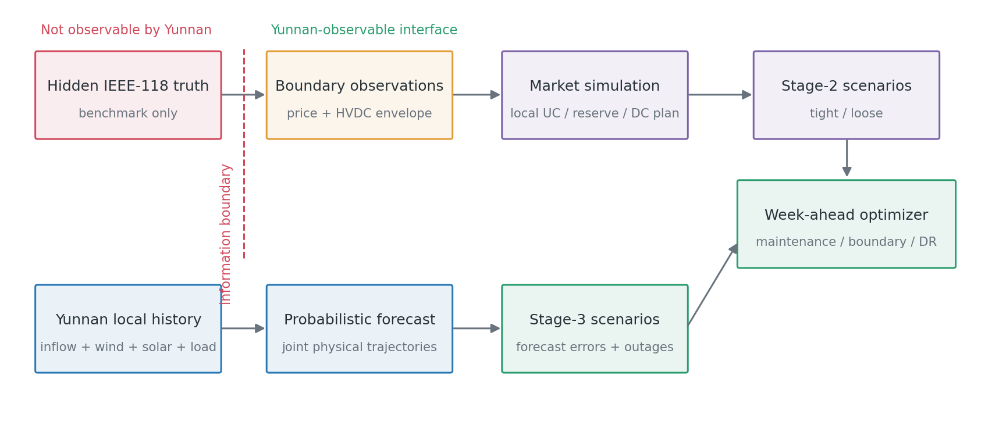
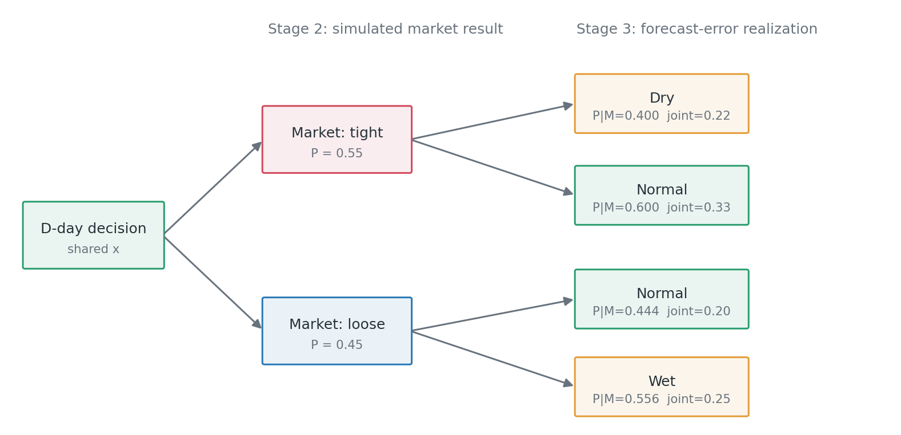
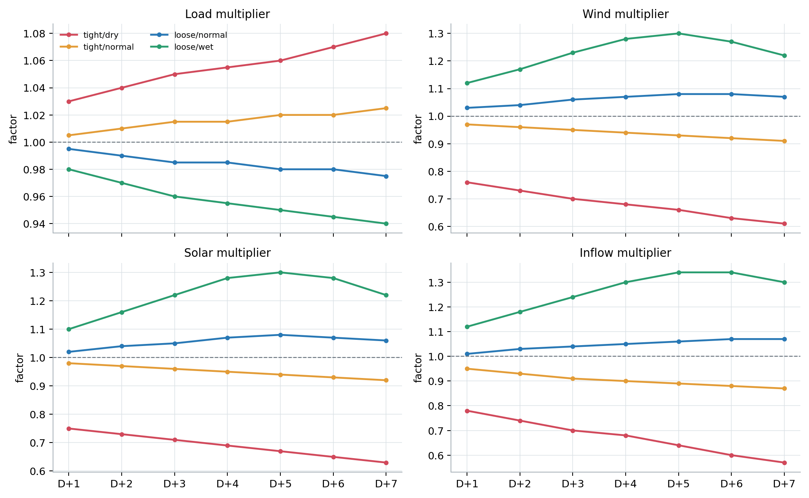
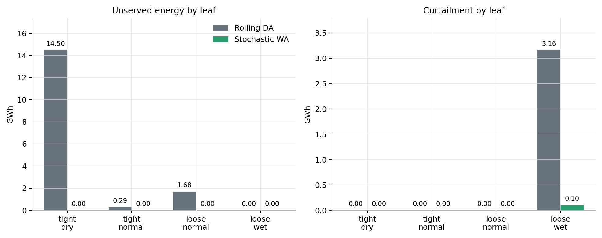
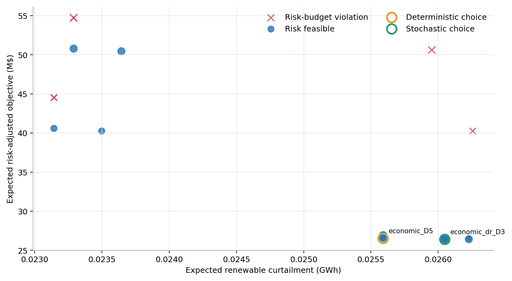

# 云南周前瞻调度双源不确定性量化与三阶段优化方法

## 1. 文档目的

本文给出云南省级调度在无法观测其他四省内部数据条件下，对两类不确定性进行
度量并用于周前瞻决策的完整理论框架：

1. 采用概率预测度量云南本地来水、风电、光伏、负荷和设备状态不确定性；
2. 采用条件市场模拟度量云南本地市场主体出清结果和云南外送计划不确定性；
3. 将两类结果组合为满足非前视性的条件场景树；
4. 在三阶段随机优化中协调市场边界、检修、需求响应、备用、水量和运行追索；
5. 通过风险预算和样本外回测区分预测精度、市场模拟精度和决策有效性。

本文所说的“市场模拟”不是读取其他四省数据后重放五省市场，而是在云南可观测
信息条件下模拟云南自身可能获得的市场结果。



---

## 2. 信息边界

### 2.1 云南可观测信息

在 `D` 日、区域日前市场出清前，定义云南信息集：

\[
\begin{aligned}
\mathcal I_D^{YN}=\{&
X_D^{local},
\widehat I_D,
\widehat W_D,
\widehat S_D,
\widehat L_D,\\
&Bid_D^{YN},
B_D^{candidate},
Q^{YN,hist},
\lambda^{hist},
I_D^{public}
\}.
\end{aligned}
\]

其中：

- \(X_D^{local}\)：云南网络、机组、水库、储能、检修和设备状态；
- \(\widehat I,\widehat W,\widehat S,\widehat L\)：云南本地预测；
- \(Bid_D^{YN}\)：云南市场主体报价；
- \(B_D^{candidate}\)：待评价的云南市场边界；
- \(Q^{YN,hist}\)：云南自身历史直流计划与执行量；
- \(\lambda^{hist}\)：已发布历史区域价格；
- \(I_D^{public}\)：公开天气、节假日、市场公告和区域状态信息。

### 2.2 不可观测信息

云南优化器不得访问：

\[
X_D^{ext}
=\{
\text{省外网络、机组、负荷、新能源、报价、开机、备用和调度结果}
\}.
\]

因此必须满足：

\[
\mathcal I_D^{YN}\cap X_D^{ext}=\varnothing.
\]

IEEE-118 在验证算例中只属于隐藏试验环境。它生成价格和直流可接受能力等合成
边界观测后即被隔离，不能作为云南优化器输入。

---

## 3. 变时间尺度和信息揭示

| 时域 | 分辨率 | 主要不确定性 | 决策作用 |
|---|---:|---|---|
| `D+1` | 96 个 15 分钟时段 | 爬坡、风光荷误差、直流和设备故障 | 正式边界与详细安全校核 |
| `D+2～D+3` | 48 个小时 | 连续天气轨迹、市场模板、检修和水量 | 近期安全风险预测 |
| `D+4～D+7` | 12 个峰平谷块 | 日来水、峰值净负荷、可靠容量 | 充裕性和终端状态 |

总时段数为：

\[
|\mathcal T|=96+48+12=156.
\]

市场出清使用 `D` 日已经形成的预测值。实际预测误差只能在第三阶段揭示，不能
提前进入市场模拟，否则会产生前视偏差。

---

## 4. 第一类不确定性：概率预测

### 4.1 随机向量

本地物理随机向量为：

\[
\xi_{t}^{phy}
=\left(
I_{r,t},W_{w,t},S_{v,t},L_{b,t},A_{i,t}^{unit},A_{k,t}^{DC}
\right).
\]

采用预测值与误差分解：

\[
\xi_{t,\omega}^{phy}
=\widehat\xi_t^{phy}+\varepsilon_{t,\omega}^{phy}.
\]

预测模块输出的不是单一点值，而是：

\[
\mathcal F_D
=\left\{
\widehat\xi_t,
q_t^{10},q_t^{50},q_t^{90},
\xi_{t,\omega}^{phy},
\pi_{\omega|m}
\right\}.
\]

### 4.2 来水预测

来水应按流域或梯级水库联合建模：

\[
I_{r,d}=f_r
\left(
I_{r,d-1:d-p},
Rain_{d:d+h},
Soil_d,
Season_d
\right)+\varepsilon_{r,d}^I.
\]

需要保留：

- 同一流域多个水库之间的空间相关性；
- 连续偏枯或偏丰状态的持续性；
- 预测期限增加导致的误差扩张；
- 来水与风光天气型之间的相关关系。

### 4.3 风电、光伏和负荷预测

分别建立残差：

\[
\varepsilon_t^W=W_t-\widehat W_t,
\quad
\varepsilon_t^S=S_t-\widehat S_t,
\quad
\varepsilon_t^L=L_t-\widehat L_t.
\]

不能用一个统一的“新能源比例”替代风电和光伏，因为二者的相关结构和爬坡风险
不同。建议使用条件分位数模型生成边际分布，再采用以下任一方法生成联合轨迹：

- 历史相似日块自助抽样；
- Gaussian Copula 或 Vine Copula；
- 多变量时序生成模型；
- 按天气型聚类后的条件残差重采样。

### 4.4 轨迹生成和场景削减

设原始样本数为 \(N_0\)，通过联合模型生成连续轨迹：

\[
\widetilde\Omega
=\left\{
(\xi_{1,\omega},\ldots,\xi_{156,\omega})
\right\}_{\omega=1}^{N_0}.
\]

然后采用前向选择、后向删除或 Wasserstein 距离削减为 \(N\) 个场景：

\[
\min_{\Omega:|\Omega|=N}
W_1
\left(
\widehat P_{N_0},P_{\Omega}
\right).
\]

场景削减必须对整条轨迹操作，不能逐时独立删点。

### 4.5 概率预测校准

| 对象 | 校准指标 |
|---|---|
| 单变量分位数 | Pinball Loss、P10/P90 覆盖率和区间宽度 |
| 连续概率分布 | CRPS |
| 多变量轨迹 | Energy Score、Variogram Score |
| 极端风险 | 尾部覆盖率、最大连续偏差持续时间 |
| 场景应用 | 实际值是否落入场景凸包、风险指标回测覆盖率 |

预测场景没有通过概率校准前，不应直接用于计算“发生概率为多少”的业务结论。

---

## 5. 第二类不确定性：条件市场模拟

### 5.1 模拟目标

市场随机结果定义为：

\[
Y_m^M
=\left\{
U_{g,t,m}^{UC},
P_{g,t,m}^{base},
R_{g,t,m}^{AS},
Z_{g,t,m}^{zone},
Q_{k,t,m}^{DC},
\lambda_{t,m}^{YN}
\right\}.
\]

这些都是云南可以在历史出清后观测到的本地结果。模拟目标是获得其条件分布：

\[
P
\left(
Y^M
\mid
\mathcal I_D^{YN},B_D
\right),
\]

而不是恢复不可观测的省外完整运行状态。

### 5.2 省外响应的潜变量表示

定义不可直接观测的外部市场状态 \(\theta_m^{ext}\)，例如：

\[
\theta_m^{ext}
=\{
\text{受端紧张、正常、宽松、直流受限、区域新能源富余}
\}.
\]

只能从云南历史结果和公开信息估计：

\[
\pi_m
=P
\left(
\theta_m^{ext}
\mid
Q^{YN,hist},\lambda^{hist},I_D^{public}
\right).
\]

外部状态不是其他省真实数据的替代品，而是对云南边界响应的统计分类。

### 5.3 降阶市场连续链

每个市场状态执行：

\[
\boxed{
\text{区域 SCUC 响应模板}
\rightarrow
\text{云南备用市场}
\rightarrow
\text{固定开机 SCED 可行性投影}
}
\]

#### SCUC 响应模板

从云南历史出清结果聚类完整开机轨迹：

\[
\mathcal U^{template}
=\{U^1,U^2,\ldots,U^K\}.
\]

模板匹配概率为：

\[
P(U^k\mid \mathcal I_D^{YN},B_D).
\]

必须整体抽取开机模板，不能按每台机组开机概率独立抽样。

#### 云南备用市场

固定 \(U^k\) 后，模拟本地备用和稳定区：

\[
\sum_g r_{g,t}^{up}\ge R_t^{up},
\qquad
P_{g,t}^{base}+r_{g,t}^{up}
\le \overline P_gU_{g,t}.
\]

水电稳定区选择满足：

\[
\underline P_{g,z}Z_{g,z,t}
\le P_{g,t}
\le\overline P_{g,z}Z_{g,z,t},
\qquad
\sum_zZ_{g,z,t}\le1.
\]

#### 固定开机 SCED 投影

在备用扣留和稳定区约束下求解能量基点与直流计划。省外作用只通过可观测代理
包络表示：

\[
\underline Q_{k,t,m}^{obs}
\le Q_{k,t,m}^{DC}
\le\overline Q_{k,t,m}^{obs}.
\]

### 5.4 市场模拟概率和残差

市场模板给出离散结构，连续结果还需要残差模型：

\[
P_{g,t,m}^{base}
=\widehat P_{g,t}^{template}
+\varepsilon_{g,t,m}^P,
\]

\[
Q_{k,t,m}^{DC}
=\widehat Q_{k,t}^{template}
+\varepsilon_{k,t,m}^Q.
\]

残差应保持直流爬坡、机组容量和时间连续性，并通过可行性投影修复。

### 5.5 市场模拟校准

| 输出 | 指标 |
|---|---|
| 开机模板 | 模板命中率、机组状态 F1、Jaccard 距离 |
| 功率基点 | MAE、分位区间覆盖率、爬坡误差 |
| 备用与稳定区 | 中标覆盖率、稳定区命中率 |
| 直流计划 | MAE、Pinball Loss、计划区间覆盖率 |
| 联合轨迹 | Energy Score、不可行轨迹比例 |

市场模拟的核心验收指标不是省外状态预测正确率，而是云南本地出清结果和直流
计划的分布覆盖率。

---

## 6. 两类不确定性的条件耦合

### 6.1 条件场景树

市场情景 \(m\in\mathcal M\) 在第二阶段揭示，物理场景
\(\omega\in\Omega(m)\) 在第三阶段揭示：

\[
\pi_{m,\omega}
=\pi_m\pi_{\omega|m}.
\]



不建议将市场和物理场景作独立笛卡尔积，因为共同天气和公开区域状态可能同时
影响云南预测误差与区域市场状态。例如：

\[
P(\text{高新能源}\mid\text{受端宽松})
\ne P(\text{高新能源}).
\]

### 6.2 非前视约束

第一阶段决策对全部场景一致：

\[
x_m=x,
\qquad\forall m.
\]

同一市场状态下的运行叶共享市场结果：

\[
Y_{m,\omega_1}^M=Y_{m,\omega_2}^M,
\qquad
\omega_1,\omega_2\in\Omega(m).
\]

第三阶段实际调度可以随 \((m,\omega)\) 变化。

---

## 7. 三阶段风险优化模型

### 7.1 第一阶段变量

\[
x=\left\{
m^{maint},K^{DR},R^{up/down},
\underline Q^{D1},\overline Q^{D1},
V^{terminal}
\right\}.
\]

其中 `D+1` 边界是正式提交量，`D+2～D+7` 仅用于风险评估。

### 7.2 第二阶段变量

市场模拟产生或匹配：

\[
y_m=\{U_m,P_m^{base},R_m^{AS},Z_m^{zone},Q_m^{DC}\}.
\]

省级优化器不能为了降低风险任意选择一个有利模板；模板及概率必须由条件市场
模拟器根据 \((\mathcal I_D^{YN},x)\) 返回。

### 7.3 第三阶段追索

\[
z_{m,\omega}
=\{P^{actual},SOC,V,DR,Curt,LS,Spill,\Delta Q^{DC}\}.
\]

核心约束包括：

\[
\sum_gP_{g,t,m,\omega}^{actual}
+W_{t,\omega}+S_{t,\omega}
-Curt_{t,m,\omega}
+LS_{t,m,\omega}
=L_{t,\omega}+Q_{t,m,\omega}^{actual},
\]

\[
V_{r,t,m,\omega}
=V_{r,t-1,m,\omega}
+I_{r,t,\omega}\Delta t_t
-P_{r,t,m,\omega}^{H}\Delta t_t
-Spill_{r,t,m,\omega},
\]

\[
Q_{k,t,m,\omega}^{actual}
=Q_{k,t,m}^{DC}
+\Delta Q_{k,t,m,\omega}^{up}
-\Delta Q_{k,t,m,\omega}^{down}.
\]

### 7.4 风险指标

定义场景失负荷量：

\[
Z_{m,\omega}^{LS}
=\sum_t\sum_bLS_{b,t,m,\omega}\Delta t_t.
\]

CVaR 线性化为：

\[
CVaR_\alpha(Z)
=\eta+
\frac{1}{1-\alpha}
\sum_{m,\omega}\pi_{m,\omega}\nu_{m,\omega},
\]

\[
\nu_{m,\omega}\ge Z_{m,\omega}-\eta,
\qquad\nu_{m,\omega}\ge0.
\]

风险预算为：

\[
CVaR_{0.9}(Z^{LS})\le\epsilon_{LS},
\]

\[
CVaR_{0.9}(Z^{Curt})\le\epsilon_{Curt},
\]

\[
E[Z^{RShort}]\le\epsilon_R.
\]

### 7.5 词典序目标

建议采用：

1. 筛除违反核心安全和风险预算的方案；
2. 在风险可行方案中最小化期望风险调整成本；
3. 再比较市场干预次数和外送经济性。

这比使用一个任意大的综合权重更容易审计。当前算法实现使用“风险预算可行优先，
然后期望目标最小”的选择规则。

---

## 8. 分解算法

### 8.1 离线层

1. 训练和校准本地概率预测模型；
2. 从云南历史出清结果提取 SCUC、备用和稳定区模板；
3. 拟合市场状态概率和直流响应包络；
4. 生成满足检修工期、互斥和人员约束的候选套餐。

### 8.2 在线层

```text
输入云南本地状态与可观测历史
        |
        +--> 概率预测 --> 条件物理轨迹 omega|m
        |
        +--> 市场模拟 --> 本地出清模板与直流计划 m
        |
        v
枚举或求解第一阶段检修/边界/DR主问题
        |
        v
按 (m, omega) 独立求解运行追索 LP
        |
        v
计算 EENS、弃电、备用不足及 CVaR
        |
        v
风险预算筛选 + 期望目标排序
```

### 8.3 有限套餐逻辑分解

验证算例使用有限套餐集合 \(\mathcal K\)。对每个套餐 \(k\)：

\[
Q_k
=\sum_{m,\omega}\pi_{m,\omega}
Q_{k,m,\omega}^{recourse}.
\]

各运行子问题在固定套餐和市场模板后均为 LP，可以并行。全部套餐均评价时，
候选集合内最优间隙为零。

实际规模扩大后，应采用逻辑 Benders：

- 主问题：检修套餐、DR 容量、边界和终端水量；
- 市场子问题：模板兼容性、备用和 SCED 投影；
- 运行子问题：按条件场景并行 LP；
- 对偶割：连续运行成本下界；
- 逻辑割：禁止不兼容检修、开机和网络模板组合。

### 8.4 伪代码

```text
GenerateForecastScenarios(I_D^YN)
SimulateMarketScenarios(I_D^YN, candidate_boundaries)
BuildConditionalTree(M, Omega(M))

for package k in K:
    for market scenario m in M:
        Fix market template Y_m(k)
        for physical scenario omega in Omega(m):
            SolveRecourseLP(k, Y_m, xi_omega)
    Compute expected metrics and CVaR(k)

FeasibleK = {k: all risk budgets satisfied}
return argmin_{k in FeasibleK} ExpectedObjective(k)
```

---

## 9. 实现对应关系

可执行文件为
[yunnan_week_ahead_ieee24_118.py](tutorial/yunnan_week_ahead_ieee24_118.py)。
图片生成程序为
[plot_yunnan_week_ahead_results.py](tutorial/plot_yunnan_week_ahead_results.py)。

| 理论对象 | 实现对象 |
|---|---|
| 市场模拟情景 | `MarketScenario`、`market_simulation_scenarios()` |
| 概率预测轨迹 | `PhysicalForecastScenario`、`physical_forecast_scenarios()` |
| 条件场景树 | `JointScenario`、`joint_scenarios()` |
| 云南可观测外部代理 | `YunnanObservableProxy` |
| 隐藏 IEEE-118 验证环境 | `_generate_hidden_ieee118_observations()` |
| 市场出清模板 | `_market_template()` |
| 运行追索 LP | `solve_dispatch()` |
| 风险度量 | `_cvar()`、`choose_and_evaluate()` |
| 检修/边界套餐 | `candidate_packages()` |

结果 JSON 分开记录：

- `information_boundary`：可观测和不可观测数据；
- `uncertainty_quantification`：市场、物理和联合场景；
- `package_evaluations`：每个套餐的期望值、CVaR 和风险可行性；
- `schemes`：基线、确定性和随机周前瞻结果。

---

## 10. 数值解释

### 10.1 预测轨迹



图中干旱场景同时包含来水下降、风光下降和负荷上升；湿润场景同时包含来水和
新能源上升。相关轨迹比逐变量独立上下浮动更能形成真实尾部风险。

### 10.2 方案总体效果


周前瞻的收益不是单纯增加发电，而是通过保水、调整检修、限制低价值外送和预留
DR，在干旱尾部消除失负荷，并在湿润尾部控制弃电。

### 10.3 风险来源



逐日基线的失负荷主要集中在受端紧张、云南干旱场景；弃电主要集中在受端宽松、
云南湿润场景。这说明两类风险不能用同一个确定性净负荷场景代表。

### 10.4 套餐筛选



气泡大小表示 DR 预留容量。算法先区分风险可行和风险不可行套餐，再在风险可行
区域比较期望目标，而不是让低成本抵消失负荷风险。

---

## 11. 真实应用的数据闭环

1. 每日保存预测发布时间、版本、分位数和场景集；
2. 保存云南报价、本地开机、基点、备用、水电稳定区和直流计划；
3. 保存实际来水、风光荷、故障、调度干预和风险结果；
4. 分别回测概率预测和市场模拟，不把两类误差混为一体；
5. 每月更新场景概率和残差分布，每季度复核模板覆盖范围；
6. 对超出历史支持域的市场边界使用压力情景或分布鲁棒集合；
7. 只将 `D+1` 边界作为正式输出，其余日期用于状态价值和风险评估。

只有当预测分布校准、市场结果覆盖率和样本外决策收益同时通过回测时，才能将
模型结果解释为业务风险量化，而不仅是机制演示。
