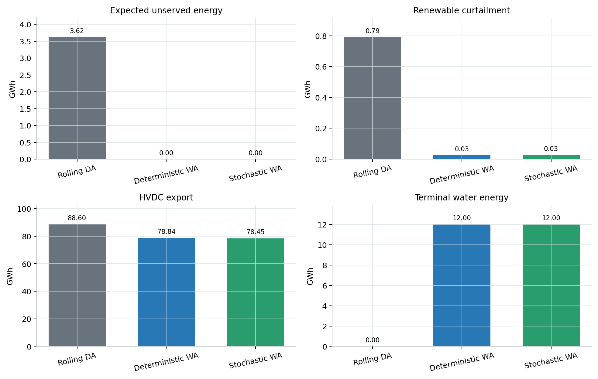

# 云南周前瞻调度 IEEE-24/118 网络化验证算例

## 1. 验证目的与结论边界

本算例用于验证《云南送端电网周前瞻市场边界与运行风险优化技术方案》中
三阶段模型的主要机制和降阶算法。它回答三个问题：

1. 周前瞻是否能够降低送端电网的失负荷和新能源弃电风险；
2. 检修、需求响应、水量和直流市场边界能否在同一信息结构下协调；
3. 不在每个随机场景中重复求解完整五省 SCUC 时，模板与场景分解是否可计算。

算例采用公开测试系统骨架和人为构造参数。计算结果只能说明给定机制下的
因果关系，不能解释为云南实际风险、收益、价格或市场出清预测。

可执行原型为
[yunnan_week_ahead_ieee24_118.py](tutorial/yunnan_week_ahead_ieee24_118.py)，
机器可读结果为
[yunnan_ieee24_118_results.json](yunnan_ieee24_118_results.json)。
概率预测、条件市场模拟和场景树的理论推导见
[云南周前瞻调度双源不确定性量化与三阶段优化方法](yunnan_dual_uncertainty_methodology.md)。

---

## 2. 变时间尺度

算例严格采用近细远粗的 7 天时间轴，而不是每天三个代表时段：

| 区间 | 分辨率 | 时段数 | 主要用途 |
|---|---:|---:|---|
| `D+1` | 15 分钟 | 96 | 正式市场边界、详细安全校核 |
| `D+2` 至 `D+3` | 1 小时 | 48 | 近期安全风险、开机与备用结果预测 |
| `D+4` 至 `D+7` | 每日峰/平/谷各 8 小时 | 12 | 水能、容量和检修充裕性 |
| 合计 | 变尺度 | 156 | 7 天滚动窗口 |

所有电量平衡、水量平衡、储能 SOC、成本和风险指标均乘以各时段持续时间
\(\Delta t_t\)。15 分钟、1 小时和 8 小时时段交界处连续传递水量和 SOC。

---

## 3. 系统构造

### 3.1 云南本地：修正 RTS-24

本地采用 IEEE RTS-24 的 24 节点、38 支路网络骨架，峰值负荷 2850 MW。
标准机组按站点聚合并重新分类，附加资源均为机制验证参数：

| 资源 | 配置 | 规模 |
|---|---|---:|
| 水电 | 4 个聚合电站，节点 13、18、21、22 | 1691 MW |
| 火电 | 6 个聚合电站，保留最小出力和爬坡 | 1714 MW |
| 风电 | 节点 8、15、21 | 1900 MW |
| 光伏 | 节点 3、9、23 | 1400 MW |
| 储能 | 节点 15，充放电各 250 MW | 1500 MWh |
| 需求响应 | `D+1` 至 `D+3` 聚合移峰 | 最大 140 MW |

需求响应将每日 18:00 至 22:00 的负荷转移到 10:00 至 14:00，日电量守恒。
水电使用一个等值周调节水库，逐时段保持水能平衡。

水电备用出清给出低、高稳定运行区。运行阶段偏离稳定区不会直接令模型
不可行，而是引入高惩罚越区量。这表示市场出清后，可靠性调度可以在必要时
修改基点，但必须显式记录该干预。

### 3.2 其他四省：不可观测的 IEEE-118 隐藏试验环境

云南省级调度不能观测其他四省的节点、线路、机组、负荷、报价、开机状态和
调度结果。因此，IEEE-118 不是云南优化模型的输入，而只是算例设计者掌握的
隐藏试验环境，用于产生合成的外部市场观测。

仓库已有 IEEE-118 隐藏数据包含 118 节点、186 支路和 54 台机组。其显式负荷
数组实际有 98 个非零负荷节点、总负荷 2890 MW。只有隐藏环境函数可以读取
这些数组；云南侧模型的函数签名只接受 `YunnanObservableProxy`。

IEEE-118 按节点编号划分为四个外部区域，边界节点取 8、38、68、100。
云南 RTS-24 的节点 14、16、21、23 分别通过一回可控直流接入上述四个区域。

隐藏环境先对完整 118 节点网络执行离线 DC-OPF，分别生成受端紧张、受端宽松
以及峰、平、谷状态下的合成边界观测：

\[
\left\{\lambda_{k,z}^{ext},\ \overline Q_{k,z}^{accept}\right\},
\qquad k=1,\ldots,4.
\]

随后立即丢弃省外网络内部状态，只将边界观测拟合为云南可使用的条件包络。
信息边界为：

| 云南模型可以使用 | 云南模型禁止使用 |
|---|---|
| 云南自身网络、资源、负荷和预测 | 其他省节点和支路参数 |
| 云南直流计划和送端设备可用性 | 其他省机组、负荷和新能源预测 |
| 已发布或历史区域价格 | 其他省报价、开机和调度结果 |
| 历史直流中标量形成的条件区间 | 其他省备用和安全约束 |
| 公开信息推断的市场状态标签 | IEEE-118 内部潮流和节点状态 |

因此，IEEE-118 的作用类似仿真试验中的“隐藏真实系统”：它用于检验只靠有限
边界信息的云南策略是否稳健，但不能被策略本身读取。真实应用中应以历史区域
市场结果、云南自身直流记录和公开信息替换这些合成观测。

---

## 4. 三阶段映射

### 4.1 第一阶段：`D` 日市场前

第一阶段从 20 个预先校验的套餐中选择：

\[
x=\{m^{H},m^{T},K^{DR},\beta^{D1},R^{up},V^{terminal}\}.
\]

其中包含水电检修起始日、火电检修日、DR 预留、`D+1` 直流边界比例、
备用比例和期末保水目标。套餐化保证检修持续时间和窗口合法。

### 4.2 第二阶段：市场情景

设置受端紧张和受端宽松两类市场情景。每个情景固定一个连续的市场模板：

- 本地火电开机状态；
- 水电稳定运行区；
- 四回直流市场计划；
- 外部区域价格和可接受外送能力。

同一市场情景下的条件运行叶共享同一模板，满足第二阶段非前视性。模板由
市场状态和报价规则产生，不是省级调度可以任意挑选的第一阶段变量。

### 4.3 第三阶段：运行情景

四个联合叶场景为：

| 运行叶 | 概率 | 主要压力 |
|---|---:|---|
| 受端紧张、云南干旱低新能源 | 0.22 | 保供、水能和直流故障风险 |
| 受端紧张、云南正常 | 0.33 | 高价值外送 |
| 受端宽松、云南正常 | 0.20 | 外送需求下降 |
| 受端宽松、云南湿润高新能源 | 0.25 | 弃电、弃水和市场消纳风险 |

固定第一、二阶段结果后，每个叶场景独立求解 RTS-24 网络约束下的 SCED
投影、水电、储能、需求响应、直流偏差、弃电、失负荷和远期充裕性 LP。

---

## 5. 对比方案

### 5.1 无周前瞻：逐日滚动基线

基线每天只求解当日时段，并向下一日传递实际水量和 SOC。它采用固定的早期
检修、无需求响应预留、较低备用要求，不设置周末保水目标。每天具有当日场景
信息，但不知道后续六天，因此不是故意构造的静态差方案。

### 5.2 确定性周前瞻

使用中心预测场景选择第一阶段套餐，再固定该套餐在全部四个运行叶上评估。
该方案用于分离“有七天视野”的价值与“显式考虑概率分布”的附加价值。

### 5.3 随机周前瞻

以四个叶场景的期望风险调整成本选择共同第一阶段套餐。失负荷、备用不足、
弃电、振动区偏离和直流计划偏差均显式计价，其中 VOLL 为 10,000 $/MWh。

---

## 6. 数值结果

### 6.1 期望指标



| 指标 | 逐日滚动 | 确定性周前瞻 | 随机周前瞻 |
|---|---:|---:|---:|
| 期望失负荷 EENS（GWh） | 3.620 | 0 | 0 |
| 失负荷 CVaR90（GWh） | 14.496 | 0 | 0 |
| 期望新能源弃电（GWh） | 0.791 | 0.026 | 0.026 |
| 期望外送电量（GWh） | 88.604 | 78.838 | 78.446 |
| 期望外送价值（M$） | 5.199 | 4.795 | 4.786 |
| 期望水电发电量（GWh） | 120.311 | 108.311 | 108.311 |
| 期望 DR 调用电量（GWh） | 0 | 0 | 0.134 |
| 期望备用不足（GWh） | 0 | 0 | 0 |
| `D+7` 期末水量（GWh） | 0 | 12 | 12 |
| 风险调整目标值（M$） | 76.330 | 26.514 | 26.398 |

相对逐日滚动基线，随机周前瞻：

- 消除 3.620 GWh 期望失负荷和 14.496 GWh 尾部失负荷；
- 将期望弃电降低约 96.7%；
- 以减少约 11.5% 外送电量、约 7.9% 外送价值为代价；
- 保留 12 GWh 窗口末水能，避免将风险推到 `D+8`；
- 风险调整目标值降低约 65.4%。

目标值包含风险惩罚和人为构造的外部价格，不是市场利润。

### 6.2 第一阶段决策差异

确定性方案选择：

- 水电检修 `D+5` 至 `D+6`；
- 火电检修 `D+4`；
- 不预留需求响应；
- 期末保水 12 GWh。

随机方案选择：

- 水电检修 `D+3` 至 `D+4`；
- 火电检修 `D+2`；
- `D+1` 至 `D+3` 预留 140 MW 需求响应；
- 期末保水 12 GWh。

随机方案在干旱低新能源叶调用 0.56 GWh DR，在受端紧张、云南正常叶中调用
0.034 GWh；概率加权调用量为 0.134 GWh。这说明 DR 预留主要作为低新能源和
高负荷条件下的保供资源，而不是常态能量资源。

---

## 7. 算法验证

求解采用“有限检修/边界套餐 + 逻辑分解 + 独立 LP 运行追索”：

1. 枚举 20 个满足窗口规则的第一阶段套餐；
2. 对每个套餐求解 4 个条件运行叶 LP；
3. 计算套餐的 EENS、弃电和备用不足风险预算；
4. 先筛除风险预算不可行套餐，再按期望目标排序；
5. 因全部候选套餐均被评价，候选集合内最优间隙为 0。

20 个套餐中有 14 个满足风险预算。本次计算共求解 80 个 156 时段 LP，本机
串行墙钟时间约 13 秒。单个最终套餐
的四个场景求解时间约 0.63 秒。场景子问题没有共享变量，可以直接并行；增加
场景数主要增加可并行工作量，而不会扩大单个 LP。

这验证的是降阶架构的正确性和可计算性，不是完整算法的工业规模性能证明。
真实应用需要将 20 个手工套餐替换为滚动生成的检修套餐，并采用 Benders 割
而不是评价全部套餐；同时应报告主问题下界、可行上界和样本外间隙。

---

## 8. 复现

在仓库根目录运行：

```bash
python3 -B docs/tutorial/yunnan_week_ahead_ieee24_118.py
```

快速冒烟测试只评价 8 个套餐：

```bash
python3 -B docs/tutorial/yunnan_week_ahead_ieee24_118.py --quick --output /tmp/yunnan_ieee_quick.json
```

根据正式结果重新生成 6 张解释图：

```bash
MPLCONFIGDIR=/tmp/mipsolvers_matplotlib \
python3 -B docs/tutorial/plot_yunnan_week_ahead_results.py
```

程序依赖 NumPy 和 SciPy。隐藏试验环境会校验 IEEE-118 的 54 台机组、186 条
支路和 98 个非零负荷节点，但输出 JSON 只记录其作为隐藏基准的规模，不输出
内部数组。JSON 中的 `information_boundary` 明确列出云南可观测和不可观测项，
`observable_external_proxy` 只包含边界价格与直流容量包络。

---

## 9. 尚未验证的内容

本算例没有声称完成以下验证：

- 南方区域市场正式规则的逐条复现和价格预测精度；
- 云南真实梯级水库、水流时滞、弃水和生态约束；
- 15 分钟完整 SCUC 二进制启停、启停轨迹和机组级备用报价；
- 直流闭锁、交流 N-1 和动态安全约束；
- 真实需求响应履约、回补和用户舒适度；
- 真实检修人员、工期、互斥和延期成本；
- 样本外历史回测和分布鲁棒半径校准。

因此，本算例足以支持“模型机制可行、降阶算法可计算”的结论；要形成业务
结论，下一阶段必须替换本地合成参数，并使用历史区域市场结果校准外部代理。
